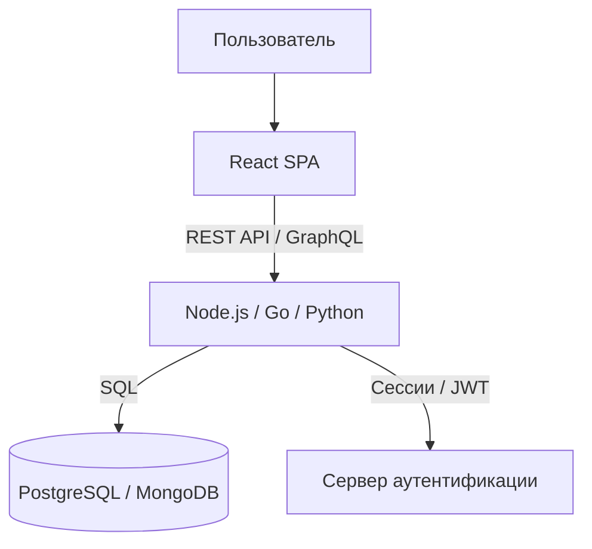
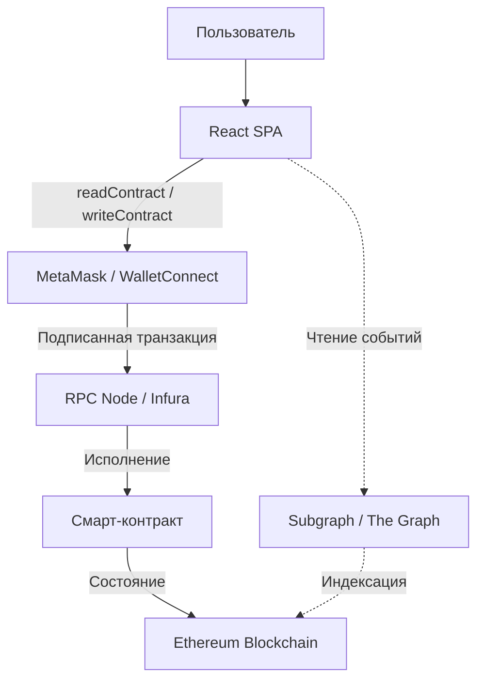
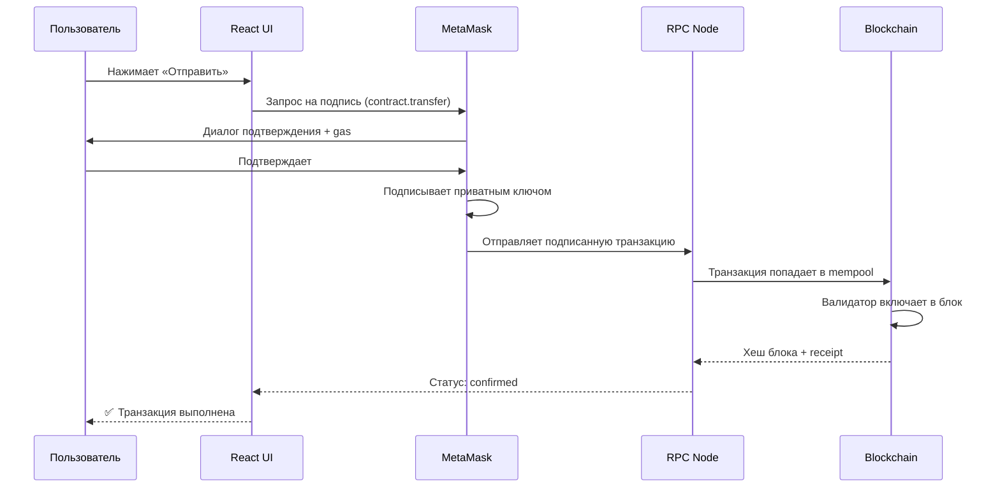

# Урок 1. Что такое Web3

## Краткое определение

Web3 — это архитектура децентрализованных приложений, в которых пользователи владеют своими активами и взаимодействуют напрямую с блокчейном через криптокошелёк, а бизнес-логика выполняется смарт-контрактами вместо серверного бэкенда.

---

## Подробное объяснение

Web3 меняет фундаментальную модель владения данными в интернете. В Web2 вся информация пользователя хранится на сервере компании: аккаунт, баланс, история операций. Компания может изменить, удалить или заблокировать эти данные в любой момент. Пользователь не владеет ничем — он лишь арендует доступ к сервису.

В Web3 данные хранятся в блокчейне — распределённом реестре, копии которого находятся у тысяч участников сети. Никто не может в одностороннем порядке изменить запись: если один участник пытается подделать данные, остальные отвергнут это изменение, потому что у них другая копия.

Для фронтенд-разработчика Web3 означает смену способа взаимодействия с бэкендом. Вместо HTTP-запросов к REST API (`fetch("/api/users")`) ты используешь вызовы смарт-контрактов через специальные библиотеки (`readContract(...)`, `writeContract(...)`). React и TypeScript остаются теми же — меняется только транспортный слой.

Ключевое отличие: в Web3 пользователь подтверждает каждую операцию своей цифровой подписью через кошелёк (MetaMask, WalletConnect). Это значит, что никто не может выполнить действие от имени пользователя без его явного согласия — даже сам разработчик приложения.

---

## Основные понятия

### Блокчейн (Blockchain)

| | |
|---|---|
| **Определение** | Распределённый реестр — цепочка блоков, каждый из которых содержит набор транзакций и криптографическую ссылку на предыдущий блок |
| **Зачем нужен** | Обеспечивает неизменяемость данных: невозможно изменить запись в прошлом блоке, не перестроив всю цепочку |
| **Где используется** | Хранение балансов, записей о владении токенами, истории транзакций, состояния смарт-контрактов |
| **Пример** | Ethereum, Solana, Polygon, Arbitrum — разные блокчейны с разными характеристиками |

### Смарт-контракт (Smart Contract)

| | |
|---|---|
| **Определение** | Программа, выполняющаяся в блокчейне. Код и состояние контракта хранятся в блокчейне и не могут быть изменены после деплоя |
| **Зачем нужен** | Заменяет серверную бизнес-логику: правила игры, условия переводов, логику токенов |
| **Где используется** | ERC-20 токены, NFT (ERC-721), DEX (Uniswap), лендинг-протоколы (Aave) |
| **Пример** | Контракт USDC определяет, кто сколько токенов имеет и как работает transfer |

### Кошелёк (Wallet)

| | |
|---|---|
| **Определение** | Инструмент для управления приватными ключами и взаимодействия с блокчейном |
| **Зачем нужен** | Хранит приватный ключ, подписывает транзакции, управляет активами пользователя |
| **Где используется** | MetaMask (браузерное расширение), WalletConnect (протокол для мобильных кошельков), Rainbow, Trust Wallet |
| **Пример** | Пользователь нажимает «Подтвердить» в MetaMask — кошелёк подписывает транзакцию приватным ключом и отправляет её в сеть |

### Транзакция (Transaction)

| | |
|---|---|
| **Определение** | Подписанное сообщение, которое изменяет состояние блокчейна: перевод ETH, вызов функции контракта, деплой контракта |
| **Зачем нужна** | Единственный способ изменить данные в блокчейне |
| **Где используется** | Отправка токенов, mint NFT, swap на DEX, голосование в DAO |
| **Пример** | `tx = await contract.transfer(to, amount)` → MetaMask запрашивает подпись → транзакция уходит в сеть |

### Gas

| | |
|---|---|
| **Определение** | Плата за выполнение операции в блокчейне. Измеряется в gwei (1 gwei = 10⁻⁹ ETH). Каждая операция потребляет вычислительные ресурсы сети |
| **Зачем нужен** | Предотвращает спам, оплачивает работу валидаторов, ограничивает бесконечные циклы |
| **Где используется** | Каждая транзакция в Ethereum и EVM-совместимых сетях требует gas |
| **Пример** | Перевод ETH: ~21 000 gas. Mint NFT: ~100 000–300 000 gas. Сложный своп: может быть >500 000 gas |

### EVM (Ethereum Virtual Machine)

| | |
|---|---|
| **Определение** | Виртуальная машина, выполняющая байт-код смарт-контрактов. Работает на каждом узле сети |
| **Зачем нужна** | Обеспечивает детерминированное выполнение: один и тот же код с одними и теми же входными данными всегда даёт одинаковый результат на всех узлах |
| **Где используется** | Ethereum, Polygon, Arbitrum, Optimism, Base — все EVM-совместимые сети |
| **Пример** | Solidity компилируется в EVM-байткод → EVM выполняет его инструкция за инструкцией |

---

## Архитектура

### Web2: клиент-серверная архитектура



Вся логика и данные на стороне сервера. Сервер — единая точка отказа и контроля.

### Web3: децентрализованная архитектура



- **React** остаётся точкой входа для пользователя
- **Wallet** управляет ключами и подписывает транзакции
- **Blockchain** хранит данные и выполняет логику контрактов
- **Indexer** ускоряет чтение исторических данных (опционально)

### Поток транзакции (детально)



---

## Сравнение: Web2 vs Web3

| Критерий | Web2 | Web3 |
|---|---|---|
| **Хранение данных** | Централизованная БД на сервере компании | Распределённый блокчейн (тысячи узлов) |
| **Аутентификация** | Логин/пароль, OAuth, JWT-токены | Приватный ключ → цифровая подпись |
| **Авторизация операций** | Сервер проверяет права | Пользователь подписывает каждую транзакцию |
| **Изменяемость данных** | Сервер может изменить/удалить любые данные | Данные неизменяемы (immutable) после записи |
| **Бизнес-логика** | На сервере (Node.js, Go, Python) | В смарт-контрактах (Solidity, Rust) |
| **Точка отказа** | Сервер упал → всё не работает | Сеть продолжает работать, пока живёт хотя бы один узел |
| **Цензура** | Компания может заблокировать пользователя | Никто не может заблокировать адрес (в публичном блокчейне) |
| **Скорость операций** | Миллисекунды | Секунды/минуты (время блока) |
| **Стоимость операции** | Бесплатно для пользователя | Платит пользователь (gas) |
| **Ответственность за данные** | Компания | Пользователь (сам хранит ключи) |
| **Транспорт** | `fetch("/api/users")` → HTTP | `readContract(...)` → RPC |
| **Прозрачность** | Код закрыт, логика скрыта | Код контракта публичен, все транзакции видны |

---

## Аналогии

### Банк vs Распределённый реестр

**Web2 (обычный банк):**
```
Клиенты → Банк → База данных
```
Один банк хранит все записи. Все доверяют ему. Если банк ошибётся или захочет изменить запись — никто не проверит.

**Web3 (распределённый реестр):**
```
Клиенты → 20 000 бухгалтеров (каждый с копией книги)
```
Каждый бухгалтер хранит идентичную копию бухгалтерской книги. Если один попытается изменить запись только у себя — остальные 19 999 скажут: «Нет, у нас запись другая». Изменение принимается только если большинство согласно.

### Договор аренды vs Смарт-контракт

**Web2:** ты подписываешь бумажный договор. Арендодатель может его потерять, изменить условия в одностороннем порядке или отказаться выполнять.

**Web3:** условия договора записаны в коде смарт-контракта. Код публичен и неизменяем. Исполнение происходит автоматически при наступлении условий. Никто не может «передумать».

---

## Частые ошибки новичков

### 1. «Web3 = криптовалюта»

Криптовалюта — лишь одно из применений блокчейна. Web3 включает: DeFi (децентрализованные финансы), NFT (цифровое владение), DAO (децентрализованные организации), DID (децентрализованная идентичность), децентрализованное хранение (IPFS) и многое другое.

### 2. «Web3 = React + MetaMask»

Это как сказать «бэкенд = кнопка Запустить сервер». MetaMask — лишь инструмент для подписи транзакций. Нужно понимать: как создаётся транзакция, почему нужен gas, как работает цифровая подпись, как контракт хранит данные, что делает EVM.

### 3. «Можно просто заменить БД на блокчейн»

Блокчейн не предназначен для замены обычных баз данных. Он медленный, дорогой и публичный. Хранить в блокчейне нужно только то, что требует неизменяемости и децентрализации. Пользовательские аватарки, логи и временные данные — в обычном хранилище (IPFS, Arweave, или даже Web2-бэкенд).

### 4. «В Web3 нет серверов»

Фронтенд всё ещё нужно где-то хостить (Vercel, Netlify, IPFS). RPC-ноды (Infura, Alchemy) — это по сути серверы, предоставляющие доступ к блокчейну. Индексаторы (The Graph) — тоже серверная инфраструктура. Web3 убирает централизованный бэкенд бизнес-логики, но не всю серверную инфраструктуру.

### 5. «Мой код защищён, потому что он в блокчейне»

Смарт-контракт публичен и виден всем. Любая уязвимость видна всем и может быть эксплуатирована кем угодно. Безопасность в Web3 — это не опция, а обязательное требование. Аудит контракта — стандартная практика перед деплоем.

---

## Вопросы с собеседований

1. **Чем Web3 отличается от Web2 на архитектурном уровне?**  
   В Web2 данные и логика на сервере компании, аутентификация через логин/пароль. В Web3 данные в блокчейне, логика в смарт-контрактах, аутентификация через цифровую подпись кошельком.

2. **Почему Web3 не может существовать без кошелька?**  
   Кошелёк хранит приватный ключ — единственный способ доказать владение адресом. Без кошелька невозможно подписать транзакцию, а без подписи блокчейн не примет операцию.

3. **Почему нельзя просто заменить блокчейн обычной базой данных?**  
   Обычная БД принадлежит одному оператору, который может изменить/удалить данные. Блокчейн распределён между тысячами узлов — изменение требует консенсуса большинства, что делает подделку практически невозможной.

4. **Что происходит, когда пользователь нажимает «Отправить» в dApp?**  
   React формирует вызов `writeContract(...)`, MetaMask показывает диалог подтверждения, пользователь подписывает, транзакция отправляется в mempool, валидатор включает её в блок, статус меняется на confirmed.

5. **Какие обязанности сервера исчезают в Web3?**  
   Исчезает: хранение пользовательских данных и балансов, авторизация операций, выполнение бизнес-логики (переносится в смарт-контракт). Остаётся: хостинг фронтенда, предоставление RPC-доступа к блокчейну, индексация данных для быстрого чтения.

6. **Зачем нужен gas и кто его платит?**  
   Gas оплачивает вычислительные ресурсы сети: каждая операция EVM стоит определённое количество gas. Платит пользователь, инициирующий транзакцию. Это предотвращает спам и бесконечные циклы.

7. **Что такое EVM и почему это важно для фронтендера?**  
   EVM — виртуальная машина Ethereum, выполняющая код смарт-контрактов. Фронтендеру важно понимать, что любое взаимодействие с контрактом (даже чтение) идёт через EVM, и что gas-стоимость зависит от сложности операций в EVM.

8. **Чем `readContract` отличается от `writeContract`?**  
   `readContract` (view-функции) — бесплатно, не требует gas, не создаёт транзакцию, выполняется мгновенно на ноде. `writeContract` — платно, требует gas и подписи, создаёт транзакцию, требует ожидания включения в блок.

9. **Может ли разработчик dApp изменить данные пользователя без его ведома?**  
   Нет. Любое изменение состояния блокчейна требует подписи приватным ключом пользователя. Разработчик не имеет доступа к приватным ключам пользователей.

10. **Почему Web3-приложения называют «dApps»?**  
    dApp = Decentralized Application. В отличие от обычных приложений, бэкенд dApp — это смарт-контракты в блокчейне, а не сервер компании. Децентрализация означает, что никто не контролирует приложение единолично.

11. **Что такое nonce и зачем он нужен?**  
    Nonce — порядковый номер транзакции с конкретного адреса. Предотвращает повторную отправку (replay attack): каждая транзакция имеет уникальный nonce, и сеть отвергнет транзакцию с уже использованным nonce.

12. **Почему время подтверждения транзакции может быть разным?**  
    Зависит от загруженности сети, установленной цены gas (выше gas → быстрее включают в блок), времени блока (в Ethereum ~12 секунд). При высокой нагрузке транзакции с низким gas могут ждать долго.

---

## Практические выводы

Frontend Web3-разработчик должен помнить:

- **Ты работаешь с тремя сущностями:** React UI, кошелёк пользователя, блокчейн
- **Вместо REST API — смарт-контракты:** `readContract()` для чтения, `writeContract()` для записи
- **Пользователь контролирует операции:** каждое изменение требует явной подписи через кошелёк
- **Нельзя изменить данные задним числом:** блокчейн иммутабелен — продумывай архитектуру заранее
- **Gas-стоимость влияет на UX:** пользователь платит за каждую транзакцию — минимизируй ончейн-операции
- **Безопасность на первом месте:** контракты публичны, любая уязвимость может быть эксплуатирована
- **Ты не обязан писать сложные контракты, но обязан понимать, как они работают**

---

## Связанные темы

- [[0_lesson-02]] — Урок 2 (следующий)
- [[Блокчейн-как-это-работает]] — Детальный разбор устройства блокчейна
- [[Смарт-контракты-введение]] — Введение в смарт-контракты
- [[Словарь-web3]] — Глоссарий всех терминов
- [[Сравнение-ethers-viem-wagmi]] — Библиотеки для взаимодействия с блокчейном из React
- [[Паттерны-транзакций-React]] — Как правильно обрабатывать транзакции в UI

---

## Краткий конспект (для быстрого повторения)

1. Web3 — архитектура, где данные в блокчейне, а логика в смарт-контрактах
2. Web2: React → REST API → Server → Database (централизованно)
3. Web3: React → Wallet → Blockchain → Smart Contract (децентрализованно)
4. Блокчейн — распределённый реестр с копиями у тысяч узлов
5. Смарт-контракт — программа в блокчейне, неизменяема после деплоя
6. Кошелёк хранит приватный ключ и подписывает транзакции
7. Без подписи кошельком невозможно изменить состояние блокчейна
8. Gas — плата за вычисления, предотвращает спам
9. EVM — виртуальная машина, выполняющая код контрактов
10. `readContract` — бесплатно, мгновенно. `writeContract` — платно, требует ожидания блока
11. В Web3 сервер не исчезает полностью: остаётся хостинг фронтенда и RPC-ноды
12. Пользователь владеет данными, а не компания
13. Прозрачность: код контрактов публичен, все транзакции видны на Etherscan
14. Неизменяемость: нельзя удалить или изменить запись в блокчейне
15. Безопасность критична: уязвимость в контракте видна всем и может быть эксплуатирована
16. Web3 ≠ криптовалюта. Это целая экосистема: DeFi, NFT, DAO, DID
17. Web3 ≠ React + MetaMask. Нужно понимать нижележащие механизмы
18. Блокчейн не заменяет обычную БД — он для данных, требующих неизменяемости и децентрализации

---

## Flashcards

**Q: Чем Web3 архитектурно отличается от Web2?**  
A: В Web2 данные и логика на сервере. В Web3 данные в блокчейне, логика в смарт-контрактах, пользователь подписывает операции кошельком.

---

**Q: Почему нельзя подделать транзакцию в Web3?**  
A: Транзакция подписывается приватным ключом. Без ключа нельзя создать валидную подпись. Сеть отвергнет неподписанную или неверно подписанную транзакцию.

---

**Q: Зачем нужен gas?**  
A: Оплата вычислений в сети. Предотвращает спам и бесконечные циклы. Платит пользователь за каждую операцию.

---

**Q: `readContract` vs `writeContract` — в чём разница?**  
A: read — бесплатно, мгновенно, без транзакции. write — платно, требует gas и подписи, ждать включения в блок.

---

**Q: Что хранит кошелёк?**  
A: Приватный ключ. Не хранит сами токены — токены «живут» в блокчейне, кошелёк лишь доказывает право ими распоряжаться.

---

**Q: Можно ли изменить смарт-контракт после деплоя?**  
A: Нет. Код контракта неизменяем. Можно только задеплоить новую версию (с новым адресом) и мигрировать состояние (паттерн proxy).

---

**Q: Кто проверяет правильность транзакций?**  
A: Валидаторы (в PoS-сетях) или майнеры (в PoW). Каждый узел сети независимо проверяет каждую транзакцию и блок.

---

**Q: Что произойдёт, если сервер dApp упадёт?**  
A: Фронтенд станет недоступен, но данные и логика контракта останутся в блокчейне. Любой может поднять свой фронтенд к тому же контракту.

---

## Термины

| Термин | Определение |
|---|---|
| **Web3** | Архитектура децентрализованных приложений на блокчейне |
| **Блокчейн** | Распределённый реестр — цепочка блоков с транзакциями, защищённая криптографией |
| **Смарт-контракт** | Программа в блокчейне, автоматически исполняющая заданную логику |
| **Кошелёк** | Инструмент для хранения приватных ключей и подписи транзакций |
| **Приватный ключ** | Секретный криптографический ключ, доказывающий владение адресом |
| **Публичный адрес** | Открытый идентификатор кошелька в блокчейне (начинается с 0x...) |
| **Транзакция** | Подписанное сообщение, изменяющее состояние блокчейна |
| **Gas** | Плата за вычислительные ресурсы сети, измеряется в gwei |
| **EVM** | Ethereum Virtual Machine — среда выполнения смарт-контрактов |
| **Мемпул (mempool)** | Очередь ожидающих транзакций перед включением в блок |
| **Валидатор** | Узел сети, формирующий новые блоки и проверяющий транзакции |
| **dApp** | Decentralized Application — приложение с бэкендом на смарт-контрактах |
| **DeFi** | Decentralized Finance — децентрализованные финансовые сервисы |
| **NFT** | Non-Fungible Token — уникальный токен, подтверждающий владение цифровым активом |
| **DAO** | Decentralized Autonomous Organization — организация, управляемая через голосование в блокчейне |
| **Nonce** | Порядковый номер транзакции с адреса, предотвращает повторную отправку |
| **RPC Node** | Сервер, предоставляющий API-доступ к блокчейну (Infura, Alchemy) |
| **Подпись** | Криптографическое доказательство того, что транзакцию создал владелец приватного ключа |
| **Иммутабельность** | Неизменяемость: данные, записанные в блокчейн, нельзя удалить или подменить |
| **Консенсус** | Механизм согласования состояния блокчейна между всеми узлами сети |

---

## Теги

`#web3` `#архитектура` `#frontend` `#блокчейн` `#введение` `#урок` `#web2-vs-web3` `#dapp` `#кошелёк` `#газ`
