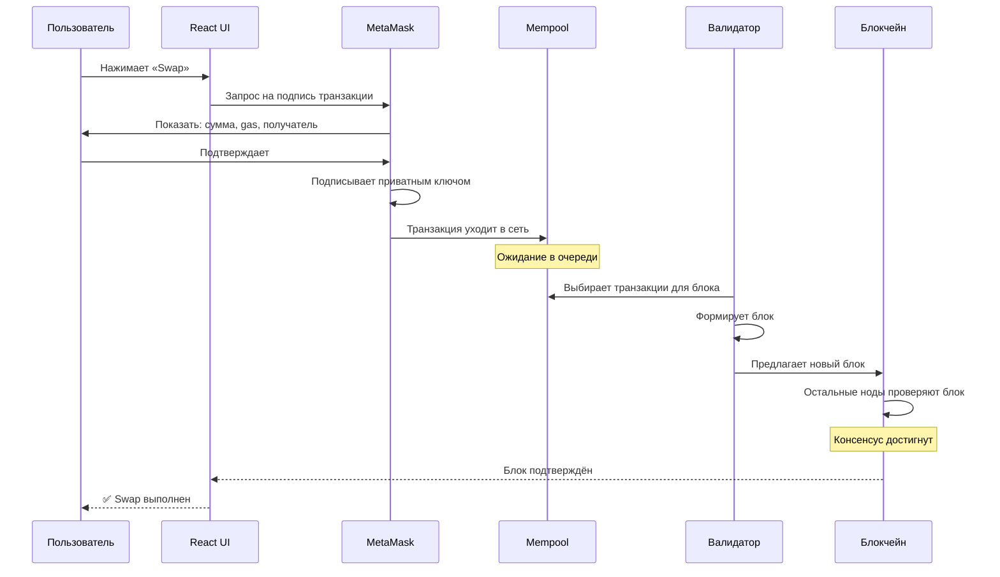
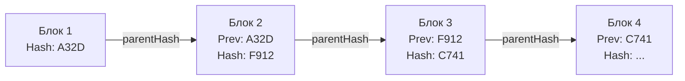
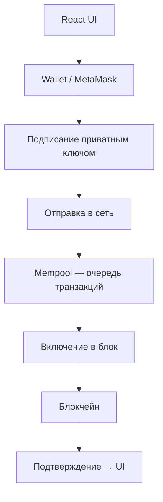
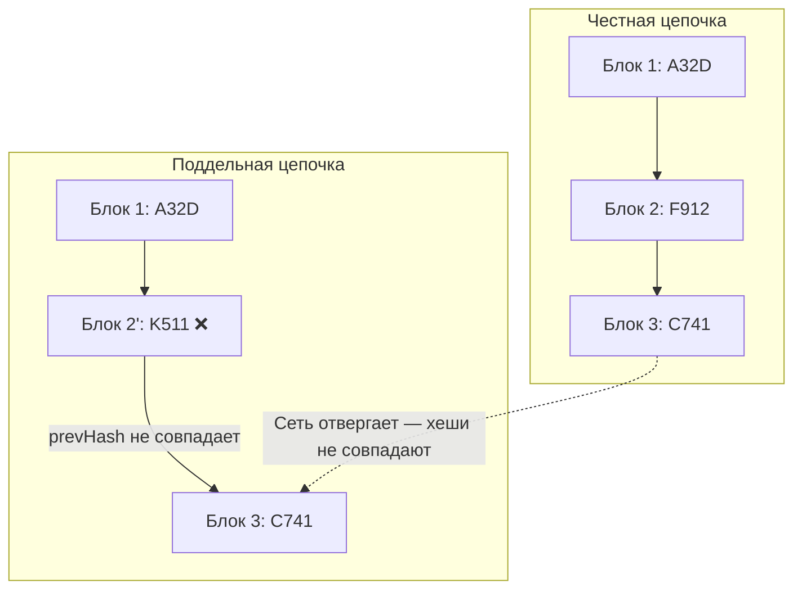
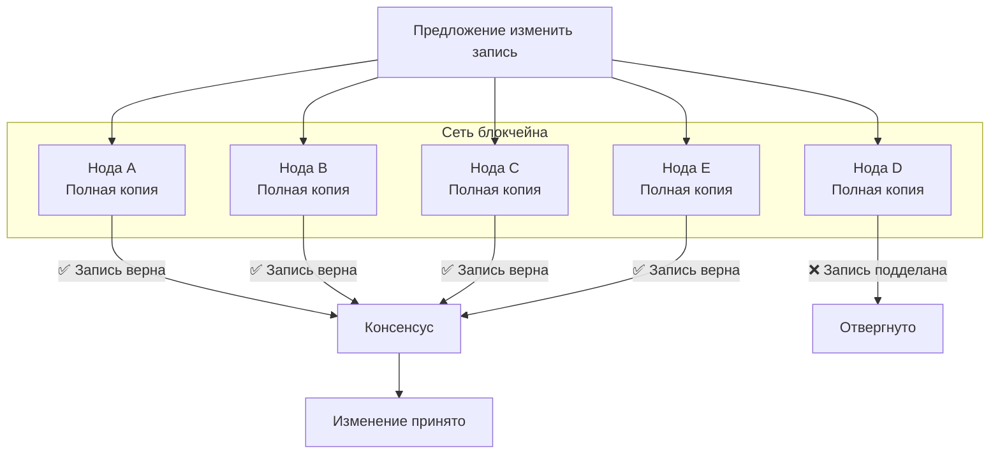

# Урок 2. Как устроен блокчейн на самом деле

## Краткое определение

Блокчейн — это распределённый реестр, состоящий из цепочки блоков, где каждый блок содержит набор транзакций и криптографический хеш предыдущего блока, что делает изменение истории вычислительно невозможным.

---

## Подробное объяснение

### От централизованной таблицы к распределённому реестру

Представь обычную Excel-таблицу с историей переводов:

| Отправитель | Получатель | Сумма |
|---|---|---|
| Иван | Сергей | 10 |
| Сергей | Алексей | 3 |
| Алексей | Мария | 2 |

Если таблица хранится **у одного человека**, он может:
- изменить сумму задним числом;
- удалить строку;
- добавить фиктивную запись;
- скрыть ошибки.

Это — **централизованная база данных**. Все доверяют одному владельцу.

Теперь представь, что **100 000 человек** имеют идентичную копию этой таблицы. Если один попытается изменить запись «Сергей → Иван = 100 000 ETH», остальные 99 999 скажут: «У нас такой записи нет». Изменение будет отвергнуто.

Именно поэтому блокчейн называют **распределённым реестром** (Distributed Ledger) — нет единого центра, все участники хранят и проверяют данные.

### Что такое блок?

Многие ошибочно думают, что **блок = одна транзакция**. Это не так.

**Блок — это контейнер**, содержащий множество транзакций:

```
Блок №1
├── Транзакция 1: Alice → Bob, 5 ETH
├── Транзакция 2: Bob → Charlie, 2 ETH
├── Транзакция 3: Charlie → Dave, 0.5 ETH
├── Транзакция 4: ...
└── ...
```

В Ethereum в одном блоке может быть от десятков до сотен транзакций — точное количество зависит от **gas limit блока** (общего лимита газа на все транзакции внутри).

**Аналогия:** блок — это коробка. В коробку складывают множество операций. Когда коробка заполнена — её закрывают, подписывают и создают новую.

### Что внутри блока?

Типичный блок Ethereum содержит:

| Поле | Описание |
|---|---|
| **block number** | Порядковый номер блока |
| **parentHash** | Хеш предыдущего блока (связь с цепочкой) |
| **timestamp** | Время создания блока |
| **transactions** | Список транзакций в блоке |
| **stateRoot** | Корень дерева состояний (Merkle Patricia Trie) |
| **transactionsRoot** | Корень дерева транзакций |
| **receiptsRoot** | Корень дерева receipt'ов |
| **gasLimit** | Лимит газа на блок |
| **gasUsed** | Фактически использованный газ |
| **miner/validator** | Адрес создателя блока |

### Что такое цепочка блоков?

```
[Блок 1] → [Блок 2] → [Блок 3] → [Блок 4]
```

Цепочка — потому что каждый следующий блок хранит **ссылку на предыдущий** через поле `parentHash`. Эта ссылка — криптографический хеш, который действует как неразрывная связь.

---

## Что такое хеш?

**Хеш (hash)** — цифровой отпечаток данных. Математическая функция, которая превращает входные данные произвольной длины в строку фиксированной длины.

### Лавинный эффект (Avalanche Effect)

Даже минимальное изменение входных данных полностью меняет хеш:

```
"Hello"  →  8b1a9953c4611296a827abf8c47804d7
"hello"  →  5d41402abc4b2a76b9719d911017c592
```

Поменялась одна буква (`H` → `h`) — хеш стал совершенно другим. Нет способа предсказать, как изменится хеш при изменении данных, и нет способа восстановить исходные данные по хешу.

### Как хеш связывает блоки

```
Блок 1                    Блок 2                    Блок 3
┌─────────────────┐      ┌─────────────────┐      ┌─────────────────┐
│ Данные          │      │ parentHash: A32D │      │ parentHash: F912 │
│ ...             │  →   │ Данные          │  →   │ Данные          │
│ hash: A32D      │      │ ...             │      │ ...             │
└─────────────────┘      │ hash: F912      │      │ hash: C741      │
                         └─────────────────┘      └─────────────────┘
```

Каждый блок хранит хеш предыдущего. Если кто-то изменит данные в Блоке 2:

1. `hash` Блока 2 изменится: `F912` → `K511`
2. Блок 3 всё ещё ссылается на `parentHash = F912`
3. `K511 ≠ F912` — **цепочка разорвана**
4. Сеть немедленно отвергает подделку

### Что такое PrevHash

**PrevHash (Previous Hash)** — поле в заголовке блока, хранящее хеш предыдущего блока. Именно через PrevHash каждый блок «знает» своего предшественника и ссылается на него.

```
Блок №1                    Блок №2                    Блок №3
┌──────────────┐          ┌──────────────┐          ┌──────────────┐
│ Hash: A32D   │          │ PrevHash: A32D│          │ PrevHash: F912│
│              │    →     │ Hash: F912    │    →     │ Hash: C741    │
└──────────────┘          └──────────────┘          └──────────────┘
```

То есть:
- **Блок №2** знает, каким был хеш Блока №1 (PrevHash = A32D)
- **Блок №3** знает, каким был хеш Блока №2 (PrevHash = F912)
- **Блок №4** будет знать хеш Блока №3 (PrevHash = C741)

Именно поэтому блоки образуют **непрерывную цепочку** — каждый следующий держится за предыдущий через PrevHash.

#### Почему нельзя удалить блок №2?

Допустим, кто-то удалил второй блок:

```
Блок 1                  Блок 3
┌──────────────┐       ┌───────────────────┐
│ Hash: A32D   │  →?   │ PrevHash: F912 ❌  │
└──────────────┘       │ Hash: C741        │
                       └───────────────────┘
```

Блок №3 ссылается на `PrevHash = F912`, но блока с таким хешем **больше не существует**. Цепочка оборвана. Все ноды немедленно это обнаружат — концы не сходятся.

#### Почему нельзя изменить содержимое блока №2?

Допустим, в блоке №2 была запись:
```
Сергей → Иван = 5 ETH
```

Мошенник меняет запись:
```
Сергей → Иван = 500 ETH
```

После изменения содержимого хеш блока пересчитывается заново:

```
Hash блока №2
БЫЛ:  F912
СТАЛ: K511
```

Но блок №3 всё ещё хранит:

```
PrevHash = F912
```

Проверка:
```
PrevHash блока №3 (F912) ≠ Hash блока №2 (K511)
            ❌ НЕ СОВПАДАЕТ
```

Цепочка повреждена. Блок №3 и все последующие становятся недействительными.

#### Главное правило

> Каждый блок доверяет предыдущему через поле **PrevHash**. Изменение одного блока автоматически делает недействительными **все последующие**.

Это не опция и не настройка — это фундаментальное свойство архитектуры блокчейна, зашитое в протокол на уровне консенсуса.

### Почему нельзя просто пересчитать все хеши?

Теоретически — можно. Практически — почти невозможно:

- Пока злоумышленник пересчитывает старые блоки, **честные узлы добавляют новые**
- Сеть продолжает расти быстрее, чем злоумышленник может пересчитывать
- Нужно **догнать и перегнать** всю сеть по вычислительной мощности (атака 51%)
- В Ethereum это требует контроля над >50% застейканных ETH — миллиарды долларов

Именно сочетание **криптографических хешей + распределённости + консенсуса** делает изменение истории чрезвычайно сложным.

---

## Что такое нода (Node)?

**Нода** — компьютер, участвующий в работе блокчейн-сети.

### Что делает нода:

```
Нода
├── Хранит полную копию блокчейна (или её часть)
├── Проверяет каждую входящую транзакцию
├── Проверяет каждый новый блок
├── Отправляет информацию другим нодам
└── Синхронизируется с сетью (догоняет новые блоки)
```

### Типы нод

| Тип | Что хранит | Что делает |
|---|---|---|
| **Full node (полная)** | Весь блокчейн | Проверяет все транзакции и блоки, участвует в консенсусе |
| **Archive node (архивная)** | Весь блокчейн + все промежуточные состояния | Нужна для исторических запросов (Etherscan, аналитика) |
| **Light node (лёгкая)** | Только заголовки блоков | Минимальная проверка, полагается на полные ноды |
| **Validator node** | Весь блокчейн | Создаёт новые блоки (только в PoS) |

### Аналогия с библиотекарями

Представь библиотеку, где у каждого библиотекаря есть **полная копия одной и той же книги**. Если один библиотекарь приносит страницу, которая не совпадает с остальными экземплярами — её не принимают. Консенсус = большинство экземпляров совпадает.

---

## Путь транзакции: от кнопки до блокчейна

Пользователь нажал «Swap» в dApp. Что происходит дальше?



### Этапы детально

1. **React → Wallet:** dApp формирует вызов `writeContract(...)` и отправляет в кошелёк
2. **Подписание:** MetaMask показывает диалог с деталями (кому, сколько, цена газа). Пользователь подписывает **приватным ключом**
3. **Отправка в сеть:** Подписанная транзакция транслируется через RPC-ноду (Infura, Alchemy) в peer-to-peer сеть
4. **Mempool:** Транзакция попадает в очередь ожидающих транзакций. Валидаторы видят её и могут включить в следующий блок
5. **Включение в блок:** Валидатор формирует блок из транзакций, выполняет их, получает новое состояние
6. **Блок в блокчейне:** Остальные ноды проверяют блок. Если всё корректно — принимают его. Блок добавлен навсегда
7. **Фронтенд получает подтверждение:** Через `waitForTransactionReceipt()` или подписку на события

---

## Почему блокчейн считается надёжным?

Пять механизмов работают одновременно:

| Механизм | Что даёт |
|---|---|
| **Тысячи независимых нод** | Нет единой точки отказа или контроля |
| **Криптографические хеши** | Любое изменение данных немедленно обнаруживается |
| **Связь блоков через parentHash** | Нельзя изменить один блок, не сломав всю цепочку |
| **Консенсус сети** | Изменения принимаются только если большинство согласно |
| **Цифровые подписи** | Только владелец приватного ключа может инициировать транзакцию |

---

## Что должен знать Frontend Web3-разработчик

Frontend **не создаёт блоки**, **не проверяет транзакции**, **не хранит блокчейн**.

Его задача — **корректно взаимодействовать с сетью**:

- Отправить транзакцию через кошелёк пользователя
- Дождаться подтверждения (включения в блок)
- Корректно обработать ошибки (revert, недостаток газа, отклонено пользователем)
- Показать пользователю **актуальное состояние** (баланс, статус транзакции)
- Понимать, что **время подтверждения** зависит от загруженности сети и цены газа

Понимание внутренних процессов помогает правильно проектировать UX: индикаторы загрузки, ожидание подтверждений, обработка реорганизаций цепочки.

---

## Архитектура

### Структура цепочки блоков



### Обработка транзакции



### Попытка подделки блока



---

## Распределённый реестр: схема



---

## Сравнение: централизованная БД vs блокчейн

| Критерий | Централизованная БД | Блокчейн |
|---|---|---|
| **Копий данных** | Одна (или master-slave реплики) | Тысячи идентичных копий |
| **Кто контролирует** | Администратор БД | Никто (консенсус участников) |
| **Изменение истории** | Возможно (UPDATE, DELETE) | Практически невозможно |
| **Скорость записи** | Миллисекунды | Секунды (время блока) |
| **Пропускная способность** | Тысячи/миллионы TPS | Десятки/сотни TPS |
| **Стоимость записи** | Бесплатно (свои серверы) | Платит пользователь (gas) |
| **Прозрачность** | Закрытая | Публичная (все транзакции видны) |
| **Точка отказа** | Сервер упал → всё недоступно | Сеть работает, пока есть хотя бы одна нода |

---

## Аналогии

### 1. Общая таблица у тысяч людей

Excel-таблица с историей переводов, копия которой хранится у 100 000 человек. Если кто-то меняет запись только у себя — остальные сверяются и отвергают изменение.

### 2. Коробка с транзакциями

Блок — это коробка, в которую складывают чеки (транзакции). Когда коробка заполнена, её опечатывают (хешируют) и ставят на полку рядом с предыдущей. Каждая новая коробка приклеена к предыдущей — нельзя вытащить одну, не разрушив всю конструкцию.

### 3. Библиотекари с одинаковыми книгами

У каждого библиотекаря — полная копия книги учёта. Если один приносит страницу, не совпадающую с остальными, её отвергают. Книга принимается только если все экземпляры совпадают.

---

## Типичные ошибки новичков

### ❌ «Блок = одна транзакция»

Нет. Блок — это контейнер, содержащий множество транзакций. В Ethereum в одном блоке могут быть сотни транзакций, ограниченные только gas limit блока.

### ❌ «Блокчейн невозможно изменить вообще никогда»

Теоретически изменить можно (атака 51%), но практически это требует контроля над большей частью сети — в случае Ethereum это миллиарды долларов. Для всех практических целей блокчейн можно считать неизменяемым.

### ❌ «React общается напрямую с блокчейном»

Нет. React общается с **кошельком** (MetaMask), который подписывает транзакцию, и с **RPC-провайдером** (Infura/Alchemy), который транслирует её в сеть. Прямого доступа к блокчейну из браузера нет.

### ❌ «Все ноды одновременно создают блоки»

Нет. Блок создаёт **один валидатор** (в Proof of Stake), выбранный протоколом. Остальные ноды **проверяют** созданный блок. Только после проверки и достижения консенсуса блок считается добавленным.

### ❌ «Блокчейн — это только финансы и криптовалюта»

Блокчейн — это технология распределённого хранения данных с гарантией неизменности. Применяется в цепочках поставок, цифровой идентичности, голосованиях, нотаризации документов, игровой индустрии и многом другом.

### ❌ «Данные в блокчейне зашифрованы»

Нет. Данные в публичных блокчейнах (Ethereum, Bitcoin) видны всем. Любой может прочитать транзакцию на Etherscan. Шифрование может применяться на уровне приложения, но не на уровне блокчейна.

---

## Вопросы с собеседований

1. **Что такое блокчейн?**  
   Распределённый реестр — цепочка блоков, каждый из которых содержит набор транзакций и криптографическую ссылку на предыдущий блок. Хранится и проверяется тысячами независимых узлов.

2. **Что такое блок?**  
   Контейнер, содержащий множество транзакций, хеш предыдущего блока, временную метку и служебную информацию. В Ethereum размер блока определяется gas limit, а не количеством транзакций.

3. **Что такое хеш?**  
   Криптографический цифровой отпечаток данных — функция, превращающая входные данные произвольной длины в строку фиксированной длины. Обладает лавинным эффектом: малейшее изменение входных данных полностью меняет хеш.

4. **Почему изменение одного блока ломает всю цепочку?**  
   Каждый блок хранит `parentHash` — хеш предыдущего блока. При изменении данных в старом блоке его хеш меняется, и следующий блок ссылается на уже несуществующий хеш. Цепочка разрывается, и все последующие блоки становятся недействительными.

5. **Что хранится внутри блока Ethereum?**  
   `block number`, `parentHash`, `timestamp`, список транзакций, `stateRoot`, `transactionsRoot`, `receiptsRoot`, `gasLimit`, `gasUsed`, адрес валидатора/майнера.

6. **Что делает нода (node)?**  
   Хранит копию блокчейна, проверяет входящие транзакции, проверяет новые блоки, синхронизируется с другими нодами, отклоняет некорректные данные. Валидаторные ноды дополнительно создают новые блоки.

7. **Что такое распределённый реестр (Distributed Ledger)?**  
   База данных, копии которой хранятся у множества независимых участников сети. Нет центрального администратора — изменения принимаются через консенсус участников.

8. **Почему блокчейн считается надёжным?**  
   Сочетание пяти механизмов: тысячи нод (распределённость), криптографические хеши (обнаружение изменений), связь блоков (непрерывность цепочки), консенсус (согласие большинства), цифровые подписи (аутентификация отправителя).

9. **Что происходит после отправки транзакции?**  
   React вызывает кошелёк → пользователь подписывает → транзакция попадает в mempool → валидатор включает в блок → блок проверяется остальными нодами → блок добавляется в блокчейн → фронтенд получает подтверждение.

10. **Чем блок отличается от транзакции?**  
    Блок — контейнер, содержащий множество транзакций и метаданные. Транзакция — одна операция (перевод, вызов контракта). Блок — это страница книги, транзакция — одна запись на странице.

11. **Что такое mempool?**  
    Очередь транзакций, ожидающих включения в блок. Валидаторы выбирают транзакции из mempool, обычно приоритизируя те, что предлагают более высокую цену газа.

12. **Почему нельзя просто пересчитать хеши после изменения блока?**  
    Пока злоумышленник пересчитывает, честная сеть продолжает добавлять новые блоки. Чтобы догнать сеть, нужен контроль над >50% вычислительной мощности (PoW) или стейка (PoS), что экономически нецелесообразно.

13. **Что такое лавинный эффект в контексте хеш-функций?**  
    Свойство, при котором минимальное изменение входных данных (даже один бит) приводит к полному и непредсказуемому изменению выходного хеша.

14. **Какие типы нод существуют в Ethereum?**  
    Full node (полная проверка), archive node (полная история состояний), light node (только заголовки), validator node (создание блоков в PoS).

15. **Как ноды узнают о новых блоках?**  
    Через peer-to-peer протокол (gossip protocol): каждая нода, получив новый блок, передаёт его своим соседям, те — своим, и так блок распространяется по всей сети за секунды.

---

## Практические выводы

Frontend Web3-разработчик должен помнить:

- **Транзакция не мгновенна** — между отправкой и подтверждением проходят секунды (или минуты при высокой нагрузке). UX должен это отражать.
- **Пользователь платит за каждую запись** — через gas. Минимизируй ончейн-операции, агрегируй там, где можно.
- **Блокчейн публичен** — не храни в нём приватные данные, если они не зашифрованы на уровне приложения.
- **Данные неизменяемы** — нельзя «удалить» ошибочную транзакцию. Только отправить новую, корректирующую.
- **Нет «суперпользователя»** — ты не можешь исправить ошибку пользователя. Проектируй UI с защитой от необратимых действий.
- **Понимание пути транзакции критично** — чтобы правильно показывать статусы: pending → mempool → included → confirmed.
- **Не храни блокчейн в браузере** — используй RPC-провайдеры (Infura, Alchemy) и индексаторы (The Graph) для чтения данных.

---

## Связанные темы

- [[0_lesson-01-chto-takoe-web3|Урок 1. Что такое Web3]] — предыдущий урок
- [[0_lesson-03]] — Урок 3 (следующий)
- [[Блокчейн-как-это-работает]] — Детальный разбор устройства блокчейна
- [[Словарь-web3]] — Полный глоссарий терминов
- [[Смарт-контракты-введение]] — Как работают смарт-контракты
- [[Паттерны-транзакций-React]] — Обработка транзакций в UI

---

## Краткий конспект (для быстрого повторения)

1. Блокчейн — распределённый реестр: тысячи нод хранят идентичную копию истории
2. Централизованная БД: один контролирует, может изменить/удалить. Блокчейн: изменение требует консенсуса
3. Блок — контейнер с множеством транзакций, а не одна транзакция
4. Каждый блок содержит: транзакции, parentHash, timestamp, gasLimit, gasUsed, служебные поля
5. Хеш — цифровой отпечаток данных. Лавинный эффект: минимальное изменение → полностью другой хеш
6. parentHash связывает блоки в цепочку. Изменил старый блок → сломал хеш → цепочка разорвана
7. Нельзя просто пересчитать хеши: честная сеть растёт быстрее, нужна атака 51%
8. Нода — компьютер сети: хранит блокчейн, проверяет транзакции и блоки, синхронизируется
9. Типы нод: full (всё проверяет), archive (вся история), light (заголовки), validator (создаёт блоки)
10. Путь транзакции: React → Wallet → Подпись → Сеть → Mempool → Валидатор → Блок → Блокчейн → Подтверждение
11. Mempool — очередь ожидающих транзакций, валидаторы выбирают с highest gas price
12. Блок создаёт один валидатор (PoS), остальные ноды проверяют и принимают через консенсус
13. Пять механизмов надёжности: распределённость, хеши, связь блоков, консенсус, цифровые подписи
14. Данные в публичном блокчейне видны всем — не путать с шифрованием
15. Frontend: отправить, ждать, обработать ошибки, показать состояние. Не создаёт блоки, не проверяет.
16. Транзакция не мгновенна → UX должен показывать статусы: pending → confirmed
17. Нельзя удалить транзакцию → проектируй UI с защитой от необратимых действий
18. Используй RPC-провайдеры и индексаторы для чтения — не храни блокчейн в браузере

---

## Flashcards

**Q: Что такое блокчейн?**  
A: Распределённый реестр — цепочка блоков, хранящаяся и проверяемая тысячами независимых узлов.

---

**Q: Что такое блок?**  
A: Контейнер, содержащий множество транзакций, хеш предыдущего блока, timestamp и метаданные.

---

**Q: Чем блок отличается от транзакции?**  
A: Блок — контейнер (страница книги), транзакция — одна операция (одна запись на странице).

---

**Q: Что такое хеш?**  
A: Криптографический цифровой отпечаток данных. Даже изменение одного бита полностью меняет хеш.

---

**Q: Что такое лавинный эффект?**  
A: Свойство хеш-функции: минимальное изменение входа → полностью другой, непредсказуемый хеш.

---

**Q: Почему изменение старого блока ломает цепочку?**  
A: Меняется хеш блока → следующий блок ссылается на старый хеш → несовпадение → цепочка разорвана.

---

**Q: Почему нельзя просто пересчитать хеши поддельной цепочки?**  
A: Пока пересчитываешь — честная сеть добавляет новые блоки. Нужна атака 51% (контроль >50% мощности/стейка).

---

**Q: Что такое нода?**  
A: Компьютер в сети блокчейна: хранит копию, проверяет транзакции и блоки, синхронизируется.

---

**Q: Какие типы нод ты знаешь?**  
A: Full node (полная проверка), archive node (история состояний), light node (заголовки), validator node (создание блоков).

---

**Q: Что такое mempool?**  
A: Очередь транзакций, ожидающих включения в блок. Валидаторы выбирают с highest gas price.

---

**Q: Опиши путь транзакции от кнопки до подтверждения.**  
A: React → Wallet (подпись) → Сеть → Mempool → Валидатор (блок) → Проверка нодами → Блокчейн → Подтверждение в UI.

---

**Q: Создают ли все ноды блоки одновременно?**  
A: Нет. Блок создаёт один валидатор (выбранный протоколом). Остальные проверяют и принимают через консенсус.

---

**Q: Что такое distributed ledger?**  
A: База данных, копии которой хранятся у множества независимых участников. Нет центрального администратора.

---

**Q: Почему блокчейн считается надёжным?**  
A: Пять механизмов: распределённость (тысячи нод), хеши (обнаружение изменений), связь блоков, консенсус, цифровые подписи.

---

**Q: Зашифрованы ли данные в публичном блокчейне?**  
A: Нет. Все данные видны всем (Etherscan). Шифрование — на уровне приложения, не блокчейна.

---

**Q: Может ли разработчик исправить ошибочную транзакцию пользователя?**  
A: Нет. Блокчейн иммутабелен. Можно только отправить новую, корректирующую транзакцию.

---

**Q: Где хранится parentHash?**  
A: В заголовке каждого блока. Это поле связывает блок с предыдущим и делает цепочку непрерывной.

---

**Q: Как ноды узнают о новых блоках?**  
A: Через gossip protocol — peer-to-peer распространение: получил блок → передал соседям → те своим → сеть синхронизирована.

---

**Q: Что ограничивает количество транзакций в блоке Ethereum?**  
A: Gas limit блока — максимальное суммарное количество газа, которое могут потребить все транзакции в блоке.

---

**Q: Зачем фронтендеру понимать устройство блокчейна?**  
A: Чтобы правильно проектировать UX: статусы транзакций, время ожидания, обработка ошибок, необратимость операций.

---

## Термины

| Термин | Определение | Где используется |
|---|---|---|
| **Блокчейн (Blockchain)** | Распределённый реестр — цепочка блоков, хранимая и проверяемая тысячами узлов | Основа всех dApps, хранение состояния |
| **Блок (Block)** | Контейнер с транзакциями и метаданными, включая parentHash | Единица добавления данных в блокчейн |
| **Хеш (Hash)** | Криптографический цифровой отпечаток данных фиксированной длины | Связь блоков, проверка целостности, адреса |
| **Лавинный эффект** | Свойство хеш-функции: минимальное изменение входа → полностью другой хеш | Обнаружение любых изменений данных |
| **parentHash** | Поле в заголовке блока, содержащее хеш предыдущего блока | Связывает блоки в непрерывную цепочку |
| **Нода (Node)** | Компьютер-участник сети: хранит, проверяет, синхронизирует | Инфраструктура блокчейна |
| **Full node** | Нода с полной копией блокчейна, проверяет все транзакции и блоки | Обеспечение децентрализации |
| **Archive node** | Нода с полной историей всех состояний | Аналитика, Etherscan, исторические запросы |
| **Light node** | Нода только с заголовками блоков | Мобильные кошельки, ограниченные устройства |
| **Validator node** | Нода, создающая новые блоки (только PoS) | Консенсус, производство блоков |
| **Распределённый реестр (DLT)** | База данных с копиями у множества независимых участников | Альтернатива централизованным БД |
| **Транзакция (Transaction)** | Подписанная операция, изменяющая состояние блокчейна | Переводы, вызовы контрактов, деплой |
| **Mempool** | Очередь транзакций, ожидающих включения в блок | Промежуточный этап перед подтверждением |
| **Gas limit блока** | Максимальный суммарный газ, который могут потребить транзакции в одном блоке | Ограничение размера блока |
| **Консенсус** | Механизм согласования состояния сети между всеми узлами | Принятие новых блоков, защита от форков |
| **Gossip protocol** | Peer-to-peer протокол распространения информации по сети | Синхронизация нод |
| **Атака 51%** | Теоретическая атака: контроль >50% мощности/стейка сети для переписывания истории | Модель угрозы блокчейна |
| **Иммутабельность** | Неизменяемость: данные после записи нельзя удалить или подменить | Гарантия целостности истории |

---

## Теги

`#web3` `#блокчейн` `#хеш` `#нода` `#транзакция` `#mempool` `#урок` `#архитектура` `#распределённый-реестр` `#frontend`
