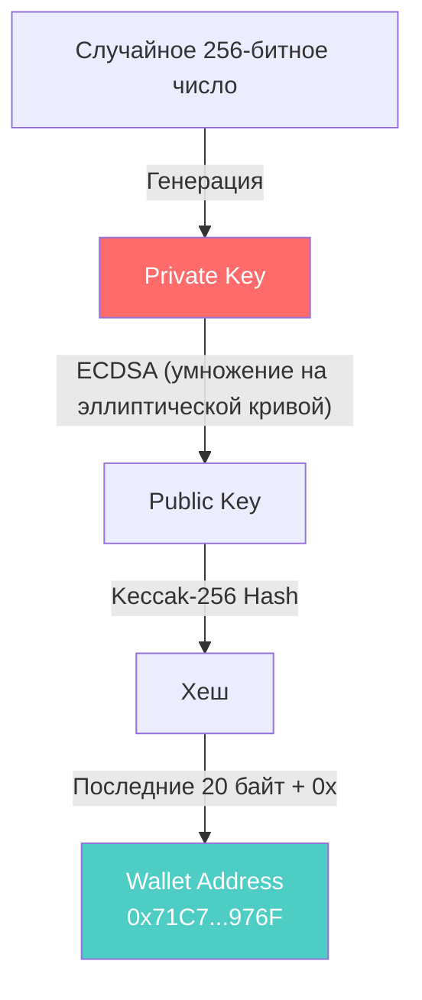
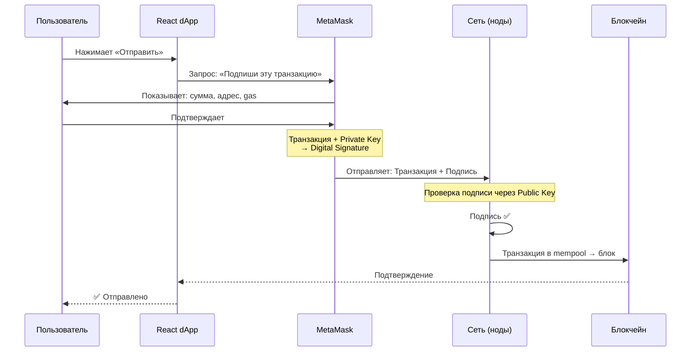
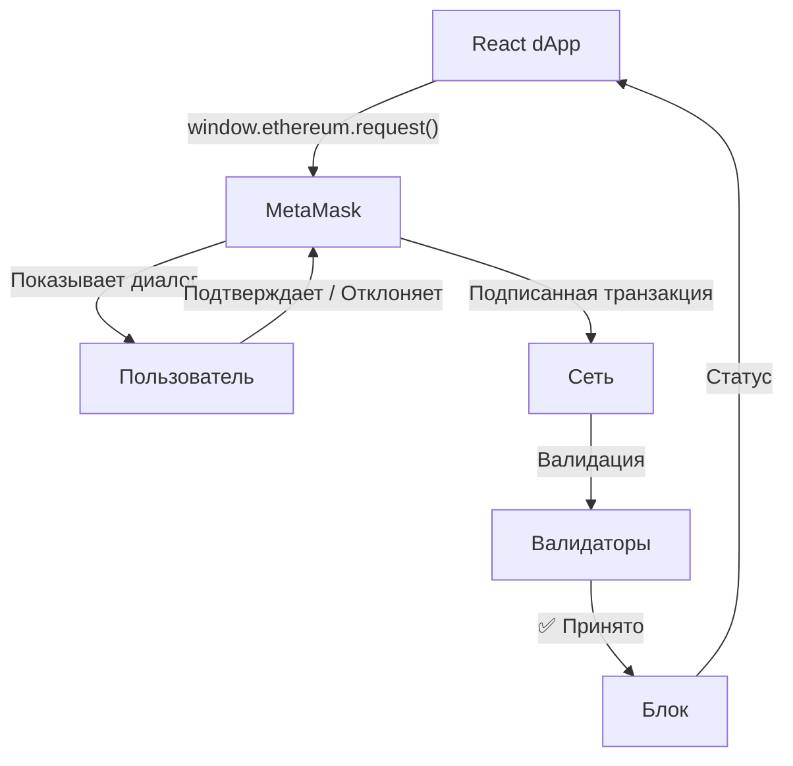

# Урок 3. Кошелёк, приватный ключ и цифровая подпись

## Краткое определение

Криптографический кошелёк — это не программа, а пара ключей (приватный + публичный), где приватный ключ создаёт цифровые подписи для авторизации транзакций, а публичный ключ позволяет сети проверить подпись, не раскрывая сам приватный ключ.

---

## Подробное объяснение

### Центральный вопрос Web3

Практически всё в Web3 сводится к одной задаче:

> Как доказать сети, что именно ты владелец кошелька, не раскрывая свой секрет?

В Web2 это решается через логин и пароль — сервер хранит твои учётные данные и проверяет их при каждом запросе.

В Web3 нет центрального сервера, которому можно доверить секрет. Нужен механизм, который позволяет **доказать владение**, не раскрывая сам секрет никому — ни сети, ни валидаторам, ни разработчикам dApp.

Именно эту задачу решает криптография с открытым ключом.

### Что такое кошелёк на самом деле?

Большинство новичков думают: **MetaMask = кошелёк**.

На самом деле:

```
MetaMask — это приложение для управления кошельком

Кошелёк — это пара криптографических ключей:
    ├── Private Key (приватный ключ)
    └── Public Key (публичный ключ)
```

MetaMask лишь помогает:
- хранить ключи (в зашифрованном виде в браузере);
- подписывать транзакции;
- показывать баланс (читая данные из блокчейна);
- подключаться к сайтам (через window.ethereum API).

Если установить MetaMask на другой компьютер и импортировать тот же **приватный ключ** (или seed-фразу), ты получишь доступ к тому же самому кошельку. Потому что кошелёк — это ключи, а не программа.

### Аналогия с сейфом

Представь огромное хранилище с тысячами сейфов:

| Компонент | Аналог в Web3 |
|---|---|
| Номер сейфа (виден всем) | Wallet Address |
| Ключ от сейфа (только у владельца) | Private Key |
| Открыть сейф может любой, у кого есть ключ | Подписать транзакцию может только владелец приватного ключа |
| Знать номер сейфа ≠ иметь доступ | Знать адрес ≠ иметь доступ к средствам |

Любой может знать номер твоего сейфа — это безопасно. Но открыть его сможет только тот, у кого есть ключ.

---

## Private Key (приватный ключ)

**Приватный ключ** — случайно сгенерированное 256-битное число.

Пример (условный):
```
8F91A72C3B...
```

В реальности это 64-символьная hex-строка (32 байта). Пространство возможных значений:

```
2²⁵⁶ ≈ 1.16 × 10⁷⁷
```

Это больше, чем количество атомов в наблюдаемой Вселенной (≈10⁸⁰). Подобрать приватный ключ перебором **практически невозможно**.

### Что даёт приватный ключ

Владелец приватного ключа может:
- отправлять транзакции от имени адреса;
- переводить токены и ETH;
- подписывать сообщения;
- взаимодействовать со смарт-контрактами;
- подтверждать владение адресом.

### Правило №1 в Web3

> **Никогда и никому не сообщай свой Private Key.**

Если кто-то узнает твой приватный ключ, он получит **полный контроль** над всеми активами, связанными с этим адресом. Без возможности отмены. Без поддержки. Без страховки.

---

## Public Key (публичный ключ)

Из приватного ключа **математически вычисляется** публичный ключ:

```
Private Key
    ↓
Математическая функция (ECDSA — elliptic curve)
    ↓
Public Key
```

Ключевое свойство — **односторонность**:

| Направление | Возможно? |
|---|---|
| Private Key → Public Key | ✅ Да (миллисекунды) |
| Public Key → Private Key | ❌ Нет (вычислительно невозможно) |

Это как смешивание красок:

```
Жёлтая + Синяя → Зелёная   (легко)
Зелёная → Жёлтая + Синяя   (практически невозможно разделить обратно)
```

Криптография использует тот же принцип: прямое преобразование тривиально, обратное — вычислительно неосуществимо при текущих мощностях.

---

## Wallet Address (адрес кошелька)

Адрес — это **не публичный ключ**, а его производная:

```
Private Key → Public Key → Hash → Wallet Address
```

Процесс (для Ethereum):
1. Приватный ключ → Публичный ключ (через ECDSA, 64 байта)
2. Публичный ключ → Keccak-256 хеш
3. Берутся последние 20 байт хеша → это и есть адрес
4. Добавляется префикс `0x`

Пример адреса:
```
0x71C7656EC7ab88b098defB751B7401B5f6d8976F
```

### Почему адрес можно публиковать?

Потому что из адреса **невозможно** восстановить:
- публичный ключ (хеш-функция односторонняя);
- приватный ключ (два односторонних преобразования).

Зная только адрес, злоумышленник не может ни подписать транзакцию, ни получить доступ к средствам.

---

## Что хранится в блокчейне?

Приватный ключ **никогда не хранится в блокчейне**.

В блокчейне хранятся:
- адреса;
- балансы;
- смарт-контракты;
- транзакции;
- цифровые подписи (созданные приватным ключом, но не содержащие его).

Приватный ключ всегда остаётся у владельца.

### Тогда как сеть понимает, что транзакцию отправил именно ты?

Через **цифровую подпись**.

---

## Цифровая подпись (Digital Signature)

Когда ты хочешь отправить 10 ETH Сергею, MetaMask **не отправляет приватный ключ** в сеть. Вместо этого:

```
Транзакция + Private Key → Digital Signature
```

В сеть уходит:
- сама транзакция (кому, сколько, данные);
- цифровая подпись.

### Что доказывает подпись

Цифровая подпись доказывает два факта:

1. **Авторство:** сообщение действительно подписал владелец приватного ключа
2. **Целостность:** сообщение не изменялось после подписания

Если изменить хотя бы один символ в транзакции:

```
Было:   10 ETH → Сергей
Стало: 100 ETH → Сергей
```

То старая подпись станет **недействительной**. Нужно создавать новую подпись — с тем же приватным ключом, но для нового содержимого транзакции.

### Почему нельзя подделать подпись?

Схема работает так:

```
Создание подписи (только с Private Key):
    Private Key + Сообщение → Подпись

Проверка подписи (с Public Key):
    Подпись + Сообщение + Public Key → ✅ Действительна / ❌ Недействительна
```

- **Создать** корректную подпись можно **только** с приватным ключом
- **Проверить** подпись может **кто угодно**, имея публичный ключ
- Из подписи **невозможно** извлечь приватный ключ

Сеть проверяет подпись, используя публичный ключ отправителя, но **не узнаёт** сам приватный ключ. Это магия криптографии с открытым ключом.

---

## Полный путь: создание кошелька



## Полный путь: отправка транзакции



---

## Роль Frontend в работе с кошельком



**Ключевой момент:** React-приложение **никогда не получает приватный ключ**. И это спроектировано намеренно.

### Почему dApp не может украсть ключ?

Если dApp написан корректно, он:
1. Говорит кошельку: «Пожалуйста, подпиши вот эту транзакцию»
2. Кошелёк показывает пользователю **окно подтверждения** с деталями
3. Пользователь принимает решение — видит, кому и сколько
4. Только после явного подтверждения создаётся подпись
5. Приватный ключ **не покидает пределы кошелька**

dApp получает только **подпись**, а не ключ. Подпись валидна только для конкретной транзакции и не может быть использована повторно для другой.

---

## Сравнение: Web2 аутентификация vs Web3 подпись

| Критерий | Web2 (логин/пароль) | Web3 (подпись) |
|---|---|---|
| **Что передаётся** | Пароль (секрет) | Подпись (не секрет) |
| **Кто проверяет** | Сервер (сравнивает с хешем в БД) | Любой узел сети (математически) |
| **Можно ли подделать** | Украсть/угадать пароль | Нет без приватного ключа |
| **Раскрывает ли секрет** | Да (сервер знает пароль или его хеш) | Нет (подпись не содержит приватный ключ) |
| **Повторное использование** | Пароль работает для всех сессий | Подпись валидна только для одной транзакции |
| **Ответственность** | Сервер (можно восстановить пароль) | Пользователь (потерял ключ = потерял всё) |

---

## Аналогии

### 1. Сейф в хранилище

| Компонент | Аналог |
|---|---|
| Номер сейфа (публичный) | Wallet Address |
| Ключ от сейфа (секретный) | Private Key |
| Сейфовое хранилище | Блокчейн |
| Открытие сейфа | Подписание транзакции |

### 2. Смешивание красок

```
Жёлтая + Синяя → Зелёная     ← легко (Private → Public)
Зелёная → Жёлтая + Синяя     ← невозможно (Public ↛ Private)
```

### 3. Подпись на документе

Твоя рукописная подпись уникальна. Эксперт может проверить, что это твоя подпись, но не может «извлечь» твою руку из подписи. Так же и цифровая подпись: проверяется математически, но приватный ключ остаётся в секрете.

### 4. Пропуск в здание

- **Адрес** — номер твоего пропуска (виден всем)
- **Приватный ключ** — магнитная карта (только у тебя)
- **Подпись** — факт прикладывания карты к считывателю (доказывает, что карта у тебя, но не раскрывает её код)

---

## Типичные ошибки новичков

### ❌ «MetaMask хранит деньги»

Нет. Все активы находятся в блокчейне. MetaMask — лишь интерфейс для взаимодействия с ними. Как банковское приложение показывает баланс, но не хранит наличные в телефоне.

### ❌ «Адрес кошелька — это секрет»

Нет. Адрес можно и нужно публиковать (для получения переводов). Из адреса невозможно восстановить приватный ключ. Секретом является только приватный ключ.

### ❌ «Public Key и Wallet Address — одно и то же»

Нет. Адрес — это хеш от публичного ключа (последние 20 байт Keccak-256). Это дополнительный уровень защиты: даже если когда-нибудь ECDSA будет взломан, хеш-функция всё ещё защищает приватный ключ.

### ❌ «Подпись содержит приватный ключ»

Нет. Подпись **создаётся с использованием** приватного ключа, но не содержит его. Из подписи невозможно извлечь приватный ключ. Именно это свойство позволяет безопасно отправлять подписи в публичную сеть.

### ❌ «React-приложение получает доступ к приватному ключу»

Нет. Браузерное расширение MetaMask изолирует приватный ключ. dApp взаимодействует с MetaMask через `window.ethereum` API, который никогда не раскрывает приватный ключ. dApp говорит «подпиши это» → MetaMask показывает диалог → пользователь подтверждает → dApp получает только подпись.

### ❌ «Если я знаю чей-то адрес, я могу что-то украсть»

Нет. Адрес — это публичная информация. Все транзакции в блокчейне видны всем, включая адреса отправителей и получателей. Без приватного ключа невозможно совершить никаких действий с адреса.

---

## Вопросы с собеседований

1. **Что такое Wallet (кошелёк) в Web3?**  
   Криптографическая сущность — пара ключей (приватный + публичный). Не программа, а математический объект. MetaMask и другие приложения лишь управляют кошельком.

2. **Что такое Private Key?**  
   Секретный 256-битный ключ. Единственное, что доказывает владение адресом. Позволяет подписывать транзакции, переводить токены, взаимодействовать с контрактами.

3. **Что такое Public Key?**  
   Открытый ключ, математически вычисленный из приватного через ECDSA. Используется для проверки цифровых подписей. Не может быть использован для восстановления приватного ключа.

4. **Чем Public Key отличается от Wallet Address?**  
   Public Key — полный открытый ключ (64 байта). Wallet Address — хеш от публичного ключа (последние 20 байт Keccak-256) с префиксом 0x. Адрес короче и добавляет дополнительный уровень защиты через хеширование.

5. **Как создаётся Wallet Address?**  
   Private Key → Public Key (ECDSA) → Keccak-256 Hash → последние 20 байт → префикс 0x → Wallet Address.

6. **Почему нельзя вычислить Private Key по Public Key?**  
   Потому что ECDSA — односторонняя функция на эллиптической кривой. Умножение точки на число легко, а дискретное логарифмирование на эллиптической кривой — вычислительно неразрешимая задача.

7. **Что такое цифровая подпись?**  
   Криптографическое доказательство того, что: (1) сообщение подписано владельцем приватного ключа, (2) сообщение не изменялось после подписания. Создаётся из приватного ключа и данных транзакции.

8. **Что именно отправляется в сеть при подписании транзакции?**  
   Сама транзакция (адрес получателя, сумма, данные) + цифровая подпись. Приватный ключ НЕ отправляется — он остаётся в кошельке.

9. **Почему изменение транзакции делает подпись недействительной?**  
   Подпись вычисляется из хеша транзакции. При изменении любого бита транзакции её хеш полностью меняется (лавинный эффект), и старая подпись больше не соответствует новому хешу.

10. **Почему безопасно публиковать адрес кошелька?**  
    Потому что адрес — это хеш от публичного ключа. Даже зная адрес, невозможно восстановить ни публичный, ни приватный ключ. Все операции требуют подписи приватным ключом.

11. **Где хранится приватный ключ?**  
    Только у пользователя: в MetaMask (зашифрован в браузере), аппаратном кошельке (Ledger, Trezor) или бумажном кошельке. Никогда не хранится в блокчейне и не передаётся в сеть.

12. **Почему dApp не имеет доступа к приватному ключу пользователя?**  
    Потому что MetaMask изолирует ключи и предоставляет только API для запроса подписей (`eth_sendTransaction`, `personal_sign`). Приватный ключ никогда не передаётся в JavaScript-контекст страницы.

13. **Что такое seed-фраза и как она связана с приватным ключом?**  
    Seed-фраза (мнемоническая фраза, обычно 12 или 24 слова) — человекочитаемое представление мастер-ключа, из которого детерминированно генерируются все приватные ключи кошелька (BIP-39, BIP-32).

14. **Можно ли восстановить кошелёк, зная только адрес?**  
    Нет. Адрес — это публичная информация, из которой невозможно восстановить приватный ключ. Восстановить кошелёк можно только по приватному ключу или seed-фразе.

15. **Что произойдёт, если отправить транзакцию с неверной подписью?**  
    Сеть (валидаторы) проверит подпись через публичный ключ отправителя, обнаружит несоответствие и отвергнет транзакцию. Она даже не попадёт в mempool.

---

## Практические выводы

Frontend Web3-разработчик должен помнить:

- **Ты никогда не работаешь с приватным ключом напрямую** — только через API кошелька (MetaMask, WalletConnect)
- **Кошелёк — это пара ключей, а не приложение** — именно ключи определяют владение, программа лишь интерфейс
- **Подпись ≠ приватный ключ** — подпись доказывает владение, но не раскрывает ключ
- **Храни данные в блокчейне, ключи — у пользователя** — разделяй ответственность: ончейн/офчейн
- **Проверяй статус подписи** — пользователь может отклонить транзакцию в MetaMask. Обрабатывай этот кейс
- **Подпись валидна только для конкретных данных** — нельзя переиспользовать подпись для другой транзакции
- **Адрес можно показывать в UI без ограничений** — это публичная информация
- **Никогда не проси приватный ключ у пользователя** — если ты просишь seed-фразу или приватный ключ, ты фишинг

---

## Связанные темы

- [[0_lesson-01-chto-takoe-web3|Урок 1. Что такое Web3]] — архитектура Web3
- [[0_lesson-02-kak-ustroen-blokchein|Урок 2. Как устроен блокчейн]] — блоки, хеши, цепочка
- [[0_lesson-04]] — Урок 4 (следующий)
- [[Словарь-web3]] — Полный глоссарий терминов
- [[Паттерны-транзакций-React]] — Как правильно обрабатывать подписание и транзакции в React
- [[wagmi-RainbowKit-фронтенд]] — React-хуки для работы с кошельком

---

## Краткий конспект (для быстрого повторения)

1. Кошелёк — это пара криптографических ключей (приватный + публичный), а не программа
2. MetaMask — приложение для управления кошельком: хранит ключи, подписывает, показывает баланс
3. Private Key — секретный 256-битный ключ, единственное доказательство владения адресом
4. Правило №1: никогда и никому не передавай приватный ключ
5. Public Key — математически вычисляется из приватного (ECDSA). Односторонняя функция
6. Из Public Key невозможно восстановить Private Key (дискретное логарифмирование на эллиптической кривой)
7. Wallet Address = Keccak-256(Public Key) → последние 20 байт → префикс 0x
8. Адрес — публичная информация, не секрет. Можно и нужно показывать
9. Приватный ключ никогда не хранится в блокчейне — только у пользователя
10. Цифровая подпись = Транзакция + Private Key (криптографическая операция)
11. Подпись доказывает: авторство (владелец ключа) + целостность (данные не менялись)
12. Проверить подпись можно через Public Key, не зная Private Key
13. Подделать подпись без приватного ключа невозможно
14. Изменение любого бита транзакции → подпись недействительна (лавинный эффект)
15. dApp никогда не получает приватный ключ — только просит кошелёк подписать
16. MetaMask изолирует ключи, dApp взаимодействует через `window.ethereum` API
17. Пользователь всегда видит и подтверждает детали транзакции перед подписанием
18. Подпись валидна только для конкретной транзакции, не переиспользуется
19. Seed-фраза (12/24 слова) — человекочитаемый мастер-ключ для восстановления всех ключей кошелька
20. Потеря приватного ключа = потеря всех активов. Необратимо

---

## Flashcards

**Q: Что такое кошелёк в Web3?**  
A: Пара криптографических ключей (приватный + публичный). Не программа, а математическая сущность.

---

**Q: Что такое Private Key?**  
A: Секретный 256-битный ключ, доказывающий владение адресом. Позволяет подписывать транзакции.

---

**Q: Что такое Public Key?**  
A: Открытый ключ, вычисленный из приватного через ECDSA. Используется для проверки подписей.

---

**Q: Чем Public Key отличается от Wallet Address?**  
A: Public Key — 64 байта, Address — Keccak-256 хеш от Public Key (последние 20 байт) + префикс 0x.

---

**Q: Как создать Wallet Address?**  
A: Private Key → Public Key (ECDSA) → Keccak-256 → последние 20 байт → 0x + hex.

---

**Q: Почему нельзя вычислить Private Key из Public Key?**  
A: ECDSA основан на дискретном логарифмировании на эллиптической кривой — вычислительно неразрешимая задача.

---

**Q: Что такое цифровая подпись?**  
A: Криптографическое доказательство авторства и целостности. Создаётся из Private Key + данных. Не содержит сам приватный ключ.

---

**Q: Что отправляется в сеть при транзакции?**  
A: Данные транзакции + цифровая подпись. Приватный ключ НЕ отправляется.

---

**Q: Почему изменение транзакции ломает подпись?**  
A: Подпись вычисляется из хеша транзакции. Лавинный эффект: любое изменение данных → другой хеш → старая подпись недействительна.

---

**Q: Почему безопасно публиковать адрес?**  
A: Адрес — хеш от Public Key. Восстановить ключи из адреса невозможно. Все действия требуют подписи.

---

**Q: Где хранится приватный ключ?**  
A: Только у пользователя: MetaMask (зашифрован), аппаратный кошелёк, бумажный. Никогда в блокчейне.

---

**Q: Почему dApp не получает приватный ключ?**  
A: MetaMask изолирует ключи. dApp взаимодействует через API (`eth_sendTransaction`), не имея доступа к ключу.

---

**Q: Что такое seed-фраза?**  
A: Мнемоническая фраза (12/24 слова) — человекочитаемый мастер-ключ, из которого генерируются все приватные ключи кошелька.

---

**Q: Можно ли восстановить кошелёк по адресу?**  
A: Нет. Адрес — публичная информация. Восстановление только по приватному ключу или seed-фразе.

---

**Q: Что будет, если отправить транзакцию с неверной подписью?**  
A: Валидаторы проверят подпись через Public Key, обнаружат несоответствие и отвергнут транзакцию.

---

**Q: Почему подпись нельзя подделать?**  
A: Создание подписи требует приватного ключа. Проверка — через публичный. Без приватного ключа корректную подпись не создать.

---

**Q: Хранит ли MetaMask деньги?**  
A: Нет. Активы в блокчейне. MetaMask — интерфейс для доступа к ним (как банковское приложение).

---

**Q: Что такое односторонняя функция в контексте ключей?**  
A: Private → Public легко (миллисекунды). Public → Private вычислительно невозможно (дискретный логарифм на эллиптической кривой).

---

**Q: Видит ли dApp приватный ключ при подписании?**  
A: Нет. dApp говорит MetaMask «подпиши это», MetaMask показывает диалог пользователю, и только подпись возвращается в dApp.

---

**Q: Что произойдёт при потере приватного ключа?**  
A: Полная и необратимая потеря доступа ко всем активам на этом адресе. Никто не сможет восстановить доступ.

---

## Термины

| Термин | Определение | Роль |
|---|---|---|
| **Wallet (Кошелёк)** | Пара криптографических ключей: приватный + публичный | Идентификация и авторизация в Web3 |
| **Private Key** | Секретный 256-битный ключ. Создаёт цифровые подписи | Доказательство владения адресом |
| **Public Key** | Открытый ключ, вычисленный из приватного через ECDSA | Проверка цифровых подписей |
| **Wallet Address** | Keccak-256 хеш от публичного ключа, 20 байт + префикс 0x | Публичный идентификатор для получения переводов |
| **Digital Signature** | Криптографическая подпись: сообщение + приватный ключ | Доказательство авторства и целостности транзакции |
| **ECDSA** | Elliptic Curve Digital Signature Algorithm | Алгоритм создания и проверки подписей в Ethereum |
| **Seed Phrase** | Мнемоническая фраза (12/24 слов), мастер-ключ кошелька | Человекочитаемое резервное копирование всех ключей |
| **Keccak-256** | Хеш-функция, используемая в Ethereum | Создание адресов, хеширование данных |
| **Односторонняя функция** | Легко вычислить в одну сторону, невозможно в обратную | Основа безопасности асимметричной криптографии |
| **window.ethereum** | API, который MetaMask инжектит в браузер | Взаимодействие dApp с кошельком без доступа к ключам |

---

## Теги

`#web3` `#кошелёк` `#криптография` `#приватный-ключ` `#цифровая-подпись` `#ECDSA` `#урок` `#MetaMask` `#адрес` `#безопасность`
