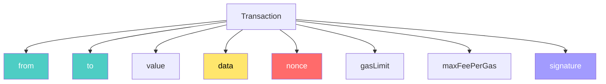
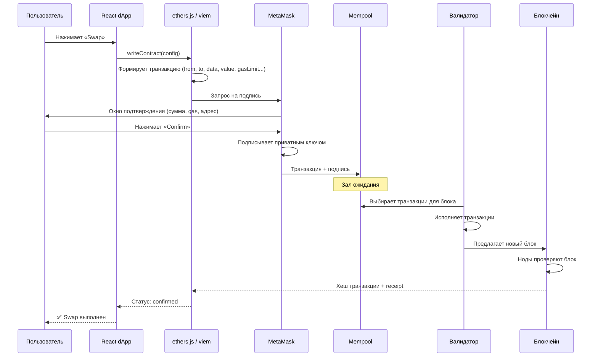

# Урок 4. Транзакция: что происходит после нажатия кнопки?

## Краткое определение

Транзакция в Ethereum — это подписанная инструкция для блокчейна, содержащая адрес отправителя, получателя, количество ETH, закодированный вызов функции, лимит газа, цену газа, порядковый номер (nonce) и цифровую подпись, которая проходит путь от кошелька через mempool до включения в блок и окончательного подтверждения.

---

## Подробное объяснение

### Что такое транзакция на самом деле?

Новички обычно думают: **транзакция = перевод денег**.

На самом деле это лишь **один из видов** транзакций. Транзакция — это **подписанная инструкция для блокчейна**. Например:

- «Переведи 1 ETH» — перевод
- «Вызови функцию `swap()`» — обмен токенов на DEX
- «Создай NFT» — mint
- «Проголосуй в DAO» — governance
- «Дай разрешение контракту тратить мои токены» — `approve()`

**Все эти действия — транзакции.** Отличаются они содержимым поля `data`, которое мы разберём ниже.

### Полная структура транзакции



---

## Разбор каждого поля

### `from` — отправитель

```
from: 0xA123...
```

Адрес, с которого отправляется транзакция.

Важно: пользователь **не пишет его вручную**. Кошелёк (MetaMask) автоматически определяет `from` как адрес, соответствующий приватному ключу, которым подписана транзакция. Сеть проверяет, что подпись действительно соответствует этому `from`.

### `to` — получатель

Два возможных варианта:

**1. Перевод пользователю:**
```
to: 0xB456...    ← адрес другого кошелька
```
Обычный перевод ETH от человека к человеку.

**2. Вызов смарт-контракта:**
```
to: 0xContract...    ← адрес смарт-контракта
```
Когда ты нажимаешь **Swap**, **Stake**, **Mint NFT** — ты отправляешь транзакцию не человеку, а **смарт-контракту**. Именно так работают все dApp.

### `value` — количество ETH

```
value: 0.5 ETH
value: 1 ETH
value: 0 ETH    ← очень частый случай
```

Интересный факт: **очень многие транзакции вообще не переводят ETH**. Например, вызов `approve()` — ты даёшь разрешение контракту тратить твои токены, но сам ETH не переводишь. `value = 0`, а транзакция всё равно существует и потребляет газ.

### `data` — сердце Web3

Именно здесь находится информация о том, **какую функцию вызвать**:

```
transfer(to, amount)
swap(tokenIn, tokenOut, amount)
mint(uri)
approve(spender, amount)
stake(amount)
vote(proposalId)
```

Все аргументы функции кодируются в бинарный формат через **ABI encoding** (Application Binary Interface) и помещаются в поле `data`.

Именно благодаря `data` блокчейн понимает, какую функцию смарт-контракта нужно выполнить и с какими параметрами.

#### Аналогия с письмом

```
Конверт:
    От кого (from)
    Кому (to)

Внутри конверта:
    Текст сообщения (data)
```

Поле `data` — это содержимое письма. Конверт говорит *куда*, а data говорит *что сделать*.

### `nonce` — порядковый номер

**Nonce** — это последовательный счётчик транзакций конкретного аккаунта:

```
Транзакция №1: nonce = 0
Транзакция №2: nonce = 1
Транзакция №3: nonce = 2
...
```

Каждый аккаунт ведёт **собственный счётчик**. Nonce начинается с 0 и увеличивается на 1 с каждой подтверждённой транзакцией.

#### Почему nonce необходим? Защита от replay-атак

Представь мир без nonce:

1. Ты отправил транзакцию «Перевести 10 ETH → Сергей»
2. Злоумышленник перехватил это сообщение
3. И начал отправлять его снова. И снова. И снова.

Без nonce сеть не смогла бы отличить оригинал от копий. Каждая копия выглядела бы как валидная.

**Nonce защищает от атаки повторного воспроизведения (replay attack):** транзакция с уже использованным nonce будет отклонена сетью.

#### Дополнительное свойство nonce: порядок

Nonce также обеспечивает **строгий порядок** выполнения:

- Транзакция с nonce = 5 **не может быть выполнена**, пока не выполнены nonce 0–4
- Это гарантирует последовательность операций с одного аккаунта

### `gasLimit` — лимит вычислений

Представь компьютер. Каждая инструкция требует процессорного времени. В Ethereum каждая операция требует **gas**.

```
x = 5         ← мало газа
for (...) {}  ← много газа
```

`gasLimit` — это максимальное количество газа, которое пользователь **разрешает потратить** на выполнение транзакции.

- Если газа хватило — транзакция выполняется, неизрасходованный газ возвращается
- Если газа **не хватило** — транзакция откатывается (revert), но газ **всё равно сгорает** (потому что валидаторы уже потратили вычислительные ресурсы на попытку выполнения)

### `maxFeePerGas` — максимальная цена за газ

Gas — это количество вычислений. Но сколько стоит одна единица газа?

После обновления **EIP-1559** (London Hard Fork, август 2021) пользователь указывает:

- `maxFeePerGas` — максимальная цена за единицу газа, которую он готов заплатить
- `maxPriorityFeePerGas` — чаевые валидатору (опционально)

Фактическая цена складывается из:
- **base fee** — базовая комиссия сети (определяется протоколом, сжигается)
- **priority fee** — чаевые валидатору (стимул включить транзакцию в блок)

```
Итоговая комиссия ≈ использованный Gas × (base fee + priority fee)
```

Подробнее о механизме EIP-1559 и рынке газа — в отдельном уроке.

### `signature` — цифровая подпись

Подтверждает: **именно владелец приватного ключа** создал эту транзакцию. Без валидной подписи сеть отвергнет транзакцию на этапе проверки, даже не допустив её в mempool.

Подпись создаётся из хеша транзакции + приватного ключа. Проверяется через публичный ключ отправителя.

---

## Полный жизненный цикл транзакции



### Этапы детально

| Этап | Где | Что происходит |
|---|---|---|
| **1. Формирование** | React / библиотека | dApp формирует объект транзакции: `to`, `data`, `value`, `gasLimit` |
| **2. Запрос кошельку** | MetaMask API | Библиотека отправляет транзакцию в MetaMask через `window.ethereum` |
| **3. Подтверждение** | Пользователь | MetaMask показывает диалог с деталями. Пользователь проверяет и нажимает Confirm |
| **4. Подписание** | MetaMask | Приватным ключом подписывается хеш транзакции. Ключ не покидает MetaMask |
| **5. Mempool** | Сеть | Подписанная транзакция попадает в очередь ожидающих транзакций |
| **6. Включение в блок** | Валидатор | Валидатор выбирает транзакции из mempool, формирует блок, исполняет их |
| **7. Подтверждение** | Блокчейн | Блок добавлен в цепочку. Фронтенд получает receipt с status = 1 (success) |

### Что должен показывать UI на каждом этапе

Хороший Web3-интерфейс отображает **разные состояния**, а не просто спиннер «Загрузка...»:

```
⏳ Ожидание подтверждения в кошельке...    ← MetaMask открыт, ждём пользователя
📤 Транзакция отправлена                     ← ушла в mempool
⏳ Ожидает включения в блок...              ← в mempool, ждём валидатора
✅ Подтверждена (12 подтверждений)          ← в блоке, финально
```

Именно поэтому UX в Web3 сложнее, чем в REST-приложениях: между нажатием кнопки и результатом проходят **секунды или минуты**, и нужно информировать пользователя на каждом шаге.

---

## Сравнение: REST-запрос vs Транзакция

| Критерий | REST API (Web2) | Транзакция (Web3) |
|---|---|---|
| **Инициация** | `fetch()` → сразу уходит | `writeContract()` → ждёт подпись пользователя |
| **Подтверждение** | HTTP-ответ через ~100 мс | Блок: 12 сек – минуты |
| **Откат** | Сервер может откатить | Транзакция необратима после подтверждения |
| **Стоимость** | Бесплатно | Платит пользователь (gas) |
| **Повтор** | Идемпотентность через токены | Защита через nonce |
| **Промежуточные состояния** | Нет | Mempool → Блок → Подтверждения |
| **Плата за ошибку** | Ошибка бесплатна | Revert сжигает gas |

---

## Аналогии

### 1. Письмо в конверте

| Компонент письма | Поле транзакции |
|---|---|
| От кого | `from` |
| Кому | `to` |
| Текст сообщения | `data` |
| Подпись отправителя | `signature` |
| Номер письма в переписке | `nonce` |

### 2. Зал ожидания аэропорта

**Mempool** — это зал ожидания. Все транзакции уже зарегистрированы (прошли проверку подписи и nonce), но ещё не «сели в самолёт» (не включены в блок). Валидаторы — диспетчеры, которые решают, какие транзакции посадят в следующий рейс.

### 3. Бензин в автомобиле

`gasLimit` — объём бензобака (максимум, сколько готов потратить). `maxFeePerGas` — максимальная цена за литр. Фактический расход — сколько бензина реально сжёг двигатель (операции EVM). Неиспользованный бензин возвращается в бак.

---

## Типичные ошибки новичков

### ❌ «После нажатия кнопки транзакция сразу выполнена»

Нет. Между нажатием и подтверждением проходит несколько этапов: подпись в MetaMask → mempool → включение в блок → подтверждение. Время может составлять от 12 секунд до нескольких минут.

### ❌ «`to` — всегда адрес человека»

Нет. Чаще `to` — это адрес смарт-контракта. Swap на Uniswap, mint NFT, stake — всё это вызовы функций контракта, а не переводы человеку.

### ❌ «`value` всегда больше нуля»

Нет. Огромное количество транзакций имеют `value = 0`. Например, `approve()`, `vote()`, `delegate()`, вызов view-подобных функций через транзакцию.

### ❌ «`nonce` — случайное число»

Нет. Nonce — строго последовательный счётчик (0, 1, 2, 3...) для каждого аккаунта. Это фундаментальный механизм защиты от replay-атак и обеспечения порядка.

### ❌ «`gasLimit` — это итоговая комиссия»

Нет. `gasLimit` — лимит вычислений (максимальное количество gas, разрешённое к использованию). Итоговая комиссия = **фактически использованный gas × фактическая цена за gas**.

### ❌ «Если транзакция в mempool — она точно выполнится»

Нет. Транзакция может «застрять» в mempool надолго, если цена газа слишком низкая. Или может быть вытеснена другой транзакцией с тем же nonce и более высокой ценой газа (replacement).

### ❌ «Ошибка в транзакции = газ возвращается»

Нет. Если транзакция выполнилась, но смарт-контракт вернул ошибку (revert) — газ **сгорает**, потому что валидаторы уже потратили вычислительные ресурсы на исполнение (до точки revert).

---

## Вопросы с собеседований

1. **Что такое транзакция в Ethereum?**  
   Подписанная инструкция для блокчейна. Может быть переводом ETH, вызовом функции смарт-контракта, созданием контракта (deploy). Содержит поля: from, to, value, data, nonce, gasLimit, maxFeePerGas, signature.

2. **Какие основные поля содержит транзакция?**  
   `from` (отправитель), `to` (получатель или контракт), `value` (ETH), `data` (закодированный вызов функции), `nonce` (порядковый номер), `gasLimit` (лимит газа), `maxFeePerGas` (макс. цена за газ), `signature` (подпись).

3. **Для чего нужен nonce?**  
   Защита от replay-атак (повторной отправки одной и той же транзакции) и обеспечение порядка выполнения. Сеть отклоняет транзакцию с уже использованным nonce.

4. **Что хранится в поле `data`?**  
   Закодированный вызов функции смарт-контракта и её аргументов (ABI encoding). Например, `transfer(address,uint256)` → 4 байта селектора функции + 32 байта адреса + 32 байта суммы.

5. **Чем отличается `gasLimit` от цены газа?**  
   `gasLimit` — максимальное количество единиц газа (вычислений). Цена газа — стоимость одной единицы газа в gwei. Итоговая комиссия = использованный газ × цена.

6. **Что такое mempool?**  
   Очередь транзакций, ожидающих включения в блок. Аналог зала ожидания в аэропорту. Валидаторы выбирают транзакции из mempool для следующего блока.

7. **Почему транзакция не сразу попадает в блок?**  
   Потому что блоки создаются с интервалом ~12 секунд, и в каждом блоке ограниченное место (gas limit блока). Транзакция ждёт в mempool, пока валидатор не включит её в блок.

8. **Что происходит после нажатия Confirm в MetaMask?**  
   MetaMask подписывает транзакцию приватным ключом, подпись добавляется к транзакции, и она отправляется в сеть (через RPC-ноду). Далее она попадает в mempool и ждёт включения в блок.

9. **Почему многие транзакции имеют `value = 0`?**  
   Потому что они не переводят ETH, а вызывают функцию смарт-контракта: `approve()`, `vote()`, `delegate()`, `stake()` — ETH не пересылается, меняется только состояние контракта.

10. **Какие этапы проходит транзакция от кнопки до подтверждения?**  
    Формирование → запрос MetaMask → подпись пользователем → отправка в сеть → mempool → включение в блок валидатором → проверка нодами → подтверждение.

11. **Что произойдёт, если отправить две транзакции с одинаковым nonce?**  
    Сеть примет только первую из них (ту, что попадёт в блок раньше). Вторая будет отклонена, потому что nonce уже использован. Это основа защиты от replay-атак.

12. **Что такое ABI encoding?**  
    Application Binary Interface — стандарт кодирования вызовов функций смарт-контракта. Определяет, как сериализовать имя функции и аргументы в бинарный формат для поля `data`.

13. **Почему gas сгорает даже при revert транзакции?**  
    Потому что валидатор уже потратил вычислительные ресурсы на исполнение транзакции до точки revert. Gas оплачивает вычисления, а не результат.

14. **Может ли транзакция «застрять» в mempool?**  
    Да. Если цена газа слишком низкая, валидаторы не включают транзакцию в блок. Она может висеть в mempool часами, пока сеть не загружена или пока пользователь не отправит заменяющую транзакцию с более высокой ценой газа и тем же nonce.

15. **Что такое «заменяющая транзакция» (replacement)?**  
    Отправка новой транзакции с тем же nonce, но более высокой ценой газа. Валидаторы выберут более выгодную (с высокой ценой), а старая будет вытеснена из mempool.

---

## Практические выводы

Frontend Web3-разработчик должен помнить:

- **Транзакция — не мгновенный ответ**, как REST. Проектируй UI с промежуточными состояниями
- **5 этапов в UI:** ожидание кошелька → отправлена → mempool → включается в блок → подтверждена
- **`to` часто контракт, не человек** — не показывай аватарку пользователя для вызова `swap()`
- **`value = 0` — норма**, не думай что транзакция без ETH бесполезна
- **Nonce защищает от повторов** — не пытайся обойти или игнорировать
- **Gas сгорает даже при revert** — предупреждай пользователя, что ошибка не бесплатна
- **Используй `waitForTransactionReceipt()`** — не считай транзакцию выполненной сразу после отправки
- **Показывай цену газа в UI** — пользователь должен видеть, сколько он заплатит
- **Обрабатывай отклонение в MetaMask** — пользователь может нажать «Reject». Это не ошибка приложения
- **Учитывай время блока (~12 сек)** — минимальное ожидание подтверждения

---

## Связанные темы

- [[0_lesson-01-chto-takoe-web3|Урок 1. Что такое Web3]] — архитектура
- [[0_lesson-02-kak-ustroen-blokchein|Урок 2. Как устроен блокчейн]] — блоки, хеши
- [[0_lesson-03-koshelek-privatnyj-kluch-podpis|Урок 3. Кошелёк и подпись]] — приватный ключ, подпись
- [[0_lesson-05-mempool-ozhidanie-transakcii|Урок 5. Mempool и ожидание транзакции]] — проверка нодой, EIP-1559, Pending, Speed Up, Cancel
- [[Паттерны-транзакций-React]] — Обработка состояний транзакции в React
- [[Словарь-web3]] — Глоссарий терминов
- [[Сравнение-ethers-viem-wagmi]] — Библиотеки для отправки транзакций

---

## Краткий конспект (для быстрого повторения)

1. Транзакция — подписанная инструкция для блокчейна, не только перевод денег
2. 9 полей: from, to, value, data, nonce, gasLimit, maxFeePerGas, maxPriorityFeePerGas, signature
3. `from` — определяется кошельком автоматически, не вводится вручную
4. `to` — адрес человека (перевод) ИЛИ адрес контракта (swap, mint, stake)
5. `value` — количество ETH. Часто равен 0 (approve, vote, delegate)
6. `data` — ABI-encoded вызов функции: селектор + аргументы
7. `nonce` — порядковый номер (0, 1, 2...), защита от replay-атак
8. Nonce гарантирует порядок: nonce=5 не выполнится раньше nonce 0–4
9. `gasLimit` — макс. лимит вычислений, не итоговая цена
10. `maxFeePerGas` — макс. цена за единицу газа (EIP-1559)
11. Итоговая комиссия ≈ использованный газ × (base fee + priority fee)
12. `signature` — доказывает авторство, без неё транзакция отвергается
13. Жизненный цикл: React → MetaMask → Подпись → Mempool → Блок → Подтверждение
14. Mempool — зал ожидания, валидаторы выбирают транзакции по цене газа
15. После Confirm транзакция ещё НЕ выполнена — она только попала в mempool
16. 5 UI-состояний: ожидание кошелька → отправлена → mempool → включается → подтверждена
17. При revert газ сгорает — валидатор уже потратил ресурсы на исполнение
18. Nonce защищает от повторной отправки: сеть отвергнет дубликат
19. Транзакция может застрять в mempool при низкой цене газа
20. Замена (replacement): та же транзакция с тем же nonce, но выше цена газа

---

## Flashcards

**Q: Что такое транзакция в Ethereum?**  
A: Подписанная инструкция для блокчейна: перевод ETH, вызов контракта, деплой. Содержит from, to, value, data, nonce, gasLimit, signature.

---

**Q: Какие поля есть в транзакции?**  
A: from, to, value, data, nonce, gasLimit, maxFeePerGas, maxPriorityFeePerGas, signature.

---

**Q: Что такое nonce?**  
A: Порядковый номер транзакции аккаунта (0, 1, 2...). Защищает от replay-атак и обеспечивает порядок.

---

**Q: Почему nonce защищает от повторной отправки?**  
A: Каждый nonce можно использовать только один раз. Сеть отвергает транзакцию с уже использованным nonce.

---

**Q: Что хранится в поле data?**  
A: ABI-кодированный вызов функции смарт-контракта: 4 байта селектора + аргументы.

---

**Q: Чем gasLimit отличается от итоговой комиссии?**  
A: gasLimit — макс. лимит вычислений. Комиссия = использованный газ × цена газа.

---

**Q: Что такое mempool?**  
A: Очередь транзакций, ожидающих включения в блок. Зал ожидания перед «посадкой в самолёт».

---

**Q: Что происходит после нажатия Confirm в MetaMask?**  
A: MetaMask подписывает транзакцию, отправляет в сеть → mempool → валидатор включает в блок.

---

**Q: Почему многие транзакции имеют value = 0?**  
A: Они вызывают функции контракта без перевода ETH: approve(), vote(), delegate(), stake().

---

**Q: Сколько этапов от кнопки до подтверждения?**  
A: 7: формирование → MetaMask → подпись → mempool → блок → проверка нодами → подтверждение.

---

**Q: Что будет, если отправить две транзакции с одинаковым nonce?**  
A: Принята будет только первая. Вторая отвергнута — nonce уже использован.

---

**Q: Возвращается ли газ при revert?**  
A: Нет. Газ сгорает — валидатор уже потратил ресурсы на исполнение до точки revert.

---

**Q: Что такое ABI encoding?**  
A: Стандарт сериализации вызовов функций контракта в бинарный формат для поля data.

---

**Q: Почему транзакция не сразу попадает в блок?**  
A: Блоки создаются каждые ~12 сек, место ограничено gas limit блока. Транзакция ждёт в mempool.

---

**Q: Может ли транзакция застрять в mempool?**  
A: Да — если цена газа слишком низкая. Валидаторы приоритизируют транзакции с высокой ценой.

---

**Q: Как «ускорить» застрявшую транзакцию?**  
A: Отправить заменяющую (replacement) — тот же nonce, та же транзакция, но выше цена газа.

---

**Q: `to` всегда адрес человека?**  
A: Нет. Чаще `to` — адрес смарт-контракта (swap, mint, stake, approve).

---

**Q: Что такое EIP-1559?**  
A: Обновление, изменившее модель газа: base fee (сжигается) + priority fee (валидатору) вместо аукциона первой цены.

---

**Q: Кто определяет поле `from`?**  
A: Кошелёк (MetaMask) автоматически — `from` соответствует подписавшему приватному ключу.

---

**Q: Почему Web3 UX сложнее, чем REST?**  
A: Операция не мгновенна: нужно показывать промежуточные состояния (кошелёк → отправлено → mempool → подтверждено).

---

## Термины

| Термин | Определение | Роль |
|---|---|---|
| **Транзакция** | Подписанная инструкция для блокчейна | Единица изменения состояния |
| **Nonce** | Порядковый номер транзакции аккаунта | Защита от replay-атак, порядок |
| **Gas** | Единица измерения вычислительных затрат | Оплата ресурсов сети |
| **Gas Limit** | Максимальный лимит газа на транзакцию | Предотвращение бесконечного потребления |
| **Gas Price** | Цена за единицу газа в gwei | Определяет приоритет транзакции |
| **Base Fee** | Базовая комиссия сети (EIP-1559), сжигается | Регулирование загруженности сети |
| **Priority Fee** | Чаевые валидатору за включение в блок | Стимул для валидаторов |
| **Mempool** | Очередь ожидающих транзакций | Промежуточный этап перед блоком |
| **ABI Encoding** | Стандарт кодирования вызовов функций контракта | Заполнение поля data |
| **Function Selector** | Первые 4 байта Keccak-256 хеша сигнатуры функции | Идентификация вызываемой функции |
| **Receipt** | Квитанция о выполнении транзакции | Статус, логи, использованный газ |
| **Replay Attack** | Повторная отправка перехваченной транзакции | Модель угрозы (защита: nonce) |
| **Replacement** | Замена транзакции в mempool (тот же nonce, выше gas) | Ускорение застрявших транзакций |
| **Revert** | Откат транзакции с ошибкой | Газ сгорает, состояние не меняется |
| **EIP-1559** | Обновление модели комиссий Ethereum (август 2021) | Base fee + priority fee |

---

## Теги

`#web3` `#транзакция` `#gas` `#nonce` `#mempool` `#ethers` `#урок` `#жизненный-цикл` `#EIP-1559` `#frontend`
