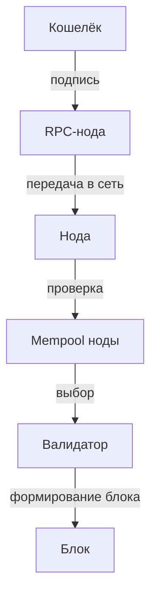

# Урок 5. Mempool и ожидание транзакции

## Краткое определение

Mempool — это набор транзакций, которые нода приняла, но которые ещё не включены в блок. После подписания транзакция отправляется через RPC-ноду в сеть и попадает в mempool конкретной ноды, откуда валидатор выбирает её для включения в следующий блок.

---

## Подробное объяснение

### Основная идея: подпись ≠ включение в блокчейн

После подписания транзакция **ещё не является частью блокчейна**. Она лишь отправлена в сеть и ожидает обработки. Между «подписано в кошельке» и «подтверждено в блоке» проходит время, в течение которого транзакция живёт в mempool.

Важно: **единого глобального mempool Ethereum не существует**. Каждая нода поддерживает **собственный** набор ожидающих транзакций и распространяет их другим нодам. Поэтому mempool одной ноды может незначительно отличаться от mempool другой.

### Жизненный цикл транзакции



```text
Wallet
   ↓
RPC
   ↓
Node
   ↓
Mempool
   ↓
Validator
   ↓
Block
```

### Проверка транзакции

Перед принятием транзакции нода проверяет, в частности:

- цифровую подпись;
- nonce;
- наличие необходимых средств;
- параметры транзакции;
- соответствие правилам протокола.

Если проверка не пройдена — транзакция отклоняется и **не попадает** в mempool.

### Выбор транзакций валидатором

Валидатор формирует блок из доступных транзакций. На выбор влияют:

- `maxFeePerGas`;
- `maxPriorityFeePerGas`;
- `base fee`;
- `gasLimit`;
- `nonce`;
- состояние аккаунта;
- зависимости между транзакциями;
- политика конкретного клиента (execution client).

Нельзя упрощённо утверждать, что валидатор всегда просто сортирует транзакции по максимальной комиссии — реальный механизм сложнее.

### EIP-1559: из чего складывается комиссия

Упрощённо:

```text
Total Fee
=
Base Fee
+
Priority Fee
```

#### Base Fee

Базовая комиссия сети. Определяется **протоколом** в зависимости от заполненности блоков (target gas usage) и **сжигается** — не получает её ни один валидатор.

#### Priority Fee

Дополнительная комиссия валидатору за включение транзакции в блок. Её также называют **tip** (чаевые).

#### maxFeePerGas

Максимальная цена газа, которую пользователь готов заплатить за единицу газа. Фактическая цена газа **не обязана** равняться `maxFeePerGas` — пользователь платит `min(maxFeePerGas, base fee + priority fee)`.

### Pending: состояния транзакции

`Pending` означает, что транзакция отправлена, но ещё не получила требуемого подтверждения.

Основной путь:

```text
Pending
   ↓
Included
   ↓
Confirmed
```

Но возможны и другие исходы:

```text
Pending
   ↓
Dropped
```

или:

```text
Pending
   ↓
Replaced
```

- **Included** — транзакция вошла в блок.
- **Confirmed** — блок (и транзакция в нём) получил подтверждения сети.
- **Dropped** — транзакция вытеснена из mempool (например, как устаревшая).
- **Replaced** — заменена другой транзакцией с тем же nonce.

### Speed Up: ускорение застрявшей транзакции

Кошелёк создаёт новую транзакцию с **тем же nonce**, но с **более высокой комиссией**:

```text
TX A
nonce = 15
fee = low

↓

TX B
nonce = 15
fee = higher
```

В итоге успешно включена может быть только **одна** транзакция с этим nonce — та, которую валидаторы включат раньше.

### Cancel: отмена транзакции

Создаётся новая транзакция с **тем же nonce**, часто с:

```text
to = own address
value = 0
```

и более высокой комиссией. Если она включается в блок раньше исходной, исходная операция **не сможет быть выполнена** — nonce уже использован.

### Важный пример: зависимость по nonce

```text
Account nonce = 7

TX1:
nonce = 7
maxFeePerGas = 20

TX2:
nonce = 8
maxFeePerGas = 50
```

Если TX1 зависла, TX2 **также** может ожидать её выполнения, несмотря на более высокую комиссию.

Причина: транзакции одного аккаунта с последующими nonce **зависят от предыдущих**. Nonce = 8 не может быть выполнен, пока не выполнен nonce = 7, потому что сеть исполняет транзакции аккаунта строго по порядку.

---

## Таблица: понятия для фронтендера

| Понятие | Что означает | Почему важно для Frontend |
|---|---|---|
| **Mempool** | Множество принятых, но не включённых в блок транзакций (у каждой ноды своё) | Транзакция после подписания живёт здесь минуты-часы — UI не должен показывать мгновенный успех |
| **Pending** | Транзакция отправлена, но не подтверждена | Ключевое UI-состояние: показывай спиннер/статус, а не только «отправлено» |
| **Base Fee** | Базовая комиссия протокола, сжигается, зависит от загрузки сети | Меняется между блоками — показывай пользователю актуальную оценку комиссии |
| **Priority Fee** | Чаевые валидатору (tip), мотивация включить транзакцию | Влияет на скорость включения — дай пользователю выбор «быстрее/дешевле» |
| **maxFeePerGas** | Максимальная цена газа, которую готов заплатить пользователь | Реальная цена может быть ниже — не показывай max как финальную стоимость |
| **Speed Up** | Замена с тем же nonce и более высокой комиссией | Готовь механизм «Ускорить» для застрявших транзакций (nonce уже известен) |
| **Cancel** | Замена с тем же nonce, to = свой адрес, value = 0 | Даёт пользователю способ отменить зависшую операцию |
| **Nonce** | Порядковый номер транзакции аккаунта | Определяет порядок и зависимость: блокированная TX блокирует все следующие |
| **Dropped / Replaced** | Вытеснена из mempool / заменена | Обрабатывай эти события: пользователю нужно объяснить, что транзакция не будет выполнена |

---

## Практические задачи

### Задача 1. Определи судьбу транзакций по nonce

Дано:

```text
Account nonce = 5

TX1: nonce = 5, maxFeePerGas = 30
TX2: nonce = 6, maxFeePerGas = 80
TX3: nonce = 7, maxFeePerGas = 40
```

Вопросы:
1. Какая транзакция может быть включена первой? (Ответ: TX1 — минимальный nonce аккаунта, независимо от комиссии.)
2. Что произойдёт, если TX1 останется в mempool, но не будет включена? (Ответ: TX2 и TX3 тоже будут ждать — они зависят от nonce 5.)
3. Что нужно сделать, чтобы разблокировать TX2 и TX3? (Ответ: либо дождаться включения TX1, либо заменить TX1 через Speed Up/Cancel.)

### Задача 2. Speed Up против Cancel

Дано:

```text
Account nonce = 9
TX_stuck: nonce = 9, maxFeePerGas = 15, to = 0xContract, data = swap(...)
```

Нужно:
1. Сформулируй параметры транзакции **Speed Up**. (Ответ: тот же nonce = 9, тот же to/data, maxFeePerGas выше, например 40.)
2. Сформулируй параметры транзакции **Cancel**. (Ответ: тот же nonce = 9, to = свой адрес, value = 0, maxFeePerGas выше, например 40.)
3. Объясни разницу в результате для пользователя. (Ответ: Speed Up выполнит исходную операцию, Cancel — отменит её, но в обоих случаях сгорит комиссия за включённую транзакцию.)

### Задача 3. Состояния UI для pending-транзакции

Опиши, какие состояния должна показывать dApp для транзакции от подписания до подтверждения.

(Ответ: `waiting for wallet` → `sent` (hash получен) → `pending` (в mempool) → `included` (в блоке) → `confirmed` (N подтверждений); отдельно — `replaced` / `dropped` / `failed`.)

### Задача 4. Оценка комиссии в UI

Пользователь устанавливает `maxFeePerGas = 100 gwei`, текущий `base fee = 60 gwei`. Какую сумму реально заплатит пользователь, если выбранная priority fee = 2 gwei?

(Ответ: `min(maxFeePerGas, base fee + priority fee)` = `60 + 2 = 62 gwei` за единицу газа — фактически пользователь платит **меньше** max. Показывай фактическую цену, а не максимум.)

---

## Вопросы с собеседований

1. **Что такое mempool и существует ли единый глобальный mempool?**  
   Mempool — набор принятых, но не включённых в блок транзакций. Единого глобального mempool нет: каждая нода ведёт собственный набор и распространяет его другим нодам.

2. **Что происходит с транзакцией после подписания в кошельке?**  
   Она отправляется через RPC-ноду в сеть, попадает в mempool, проходит проверку ноды и ждёт, пока валидатор включит её в блок.

3. **Какие проверки выполняет нода перед принятием транзакции?**  
   Цифровую подпись, nonce, наличие средств, параметры транзакции и соответствие правилам протокола.

4. **По каким критериям валидатор выбирает транзакции для блока?**  
   По `maxFeePerGas`, `maxPriorityFeePerGas`, `base fee`, `gasLimit`, nonce, состоянию аккаунта, зависимостям между транзакциями и политике клиента. Простой сортировки по комиссии недостаточно.

5. **Как EIP-1559 делит комиссию на части?**  
   `Total Fee = Base Fee + Priority Fee`. Base Fee сжигается, Priority Fee (tip) получает валидатор.

6. **Чем `maxFeePerGas` отличается от фактической цены газа?**  
   `maxFeePerGas` — максимум, который готов заплатить пользователь. Фактическая цена `= min(maxFeePerGas, base fee + priority fee)` и может быть ниже максимума.

7. **Что означает статус Pending?**  
   Транзакция отправлена, но ещё не получила требуемого подтверждения — она ожидает включения в блок.

8. **Какие возможны исходы после Pending?**  
   `Pending → Included → Confirmed`, либо `Pending → Dropped`, либо `Pending → Replaced`.

9. **Что такое Speed Up?**  
   Отправка новой транзакции с тем же nonce и более высокой комиссией. Только одна транзакция с этим nonce будет включена — та, что попадёт в блок раньше.

10. **Что такое Cancel?**  
    Транзакция с тем же nonce, часто `to = own address`, `value = 0` и более высокой комиссией. Если она включена раньше исходной, исходная не выполнится.

11. **Почему TX2 с более высокой комиссией может ждать TX1 с низкой?**  
    Если они из одного аккаунта и nonce TX2 больше nonce TX1, транзакция не может быть выполнена до исполнения предыдущей по nonce — транзакции аккаунта исполняются строго по порядку.

12. **Что произойдёт, если отправить Cancel, но исходная транзакция попадёт в блок первой?**  
    Выполнится исходная транзакция, а Cancel будет отклонён (nonce уже использован) — отменить уже не получится.

---

## Ключевые тезисы урока

1. После подписания транзакция ещё не в блокчейне — она только в mempool.
2. Единого глобального mempool Ethereum не существует — у каждой ноды свой.
3. Жизненный цикл: Wallet → RPC → Node → Mempool → Validator → Block.
4. Нода проверяет подпись, nonce, средства и параметры перед принятием транзакции.
5. Валидатор не сортирует механически по комиссии — влияет много факторов (nonce, зависимости, политика клиента).
6. EIP-1559: `Total Fee = Base Fee + Priority Fee`; Base Fee сжигается, Priority Fee — чаевые валидатору.
7. `maxFeePerGas` — максимум, а не фактическая цена; фактическая цена может быть ниже.
8. Pending может закончиться Confirmed, Dropped или Replaced.
9. Speed Up и Cancel — это замена с тем же nonce и более высокой комиссией; включается только одна.
10. Транзакции одного аккаунта зависимы по nonce: зависшая TX блокирует все последующие.

---

## Связанные темы

- [[0_lesson-04-transakcija-zhiznennyj-cikl|Урок 4. Жизненный цикл транзакции]] — поля транзакции, nonce, gas, путь от кнопки до блока
- [[0_lesson-01-chto-takoe-web3|Урок 1. Что такое Web3]] — роль RPC-нод и кошелька в архитектуре
- [[0_lesson-02-kak-ustroen-blokchein|Урок 2. Как устроен блокчейн]] — ноды, валидаторы, формирование блоков
- [[Паттерны-транзакций-React|Паттерны транзакций в React]] — pending → confirmed → receipt, обработка статусов
- [[Словарь-web3|Словарь терминов web3]] — глоссарий: mempool, nonce, gas
- [[Блокчейн-как-это-работает|Блокчейн — как это работает]] — консенсус, валидаторы, газ
- [[Сравнение-ethers-viem-wagmi|ethers vs viem vs wagmi]] — как библиотеки работают с pending-статусами

---

## Flashcards

**Q: Что такое mempool?**  
A: Набор принятых нодой, но ещё не включённых в блок транзакций. Единого глобального mempool нет — у каждой ноды свой.

**Q: Что происходит с транзакцией после подписания?**  
A: Она отправляется через RPC-ноду в сеть, попадает в mempool и ждёт включения в блок валидатором.

**Q: Существует ли единый глобальный mempool Ethereum?**  
A: Нет. Каждая нода ведёт собственный набор ожидающих транзакций и распространяет его другим нодам.

**Q: Какие проверки проходит транзакция перед принятием нодой?**  
A: Цифровая подпись, nonce, наличие средств, параметры транзакции, правила протокола.

**Q: Всегда ли валидатор сортирует транзакции по максимальной комиссии?**  
A: Нет. Влияют maxFeePerGas, maxPriorityFeePerGas, base fee, gasLimit, nonce, зависимости и политика клиента.

**Q: Из чего складывается Total Fee по EIP-1559?**  
A: `Total Fee = Base Fee + Priority Fee`.

**Q: Кто получает Base Fee?**  
A: Никто — она сжигается. Определяется протоколом по заполненности блоков.

**Q: Что такое Priority Fee?**  
A: Дополнительная комиссия валидатору за включение транзакции в блок. Ещё называют tip.

**Q: Что означает maxFeePerGas?**  
A: Максимальная цена газа, которую пользователь готов заплатить за единицу газа.

**Q: Фактическая цена газа всегда равна maxFeePerGas?**  
A: Нет. Фактическая цена = `min(maxFeePerGas, base fee + priority fee)` — может быть ниже.

**Q: Что означает статус Pending?**  
A: Транзакция отправлена, но ещё не получила требуемого подтверждения.

**Q: Какие возможны исходы из Pending?**  
A: Included → Confirmed, Dropped или Replaced.

**Q: Что такое Speed Up?**  
A: Новая транзакция с тем же nonce и более высокой комиссией — чтобы ускорить включение.

**Q: Сколько транзакций с одним nonce может быть включено?**  
A: Одна. Какая попадёт в блок первой, та и будет выполнена.

**Q: Что такое Cancel?**  
A: Новая транзакция с тем же nonce, часто `to = own address`, `value = 0`, с более высокой комиссией.

**Q: Когда Cancel «срабатывает»?**  
A: Когда новая транзакция включена в блок раньше исходной — тогда исходная не выполнится.

**Q: Что будет, если исходная транзакция попадёт в блок раньше Cancel?**  
A: Выполнится исходная, Cancel будет отклонён — nonce уже использован.

**Q: Почему TX2 (nonce 8, fee 50) ждёт TX1 (nonce 7, fee 20)?**  
A: Транзакции аккаунта исполняются строго по nonce — TX2 зависит от TX1.

**Q: Что блокирует пользовательская зависшая транзакция?**  
A: Все последующие транзакции аккаунта с большим nonce.

**Q: Как разблокировать зависшие транзакции с большим nonce?**  
A: Дождаться включения предыдущей или заменить её через Speed Up / Cancel.

**Q: Что должен показывать UI в состоянии Pending?**  
A: Явный статус «ожидает включения», а не мгновенный успех — плюс опции Speed Up / Cancel.

---

## Термины

| Термин | Определение | Роль |
|---|---|---|
| **Mempool** | Набор принятых, но не включённых в блок транзакций (свой у каждой ноды) | Промежуточный этап между подписью и блоком |
| **Pending Transaction** | Транзакция, отправленная, но не получившая подтверждения | UI-статус ожидания |
| **Base Fee** | Базовая комиссия протокола, сжигается, зависит от загрузки блоков | Регулирование стоимости сети |
| **Priority Fee** | Чаевые валидатору (tip) | Стимул включить транзакцию в блок |
| **Max Fee Per Gas** | Максимальная цена газа пользователя | Верхняя граница стоимости |
| **Replacement Transaction** | Замена с тем же nonce и более высокой комиссией | Механизм Speed Up и Cancel |
| **Speed Up** | Замена для ускорения включения (тот же nonce, выше комиссия) | Восстановление UX при застревании |
| **Cancel** | Замена с тем же nonce, to = свой адрес, value = 0 | Отмена зависшей операции |
| **Nonce** | Порядковый номер транзакции аккаунта | Порядок исполнения, защита от повторов |

---

## Теги

`#web3` `#транзакция` `#mempool` `#pending` `#nonce` `#gas` `#eip-1559` `#speed-up` `#cancel` `#урок`
