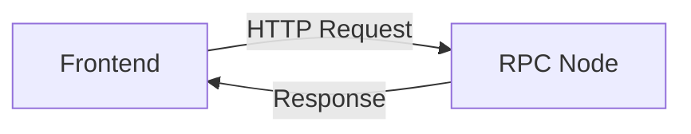
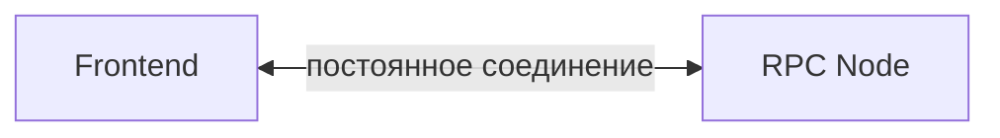
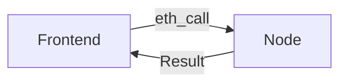
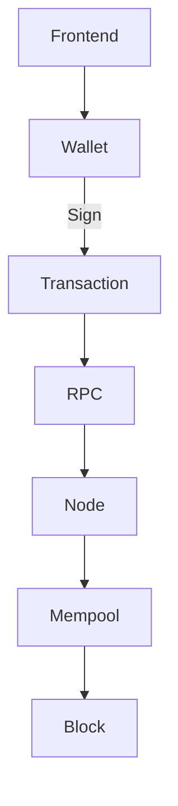

# Урок 6. RPC: как Frontend разговаривает с Ethereum

## Краткое определение

RPC (Remote Procedure Call) — механизм, через который приложение обращается к удалённой Ethereum-ноде за данными или отправляет транзакции. Это интерфейс связи, а не сам блокчейн и не нода.

---

## Подробное объяснение

### Основная идея

Frontend не подключается к блокчейну напрямую. Он общается с нодой через RPC:

```text
React / Browser
      ↓
   RPC request
      ↓
Ethereum Node
      ↓
Ethereum
```

RPC — не блокчейн и не нода:

```text
Wallet
=
ключи + подпись

RPC
=
интерфейс связи с Node

Node
=
участник сети

Blockchain
=
распределённое состояние и история
```

### HTTP RPC



Обычный запрос-ответ. Подходит для большинства операций: чтение балансов, получение транзакций и блоков, отправка подписанных транзакций.

### WebSocket RPC



Поддерживает постоянное двустороннее соединение и позволяет получать события в реальном времени (новые блоки, pending-транзакции) без опроса по HTTP.

### JSON-RPC

Ethereum RPC использует протокол **JSON-RPC 2.0** — запросы и ответы кодируются JSON.

Пример запроса:

```json
{
  "jsonrpc": "2.0",
  "method": "eth_blockNumber",
  "params": [],
  "id": 1
}
```

Ответ может содержать hex-значение:

```json
{
  "jsonrpc": "2.0",
  "id": 1,
  "result": "0x..."
}
```

### Основные RPC методы

| Метод | Назначение | Меняет состояние? |
|---|---|---|
| `eth_blockNumber` | Получить номер последнего блока | Нет |
| `eth_getBalance` | Получить баланс ETH | Нет |
| `eth_getBlockByNumber` | Получить информацию о блоке | Нет |
| `eth_getTransactionByHash` | Получить транзакцию по hash | Нет |
| `eth_getTransactionReceipt` | Получить receipt транзакции: статус, gas, block info, logs | Нет |
| `eth_call` | Выполнить вызов контракта без отправки транзакции и без изменения состояния | Нет |
| `eth_sendRawTransaction` | Отправить уже подписанную транзакцию | Да |

### eth_call против Transaction

**Чтение** — `eth_call`: нода исполняет код локально, ничего не меняя:



**Изменение состояния** — подписанная транзакция проходит полный путь:



### Архитектура Web3 Frontend

**Чтение:**

```text
React
 ↓
viem / wagmi
 ↓
RPC
 ↓
Node
 ↓
Ethereum
```

**Запись:**

```text
React
 ↓
viem / wagmi
 ↓
Wallet
 ↓
User confirms
 ↓
Signature
 ↓
RPC
 ↓
Node
 ↓
Mempool
 ↓
Block
```

Ключевое отличие: при записи транзакция проходит через кошелёк, получает подпись пользователя и только затем отправляется через RPC в сеть.

### RPC Provider

Разработчику не нужно поднимать собственную Ethereum-ноду — можно использовать готового RPC-провайдера (Alchemy, Infura и т.п.).

- Провайдер — сервис, отдающий доступ к нодам через RPC endpoint.
- Production-приложение может использовать несколько RPC endpoints для отказоустойчивости (failover).

### Практическая классификация

```text
Получить баланс ETH           → eth_getBalance           → read
Получить balanceOf() ERC-20   → eth_call                 → read
Перевести ERC-20              → Transaction              → write
Получить транзакцию по hash   → eth_getTransactionByHash → read
Swap токенов                  → Transaction              → write
```

---

## Практические задания

### Задание 1. Классифицируй операции (read / write)

Определи для каждой операции: используется `eth_call`/чтение или отправляется транзакция?

1. Узнать курс токена с контракта Uniswap.
2. Перевести 100 USDC другу.
3. Получить баланс ETH кошелька.
4. Вызвать `approve()` для разрешения DEX тратить токены.
5. Прочитать `owner()` контракта.
6. Mint NFT.
7. Получить receipt ранее отправленной транзакции.

(Ответы: 1 — read (`eth_call`), 2 — write, 3 — read (`eth_getBalance`), 4 — write, 5 — read (`eth_call`), 6 — write, 7 — read (`eth_getTransactionReceipt`).)

### Задание 2. Выбери RPC-метод

Укажи метод JSON-RPC для каждой задачи:

1. Показать пользователю номер последнего блока.
2. Найти транзакцию по hash на Etherscan-подобном экране.
3. Проверить, прошла ли транзакция (успех/фейл) и сколько газа израсходовано.
4. Отправить подписанную кошельком транзакцию в сеть.

(Ответы: 1 — `eth_blockNumber`, 2 — `eth_getTransactionByHash`, 3 — `eth_getTransactionReceipt`, 4 — `eth_sendRawTransaction`.)

### Задание 3. HTTP или WebSocket?

Какой транспорт выбрать:

1. Один раз загрузить баланс при открытии страницы.
2. Подписываться на новые блоки и обновлять цены в реальном времени.
3. Массовое фоновое чтение истории транзакций для аналитики.

(Ответы: 1 — HTTP, 2 — WebSocket, 3 — HTTP.)

---

## Вопросы с собеседований

1. **Что такое RPC и зачем он нужен фронтенду?**  
   RPC — механизм обращения приложения к удалённой Ethereum-ноде. Фронтенд не подключается к блокчейну напрямую, а общается с нодой через RPC: читает данные и отправляет транзакции.

2. **Чем RPC отличается от блокчейна и ноды?**  
   RPC — интерфейс связи; Node — участник сети, хранящий состояние; Blockchain — распределённое состояние и история. RPC не является ни тем, ни другим.

3. **Чем HTTP RPC отличается от WebSocket RPC?**  
   HTTP — запрос-ответ, подходит для обычных операций. WebSocket — постоянное двустороннее соединение для событий в реальном времени (новые блоки, pending).

4. **Какой протокол использует Ethereum RPC?**  
   JSON-RPC 2.0. Запрос содержит `jsonrpc`, `method`, `params`, `id`; ответ — `jsonrpc`, `id`, `result` (часто hex).

5. **Что делает `eth_call`?**  
   Выполняет вызов контракта локально на ноде без отправки транзакции и без изменения состояния. Используется для чтения (`balanceOf`, `owner`, `getReserves`).

6. **Чем `eth_call` отличается от транзакции?**  
   `eth_call` — бесплатное чтение без изменения состояния и без подписи. Транзакция — подписанная запись, проходит Wallet → Sign → RPC → Node → Mempool → Block и меняет состояние.

7. **Что возвращает `eth_getTransactionReceipt`?**  
   Статус (успех/фейл), использованный газ, информацию о блоке и logs. Именно по нему фронтенд определяет, подтверждена ли транзакция.

8. **Что такое RPC Provider?**  
   Сервис, дающий доступ к нодам через RPC endpoint (Alchemy, Infura). Разработчику не нужно поднимать собственную ноду.

9. **Зачем production-приложению несколько RPC endpoints?**  
   Для отказоустойчивости (failover): при отказе одного провайдера запросы идут на другой.

10. **Как фронтенд отправляет транзакцию через RPC?**  
    Через `eth_sendRawTransaction`: кошелёк подписывает транзакцию приватным ключом, подписанные raw-байты отправляются на ноду, затем транзакция идёт в mempool и включается в блок.

11. **Что такое endpoint?**  
    URL, по которому доступен RPC сервис (например, `https://mainnet.infura.io/v3/...`). Клиент отправляет на него JSON-RPC запросы.

---

## Ключевые тезисы урока

1. RPC — интерфейс связи Frontend с Ethereum-нодой, а не блокчейн и не нода.
2. Путь чтения: React → viem/wagmi → RPC → Node → Ethereum.
3. Путь записи: React → viem/wagmi → Wallet → подпись → RPC → Node → Mempool → Block.
4. Ethereum RPC использует JSON-RPC 2.0 (запрос/ответ в JSON, hex-значения).
5. HTTP — запрос-ответ; WebSocket — постоянное соединение для событий реального времени.
6. `eth_call` — локальное чтение без изменения состояния; транзакция — подписанная запись.
7. `eth_sendRawTransaction` отправляет уже подписанную транзакцию.
8. `eth_getTransactionReceipt` даёт статус, газ и logs — по нему определяют подтверждение.
9. RPC Provider (Alchemy/Infura) избавляет от необходимости поднимать собственную ноду.
10. Для отказоустойчивости используй несколько RPC endpoints.

---

## Связанные темы

- [[0_lesson-03-koshelek-privatnyj-kluch-podpis|Урок 3. Кошелёк, приватный ключ и цифровая подпись]] — подпись, ECDSA, MetaMask API
- [[0_lesson-04-transakcija-zhiznennyj-cikl|Урок 4. Жизненный цикл транзакции]] — поля транзакции, nonce, gas
- [[0_lesson-05-mempool-ozhidanie-transakcii|Урок 5. Mempool и ожидание транзакции]] — что происходит после отправки через RPC
- [[0_lesson-02-kak-ustroen-blokchein|Урок 2. Как устроен блокчейн]] — ноды, валидаторы, формирование блоков
- [[Сравнение-ethers-viem-wagmi|ethers vs viem vs wagmi]] — библиотеки, оборачивающие RPC
- [[wagmi-RainbowKit-фронтенд|wagmi + RainbowKit — фронтенд]] — хуки для чтения/записи через RPC
- [[Словарь-web3|Словарь терминов web3]] — RPC, JSON-RPC, Node, Receipt

---

## Flashcards

**Q: Что такое RPC?**  
A: Механизм обращения приложения к удалённой ноде. Интерфейс связи, а не блокчейн и не нода.

**Q: Что такое Node?**  
A: Участник сети, хранящий копию блокчейна и исполняющий запросы через RPC.

**Q: Что такое Blockchain в этой модели?**  
A: Распределённое состояние и история. RPC и Node — не одно и то же с блокчейном.

**Q: Какой протокол использует Ethereum RPC?**  
A: JSON-RPC 2.0.

**Q: Что содержит JSON-RPC запрос?**  
A: `jsonrpc`, `method`, `params`, `id`.

**Q: Какой формат имеет результат JSON-RPC ответа?**  
A: Часто hex, например `"result": "0x..."`.

**Q: Что делает eth_blockNumber?**  
A: Возвращает номер последнего блока.

**Q: Что делает eth_getBalance?**  
A: Возвращает баланс ETH адреса.

**Q: Что делает eth_getTransactionByHash?**  
A: Возвращает транзакцию по её hash.

**Q: Что делает eth_getTransactionReceipt?**  
A: Возвращает статус, газ, информацию о блоке и logs транзакции.

**Q: Что делает eth_call?**  
A: Выполняет вызов контракта локально, без отправки транзакции и без изменения состояния.

**Q: Что делает eth_sendRawTransaction?**  
A: Отправляет уже подписанную транзакцию в сеть.

**Q: Меняет ли eth_call состояние?**  
A: Нет. Это бесплатное чтение.

**Q: Меняет ли транзакция состояние?**  
A: Да. Подписанная транзакция исполняется и записывается в блок.

**Q: Чем HTTP RPC отличается от WebSocket RPC?**  
A: HTTP — запрос-ответ; WebSocket — постоянное соединение для событий в реальном времени.

**Q: Когда нужен WebSocket RPC?**  
A: Когда нужно слушать новые блоки и pending-транзакции без опроса.

**Q: Что такое RPC Provider?**  
A: Сервис, дающий доступ к нодам через RPC endpoint (Alchemy, Infura).

**Q: Что такое endpoint?**  
A: URL, по которому доступен RPC сервис.

**Q: Зачем несколько RPC endpoints?**  
A: Для отказоустойчивости (failover).

**Q: Как фронтенд отправляет транзакцию?**  
A: Wallet подписывает → `eth_sendRawTransaction` → Node → Mempool → Block.

**Q: По какому методу фронтенд определяет подтверждение транзакции?**  
A: По `eth_getTransactionReceipt` (статус, газ, logs).

**Q: Как прочитать balanceOf() ERC-20?**  
A: Через `eth_call` — без транзакции и без изменения состояния.

---

## Термины

| Термин | Определение | Роль |
|---|---|---|
| **RPC** | Механизм обращения приложения к удалённой ноде | Интерфейс связи Frontend с Ethereum |
| **JSON-RPC** | Протокол запрос-ответ в JSON (2.0) | Формат общения клиента и ноды |
| **RPC Provider** | Сервис, дающий доступ к нодам через endpoint | Доступ без собственной ноды |
| **Node** | Участник сети, хранит состояние и исполняет запросы | Точка входа в Ethereum |
| **Endpoint** | URL RPC сервиса | Адрес, куда слать запросы |
| **eth_call** | Локальный вызов контракта без изменения состояния | Бесплатное чтение |
| **Transaction Receipt** | Статус, газ, блок, logs транзакции | Подтверждение выполнения |
| **WebSocket RPC** | Постоянное двустороннее соединение | События в реальном времени |

---

## Повторить на лавке

1. RPC = интерфейс связи; Node = участник сети; Blockchain = состояние и история.
2. JSON-RPC 2.0: `method` + `params` → `result` (hex).
3. HTTP — запрос-ответ; WebSocket — события в реальном времени.
4. Чтение = `eth_call` (без подписи, без изменения состояния, бесплатно).
5. Запись = транзакция: Wallet → Sign → RPC → Node → Mempool → Block.
6. `eth_sendRawTransaction` — отправить подписанную транзакцию.
7. `eth_getTransactionReceipt` — статус, газ, блок, logs → подтверждение.
8. Provider (Alchemy/Infura) = готовые ноды; несколько endpoints = failover.
9. Баланс ETH → `eth_getBalance`; balanceOf() → `eth_call`; swap → транзакция.
10. RPC — не блокчейн: он лишь провод между Frontend и Ethereum.

---

## Теги

`#web3` `#rpc` `#json-rpc` `#eth_call` `#нода` `#provider` `#websocket` `#урок`
