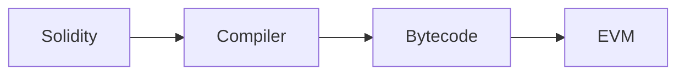
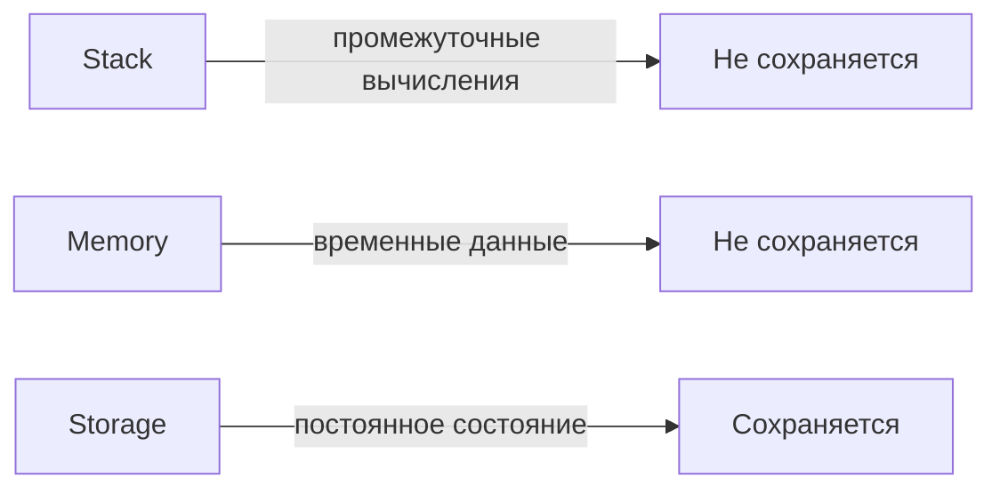
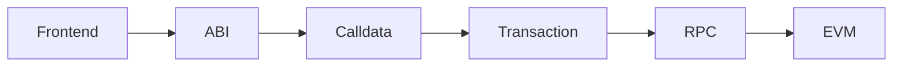

# Урок 7. EVM — Ethereum Virtual Machine

## Основная идея

EVM (Ethereum Virtual Machine) — виртуальная машина, которая выполняет bytecode смарт-контрактов Ethereum.

Transaction
     � ↓
EVM
     � ↓
Smart Contract Code
     � ↓
New Blockchain State

EVM должна быть детерминированной: одинаковые входные данные и состояние должны приводить к одинаковому результату выполнения.

## Компиляция

Solidity
   � ↓
Compiler
   � ↓
EVM Bytecode
   � ↓
EVM

Bytecode состоит из инструкций, называемых opcodes.

Примеры opcode:

- ADD
- MUL
- SUB
- SLOAD
- SSTORE
- CALL
- RETURN

## Gas

Каждая операция EVM имеет стоимость в Gas.

Gas ограничивает вычислительную работу и предотвращает бесконечное выполнение операций.

## Stack

EVM использует stack-based architecture.

Пример:

PUSH 2
PUSH 3
ADD

Состояние:

[2]
[2, 3]
[5]

Stack работает с элементами размером 256 бит.

## Memory

Memory используется для временных данных во время текущего выполнения.

Она не является постоянным состоянием блокчейна.

## Storage

Storage хранит постоянное состояние смарт-контракта.

Например:

uint256 public counter;

Изменение:

counter = 10;

сохраняется в состоянии Ethereum.

## Stack vs Memory vs Storage

| Область | Назначение | Сохраняется? |
|---|---|---|
| Stack | промежуточные вычисления | Нет |
| Memory | временные данные | Нет |
| Storage | постоянное состояние контракта | Да |

Storage особенно дорогой, поскольку его изменение меняет состояние блокчейна.

## Calldata

Calldata — данные, переданные контракту вместе с вызовом.

Упрощённо:

Function Selector
+
Encoded Arguments

Они находятся в transaction.data.

Путь:

Frontend
   � ↓
ABI encoding
   � ↓
calldata
   � ↓
transaction.data
   � ↓
EVM
   � ↓
contract

## Пример вызова

Для:

function add(uint256 a, uint256 b)
    public
    pure
    returns (uint256)
{
    return a + b;
}

вызов:

add(2, 3)

концептуально проходит:

Frontend
   � ↓
ABI encoding
   � ↓
calldata
   � ↓
Transaction
   � ↓
EVM
   � ↓
Contract bytecode
   � ↓
Decode arguments
   � ↓
ADD
   � ↓
RETURN 5

## Изменение Storage

Для:

function increment() public {
    counter++;
}

концептуально:

Transaction
   � ↓
EVM
   � ↓
Contract bytecode
   � ↓
SLOAD
   � ↓
counter
   � ↓
ADD
   � ↓
SSTORE
   � ↓
new state

SLOAD читает Storage.

SSTORE изменяет Storage.

## eth_call

eth_call позволяет выполнить вызов без изменения постоянного состояния блокчейна.

Например:

balanceOf(user)

может быть вызван через eth_call.

Обычно:

- транзакция не создаётся;
- подпись пользователя не требуется;
- пользователь не оплачивает Gas;
- постоянное состояние не изменяется.

## view и pure

view — функция не должна изменять состояние.

pure — функция не читает и не изменяет состояние.

Пример:

function add(uint a, uint b)
    public
    pure
    returns (uint)
{
    return a + b;
}

## Общая архитектура

Frontend
    � ↓
ABI Encoding
    � ↓
Calldata
    � ↓
Transaction
    � ↓
RPC
    � ↓
Node
    � ↓
EVM
    � ↓
Smart Contract
    � ↓
Storage / State

## Mermaid-схемы

## Таблица: Concept | Что делает | Сохраняется ли состояние | Важность для Frontend

| Concept | Что делает | Сохраняется ли состояние | Важность для Frontend |
|---|---|---|---|
| EVM | Выполняет bytecode смарт-контрактов | Нет (является исполнительной средой) | Нужен для понимания выполнения кода |
| Bytecode | Низкоуровневый код, исполняемый EVM | Нет | Результат компиляции Solidity |
| Opcode | Инструкция EVM (ADD, MUL и т.д.) | Нет | Базовые операции, оплачиваемые Gas |
| Stack | Промежуточные вычисления (LIFO, 256‑бит) | Нет | Используется для вычислений внутри EVM |
| Memory | Временное хранилище данных выполнения | Нет | Хранит локальные переменные, динамические данные |
| Storage | Постоянное состояние контракта (key‑value) | Да | Дорогое чтение/запись, меняет состояние блокчейна |
| Calldata | Неизменяемый вход данных вызова (функция + аргументы) | Нет | Доступен только для чтения, дешевле Memory |
| SLOAD | Чтение значения из Storage по ключу | Нет (чтение) | Необходимо для получения текущего состояния |
| SSTORE | Запись значения в Storage по ключу | Да (изменение) | Основная операция изменения состояния, высокий Gas |
| eth_call | Выполнение вызова без создания транзакции | Нет (не меняет состояние) | Позволяет бесплатно читать данные через RPC |
| view | Функция, обещающая не менять состояние (может читать) | Нет (может читать) | Указывает frontend, что вызов можно выполнить через eth_call |
| pure | Функция, не читающая и не меняющая состояние | Нет | Зависит только от параметров, можно выполнять локально |

## Словарь терминов

- **EVM** — Ethereum Virtual Machine, стековая виртуальная машина, исполняет bytecode смарт-контрактов.
- **Bytecode** — последовательность opcode, получаемая после компиляции Solidity (или другого языка) для EVM.
- **Opcode** — базовая инструкция EVM (например, ADD, MUL, SLOAD, SSTORE, CALL, RETURN).
- **Stack** — стек размером 256‑бит на каждый элемент, используется для промежуточных вычислений.
- **Memory** — линейное адресное пространство, временное хранилище данных во время выполнения транзакции.
- **Storage** — постоянное ключ‑значение хранилище контракта, сохраняется в блокчейне, дорогое в изменении.
- **Calldata** — неизменяемая область transaction.data, содержит ABI‑закодированный селектор функции и аргументы.
- **SLOAD** — opcode, читает 256‑битное значение из Storage по ключу и помещает его в стек.
- **SSTORE** — opcode, записывает 256‑битное значение из стека в Storage по ключу, меняет состояние блокчейна.
- **eth_call** — JSON‑RPC метод, имитирует вызов контракта без создания транзакции, не требует gas от пользователя и не меняет состояние.
- **view** — модификатор функции Solidity, гарантирует, что функция не изменяет состояние (может читать состояние).
- **pure** — модификатор функции Solidity, гарантирует, что функция ни читает, ни изменяет состояние (зависит только от параметров).

## Flashcards (вопрос → ответ)

1. Что такое EVM? → Виртуальная машина, исполняющая bytecode смарт-контрактов Ethereum.
2. Какой язык компилируется в EVM bytecode? → Solidity (и другие языки, поддерживающие компиляцию в EVM).
3. Что такое opcode? → Базовая инструкция EVM, например ADD, MUL, SLOAD, SSTORE.
4. Какой размер элементов в стеке EVM? → 256 бит.
5. Где хранятся временные данные во время выполнения транзакции? → В Memory.
6. Что такое Storage в контексте смарт-контракта? → Постоянное ключ‑значение хранилище, сохраняющее состояние контракта в блокчейне.
7. Чем отличается Calldata от Memory? → Calldata — неизменяемая входная data транзакции, Memory — изменяемое временное хранилище.
8. Какой opcode читает значение из Storage? → SLOAD.
9. Какой opcode записывает значение в Storage? → SSTORE.
10. Что такое gas? → Единица измерения вычислительной работы, ограничивающая выполнение операций в EVM.
11. Для чего нужен eth_call? → Выполнить вызов контракта без изменения состояния блокчейна и без оплаты gas.
12. Чем отличается view от pure? → View может читать состояние, но не изменять его; pure не читает и не изменяет состояние.
13. Какой модификатор функции указывает, что функция не изменяет состояние? → view.
14. Какой модификатор функции указывает, что функция ни читает, ни изменяет состояние? → pure.
15. Что происходит при выполнении SLOAD? → Значение из Storage по ключу помещается в стек.
16. Что происходит при выполнении SSTORE? → Значение из стека записывается в Storage по ключу, изменяя состояние.
17. Какой путь проходит calldata от frontend до EVM? → Frontend → ABI encoding → calldata → transaction.data → EVM.
18. Какой тип данных хранится в стеке EVM? → 256‑битные слова.
19. Почему изменение Storage дорого? → Потому что требует изменения глобального состояния блокчейна, потребляет много gas.
20. Можно ли изменить calldata после отправки транзакции? → Нет, calldata неизменяема.

## Вопросы для собеседования

1. Опишите, как Solidity код превращается в исполняемый байткод EVM.
2. Чем отличаются stack, memory и storage в EVM по стоимости и сохранности?
3. Как gas влияет на выполнение операций в EVM?
4. Что такое calldata и где он находится в транзакции?
5. Какой opcode используется для чтения состояния контракта, а какой — для записи?
6. Объясните разницу между eth_call и обычной транзакцией.
7. Когда следует использовать модификатор view, а когда pure?
8. Как EVM обеспечивает детерминированность выполнения?
9. Какие данные доступны в calldata функции?
10. Почему чтение из storage (SLOAD) дешевле записи (SSTORE)?
11. Как abi.encodeWithSelector связан с формированием calldata?
12. Приведите пример простой функции pure и объясните, почему её можно выполнить без обращения к блокчейну.

## Практические задания

1. Определите, к какой области (stack, memory, storage) относятся следующие элементы: локальная переменная типа uint в функции, динамический массив, стек вычислений при выполнении ADD.
2. Для данного opcode определите, является ли операция чтением (read) или записью (write) состояния: SLOAD, SSTORE, MUL, CALL, RETURN.
3. Проследите путь calldata от ввода функции в Remix (или аналогичном IDE) до выполнения внутри EVM, укажите этапы: ABI encoding, transaction.data, eth_call или transaction, распаковка в контракте.
4. Объясните разницу между eth_call и обычной транзакции с точки зрения создания транзакции, подписи, оплаты gas и изменения состояния.

## Ссылки

- [[wiki/0_lesson-04-transakcija-zhiznennyj-cikl|04. Жизненный цикл транзакции]]
- [[wiki/0_lesson-06-rpc-frontend-ethereum|06. RPC — взаимодействие Frontend с Ethereum]]
- [[wiki/ABI|ABI]]
- [[wiki/Calldata|Calldata]]
- [[wiki/Gas|Gas]]
- [[wiki/Smart Contract|Smart Contract]]
- [[wiki/Storage|Storage]]

## Повторить на лавке

- EVM — детерминированная стековая виртуальная машина Ethereum.
- Bytecode = sequência опкодов, получаемая после компиляции Solidity.
- Gas ограничивает вычисления и оплачивает каждую операцию (opcode).
- Stack — LIFO, 256‑бит, для промежуточных вычислений; не сохраняется.
- Memory — временное линейное хранилище; не сохраняется.
- Storage — постоянное key‑value; сохраняется, дорого в изменении.
- Calldata — неизменяемая входная данные транзакции (селектор + аргументы).
- SLOAD читает storage, SSTORE пишет в storage.
- eth_call позволяет выполнить вызов без изменения состояния и без gas.
- view может читать состояние, но не менять его; pure не читает и не меняет состояние.
- Архитектура вызова: Frontend → ABI → Calldata → Transaction → RPC → Node → EVM → Contract.

## Связь с Web3 DevTools Hub

EVM, ABI и calldata являются фундаментальными блоками для будущих инструментов в Web3 DevTools Hub:

- **ABI Decoder** — требует знание ABI и формата calldata для преобразования transaction.data в читаемые параметры функции.
- **Calldata Decoder** — работает напрямую с calldata, извлекая селектор функции и закодированные аргументы без обращения к ABI (если известен селектор).
- **Transaction Decoder** — анализирует całą transakcję, включая gas, value, nonce, и использует eth_call для имитации вызова без изменения состояния.
- **Gas Tools** — моделируют стоимость операций (opcode) в EVM, полагаясь на таблицу gas стоимости и понимание стека, памяти и storage.

Понимание того, как EVM обрабатывает stack/memory/storage и как calldata попадает в transaction.data, позволяет создавать точные декодеры, отладчики и профилировщики для dApp‑разработки.
