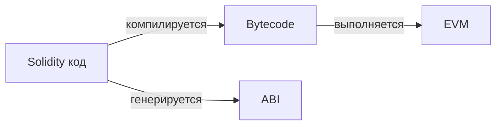
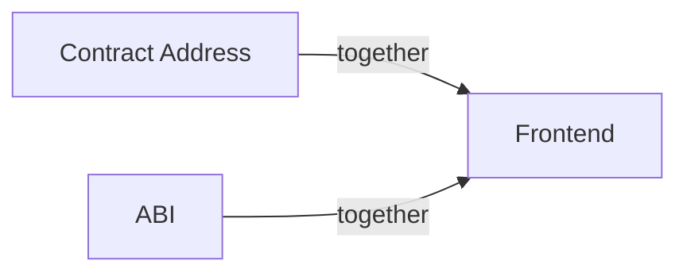
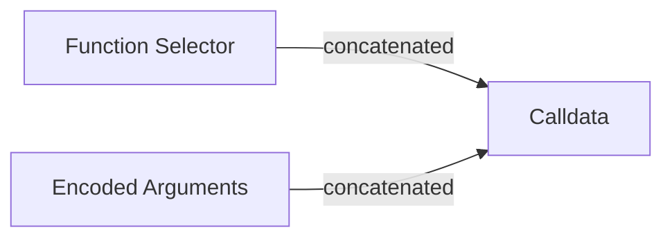
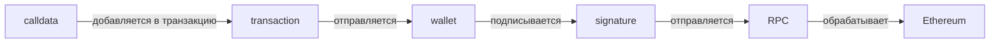
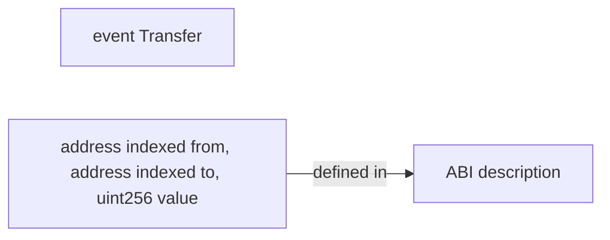
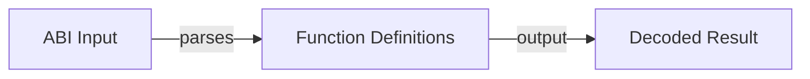
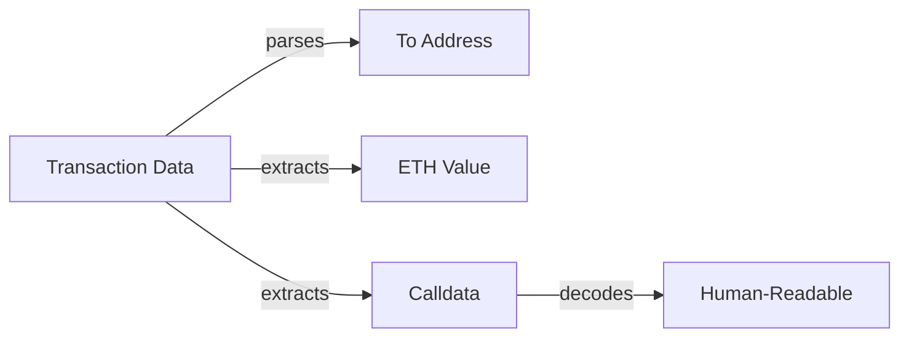
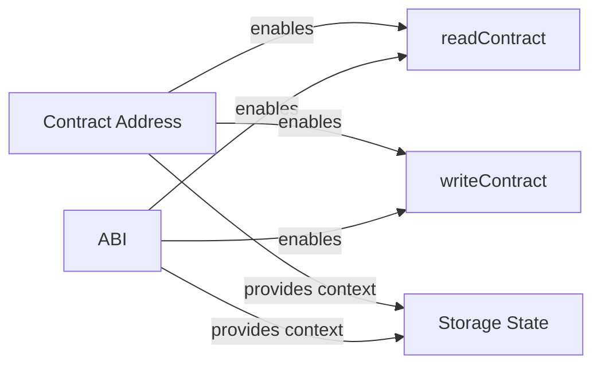
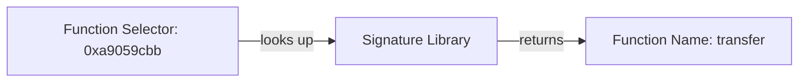

# Урок 10. Smart Contract и ABI

## Основная идея

ABI (Application Binary Interface) — машиночитаемое описание интерфейса смарт-контракта для взаимодействия с ним извне.

ABI может описывать:

- функции;
- аргументы;
- типы аргументов;
- возвращаемые значения;
- события.

## ABI vs Bytecode



**Bytecode используется EVM для выполнения операций.**

**ABI используется внешними приложениями для взаимодействия.**

---

## Contract Address + ABI

Frontend обычно использует:



- **ABI не содержит адрес конкретного контракта.**
- **Один ABI может использоваться с разными адресами.**
- **Контракт-адрес + ABI = полный доступ к контракту.**

---

## Function Signature

**Function Signature** — идентификатор функции, включающий название и типы аргументов.

Пример:

```javascript
transfer(address,uint256)
```

Это **Function Signature**.

---

## Function Selector

Selector создаётся из:

```mermaid
graph LR
    Sig[Function Signature: "transfer(address,uint256)"]
    Keccak[keccak256(Sig)]
    Sel[Function Selector: первые 4 байта]

    Sig -->|хешируется| Keccak
    Keccak -->|берем 4 байта| Sel
```

**Для `transfer(address,uint256)`:**

```
selector: 0xa9059cbb
```

---

## Calldata

Упрощённо:



### Пример:

```javascript
transfer(
    0x123...,
    100
)
```

превращается в:

```
0xa9059cbb
0000000000000000000000000000000000000000000000000000000000000100
```

(адрес получателя padded to 32 bytes + сумма 100 как uint256 padded to 32 bytes)

---

## ABI Encoding

Frontend кодирует аргументы через ABI.

В viem:

```javascript
import { encodeFunctionData } from 'viem'

const data = encodeFunctionData({
  abi,
  functionName: 'transfer',
  args: [
    '0x123...',
    100n,
  ],
})
```

Полученный hex используется как:

transaction.data

---

## Read

Например:

```javascript
balanceOf(address)
```

может быть вызван через:

```javascript
eth_call
```

---

## Write

Например:

```javascript
transfer(address,uint256)
```

требует подготовки calldata и отправки транзакции.

Упрощённо:



---

## Events

ABI также описывает события.



### Пример события:

```javascript
event Transfer(
    address indexed from,
    address indexed to,
    uint256 value
);
```

**ABI позволяет Frontend декодировать logs.**

---

## ABI и Web3 tooling

ABI используется для:

- readContract;
- writeContract;
- encodeFunctionData;
- decodeFunctionResult;
- event decoding;
- TypeScript typing.

---

## ABI vs Bytecode

| Характеристика | Bytecode | ABI |
|---|---|---|
| Что это | Код для EVM | Описание интерфейса |
| Цель | Выполнение операций | Взаимодействие извне |
| Использует | EVM | Frontend, Wallets, Tools |
| Содержит | Инструкции EVM | Названия функций, аргументы, события |
| Результат | Изменение состояния блокчейна | Человекочитаемые данные |

---

## Function Signature vs Function Selector

| Характеристика | Function Signature | Function Selector |
|---|---|---|
| Определение | Название + типы аргументов | Первые 4 байта keccak256 |
| Пример | `transfer(address,uint256)` | `0xa9059cbb` |
| Длина | Переменная | Всегда 4 байта (8 hex-символов) |
| Цель | Человеческое чтение | EVM идентификация функции |
| Вычисление | Задан разработчиком | keccak256(Signature) →取前4 байта |

---

## Calldata изнутри

### Структура calldata:

```mermaid
graph LR
    FullCalldata[Полный calldata]
    Selector[Function Selector: 4 байта]
    Args[Encoded Arguments]

    FullCalldata = Selector + Args
```

### Пример кодирования `transfer(to, amount)`:

```mermaid
graph LR
    Full[Полный calldata]
    Sel[Selector: 0xa9059cbb]
    Addr[Address: padded to 32 bytes]
    Amount[Amount: uint256 padded to 32 bytes]

    Full = Sel + Addr + Amount
```

Разбор calldata для `transfer(to, 100)`:

```
0xa9059cbb  (Function Selector)
000000000000000000000000получатель...  (address, 32 bytes)
00000000000000000000000000000000000000000000000000000000000000064  (100 = 0x64, 32 bytes)
```

---

## Ссылки на связанные материалы

- [[07. EVM — Ethereum Virtual Machine]] — глубокий разбор работы виртуальной машины
- [[09. Account Model — EOA и Contract Account]] — учетные модели Ethereum
- [[08. Gas — стоимость выполнения транзакции]] — Gas, газ-лимиты и комиссии
- [[Calldata]] — детальная информация о calldata
- [[Function Selector]] — как вычисляется селектор функции
- [[Smart Contract]] — что такое смарт-контракты
- [[ERC-20]] — стандарт токенов и ABI
- [[viem]] — библиотека для взаимодействия с Ethereum

---

## 10. Повторить на лавке

### 10 максимально коротких тезисов для повторения:

1. **ABI** — машиночитаемое описание интерфейса смарт-контракта.
2. **Bytecode** — выполняется EVM, результат компиляции Solidity.
3. **ABI vs Bytecode**: Bytecode — для EVM, ABI — для фронтенда и инструментов.
4. **Contract Address + ABI** = полный доступ к контракту из фронтенда.
5. **Function Signature** — название функции + типы аргументов (например, `transfer(address,uint256)`).
6. **Function Selector** — первые 4 байта keccak256 от Function Signature (например, `0xa9059cbb`).
7. **Calldata** — concatenation Function Selector + Encoded Arguments.
8. **ABI Encoding** — процесс кодирования аргументов в формат, понятный EVM.
9. **readContract** использует `eth_call`, **writeContract** требует отправки транзакции.
10. **Events** в ABI позволяют декодировать logs и показывать человекочитаемые данные.

---

## 11. Связь с Web3 DevTools Hub

Подробно показываем связь урока с будущими инструментами:

### ABI Decoder



**Объяснение:** Инструмент принимает raw ABI определение и превращает его в структурированные определения функций. Используется для генерации TypeScript типов, валидации аргументов и автоматическогоCompletion кода в IDE.

### Calldata Decoder

```mermaid
graph LR
    Calldata[Raw Calldata: 0xa9059cbb...]
    Selector[Function Selector: 0xa9059cbb]
    Args[Encoded Arguments]
    Decoded[Decoded Call: transfer(to, amount)]

    Calldata -->|extracts| Selector
    Calldata -->|removes selector| Args
    Selector & Args -->|reconstructs| Decoded
```

**Объяснение:** Инструмент считывает calldata из транзакции, отделяет function selector от аргументов, хеширует selector для определения вызываемой функции, а затем декодирует аргументы с использованием ABI. Позволяет пользователю видеть `transfer(0x123..., 100)` вместо бесполезного hex.

### Transaction Decoder



**Объяснение:** Полный декстер транзакции, который разбивает данные транзакции на компоненты: получатель, значение ETH и calldata. Затем calldata декодируется с использованием ABI для отображения понятного действия (например, `Swap on Uniswap` или `Transfer 50 USDC`).

### Contract Inspector



**Объяснение:** Инструмент для инспектации контракта: чтение состояния переменных, вызов функций с проверкой аргументов, анализ событий. Использует ABI для валидации входных данных и интерпретации результатов.

### Function Selector Lookup



**Объяснение:** Инструмент для поиска имени функции по ее селектору. Вводит 4-байтовый hex-селектор и получает соответствующее название функции и типы аргументов. Полезно при анализе старых транзакций или деобфускации кода контракта.

---