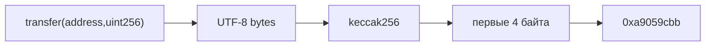
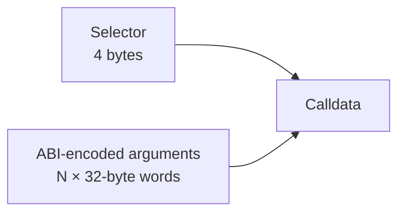
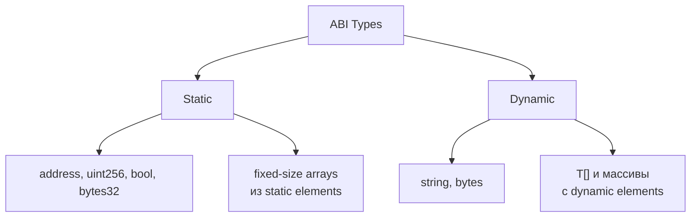
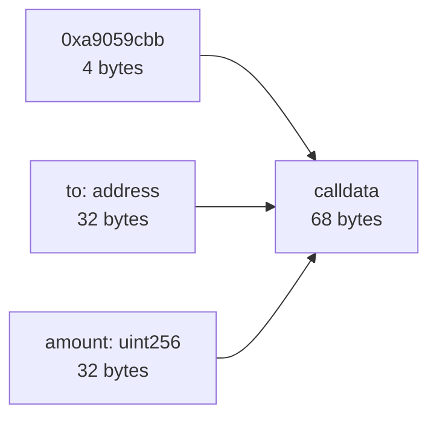
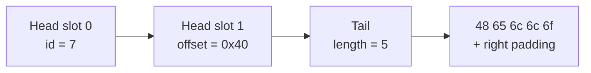
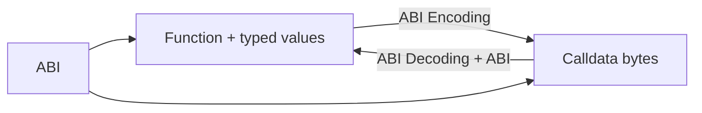
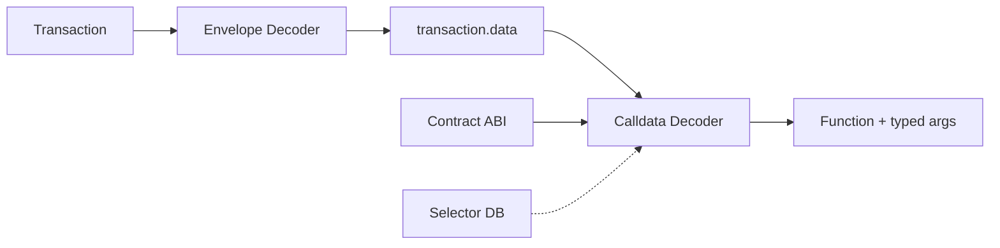

# Урок 11. ABI Encoding: calldata изнутри

## Краткое определение

**ABI Encoding** — правила преобразования вызова функции и его аргументов в байтовую строку, которую EVM получает как `calldata`. Для обычного внешнего вызова функции первые 4 байта содержат **Function Selector**, а оставшаяся часть — ABI-кодированные аргументы.

```text
calldata = selector || encoded arguments
```

Здесь `||` означает конкатенацию байтов. Результат помещается в поле `transaction.data` или передаётся в `eth_call`.

---

## От вызова функции к calldata

Frontend работает с человекочитаемыми значениями, но EVM получает только байты:

```text
Function Call
    ↓
Function Signature
    ↓ keccak256
Function Selector
    +
ABI-encoded Arguments
    ↓
Calldata
    ↓
transaction.data / eth_call.data
```

### Function Signature → Selector

**Function Signature** состоит из имени функции и canonical-типов аргументов без пробелов и имён параметров:

```text
transfer(address,uint256)
```



Selector равен первым 4 байтам `keccak256` от байтов signature. Четыре байта — это восемь hex-символов без префикса `0x`.

> [!important]
> Используется **Keccak-256**, применяемый Ethereum, а не стандартизированный SHA3-256. Для вычисления selector лучше использовать библиотеку.

### Canonical types

При вычислении signature типы приводятся к canonical form:

| Запись в Solidity | Canonical type |
|---|---|
| `uint` | `uint256` |
| `int` | `int256` |
| `fixed` | `fixed128x18` |
| `ufixed` | `ufixed128x18` |

Имена аргументов и возвращаемые типы в signature не входят. Поэтому `transfer(address to, uint amount)` нормализуется в `transfer(address,uint256)`.

---

## Структура calldata



| Элемент calldata | Размер | Назначение |
|---|---:|---|
| Function Selector | 4 байта | Выбирает функцию контракта |
| Head аргумента | Обычно 32 байта на параметр | Содержит значение static type или offset для dynamic type |
| Offset | 32 байта | Указывает начало динамического значения относительно начала области аргументов |
| Length | 32 байта | Задаёт длину `string`, `bytes` или динамического массива |
| Tail | Кратно 32 байтам | Содержит длину и данные dynamic type с padding |
| Padding | До границы 32 байт | Выравнивает ABI-данные |

Selector не входит в ABI-область аргументов. Поэтому offset верхнеуровневого динамического аргумента отсчитывается от байта сразу после selector.

---

## ABI slots и static types

Базовая единица ABI-кодирования — 32-байтовое слово (**ABI Slot**):

```text
256 bits ÷ 8 = 32 bytes = 64 hex-символа
```

### `uint256`

Число `100` равно `0x64` и дополняется нулями слева:

```text
0000000000000000000000000000000000000000000000000000000000000064
```

### `address`

Адрес занимает 20 байт, но в ABI размещается в 32-байтовом слове с 12 байтами нулей слева:

```text
0000000000000000000000001111111111111111111111111111111111111111
```

При декодировании `address` берутся последние 20 байт слова.

### `bool` и `bytes32`

- `false` кодируется как 32 нулевых байта, `true` — как число `1` в 32-байтовом слове.
- `bytes32` уже занимает ровно одно слово и не требует отдельного offset.
- Fixed-size bytes (`bytes1`…`bytes32`) выравниваются справа нулями; целые числа и `address` — слева.

---

## Static vs Dynamic ABI Types

Тип является **static**, если размер его ABI-представления известен только по типу. **Dynamic type** требует offset и отдельной области данных.



| Тип | Static/Dynamic | ABI-представление | Размер/структура |
|---|---|---|---|
| `address` | Static | Нули слева + 20 байт адреса | 1 × 32 байта |
| `uint256` | Static | Big-endian integer, нули слева | 1 × 32 байта |
| `bool` | Static | `0` или `1` как `uint256` | 1 × 32 байта |
| `bytes32` | Static | 32 байта данных | 1 × 32 байта |
| `string` | Dynamic | Offset → length + UTF-8 bytes + padding | Head: 32 байта; Tail: переменный |
| `bytes` | Dynamic | Offset → length + bytes + padding | Head: 32 байта; Tail: переменный |
| `uint256[]` | Dynamic | Offset → length + элементы | 32 байта length + 32 байта на элемент |
| `address[]` | Dynamic | Offset → length + padded addresses | 32 байта length + 32 байта на элемент |

> [!note]
> Массив фиксированной длины не обязательно static: например, `uint256[2]` static, а `string[2]` dynamic, потому что его элементы dynamic.

---

## Пример: `transfer(address,uint256)`

Вызов:

```solidity
transfer(
    0x1111111111111111111111111111111111111111,
    100
)
```

Кодируется так:

```text
0xa9059cbb
0000000000000000000000001111111111111111111111111111111111111111
0000000000000000000000000000000000000000000000000000000000000064
```



Размер: `4 + 32 + 32 = 68` байт. Аргументы идут в том же порядке, что и типы в signature: сначала `address`, затем `uint256`.

---

## Dynamic types: Head, Offset и Tail

Для dynamic type в Head записывается не само значение, а offset до его данных в Tail.

Рассмотрим функцию:

```solidity
setMessage(uint256 id, string message)
```

и вызов `setMessage(7, "Hello")`. После 4-байтового selector область аргументов выглядит концептуально так:



`0x40 = 64` байта: Head содержит два слова по 32 байта, поэтому Tail начинается через 64 байта от начала области аргументов.

```text
Head:
slot 0: 0000...0007   // id
slot 1: 0000...0040   // offset к string

Tail:
slot 2: 0000...0005   // длина строки в байтах
slot 3: 48656c6c6f00... // UTF-8 "Hello" + padding справа
```

### Как интерпретировать offset

```text
начало calldata:          byte 0
начало аргументов:        byte 4
offset из Head:           0x40 = 64
начало Tail для message:  byte 4 + 64 = byte 68 calldata
```

Для вложенных массивов и tuples правила базы отсчёта зависят от контейнера. При ручном разборе сложных значений нужно следовать формальной спецификации ABI, а не прибавлять offsets к началу всего calldata.

---

## Padding

ABI выравнивает данные по границе 32 байт:

- `uint256` и `address` дополняются нулями слева;
- fixed-size `bytesN` дополняются нулями справа;
- содержимое динамических `bytes` и `string` дополняется справа до ближайшего кратного 32 байтам;
- padding не входит в значение length.

Для `"Hello"` length равен `5`, хотя данные занимают целый 32-байтовый слот.

---

## Encoding ↔ Decoding



Encoding требует знать типы аргументов. Надёжное decoding тоже требует ABI или хотя бы подходящей function signature. Сам selector не гарантирует однозначного имени: пространство selector всего 32-битное, поэтому коллизии возможны.

### Кодирование через viem

```ts
import { encodeFunctionData } from 'viem'

const data = encodeFunctionData({
  abi,
  functionName: 'transfer',
  args: [
    '0x1111111111111111111111111111111111111111',
    100n,
  ],
})
```

### Декодирование через viem

```ts
import { decodeFunctionData } from 'viem'

const decoded = decodeFunctionData({ abi, data })

// {
//   functionName: 'transfer',
//   args: ['0x1111...', 100n]
// }
```

`encodeFunctionData` возвращает полный calldata, включая selector. `decodeFunctionData` сопоставляет selector с функцией из переданного ABI и декодирует аргументы по её типам.

---

## Как читать calldata вручную

Используй последовательность:

```text
selector → slots → types → values
```

### Шаг 1. Отделить selector

Убери `0x` и возьми первые 8 hex-символов — это 4 байта selector.

```text
a9059cbb | 000000...1111 | 000000...0064
```

### Шаг 2. Разбить аргументы на слова

Оставшуюся строку раздели по 64 hex-символа, то есть по 32 байта.

### Шаг 3. Определить функцию и типы

Найди selector в ABI контракта. Для `0xa9059cbb` подходящая signature — `transfer(address,uint256)`. База известных signatures даёт кандидатов, но ABI конкретного контракта надёжнее.

### Шаг 4. Сопоставить slots с аргументами

Первый тип — `address`, второй — `uint256`. Если тип dynamic, значение текущего слова трактуется как offset, а не как данные.

### Шаг 5. Декодировать значения

- `address`: взять последние 40 hex-символов слова и добавить `0x`;
- `uint256`: прочитать 64 hex-символа как беззнаковое big-endian число;
- dynamic type: перейти по offset, прочитать length, затем нужное число байт данных;
- проверить допустимость padding и границ.

Результат примера:

```json
{
  "function": "transfer",
  "args": {
    "to": "0x1111111111111111111111111111111111111111",
    "amount": "100"
  }
}
```

> [!warning]
> Не преобразуй большие `uint256` в JavaScript `number`: он теряет точность выше `2^53 - 1`. Используй `bigint` или десятичную строку.

---

## Частые ошибки новичков

### ❌ Selector содержит имя функции

В calldata нет строки `transfer`. Selector — только 4 байта хеша signature.

### ❌ Offset отсчитывается от начала всего calldata

Для верхнеуровневых аргументов offset отсчитывается от начала ABI-области аргументов, то есть после 4-байтового selector.

### ❌ Любой аргумент занимает ровно один slot

Один Head-slot достаточен для простого static type или ссылки на dynamic data. Сам Tail динамического значения может занимать много слов.

### ❌ `string.length` — число символов

В ABI это длина байтовой последовательности. Для UTF-8 она может отличаться от числа визуальных символов.

### ❌ Selector однозначно определяет функцию

Четырёх байт недостаточно для глобальной уникальности. Возможны коллизии, поэтому нужен контекст ABI контракта.

### ❌ Padding всегда добавляется слева

Направление зависит от типа: числа и адреса выравниваются слева нулями, `bytesN` и динамические byte sequences — справа.

---

## Связь с Calldata Decoder

Будущий decoder должен выполнять такой pipeline:

1. Проверить hex-формат и минимальную длину calldata.
2. Извлечь первые 4 байта как selector.
3. Найти совпадающие функции в ABI; без ABI — получить кандидатов из базы signatures.
4. Получить ordered list типов аргументов из выбранной signature.
5. Читать Head 32-байтовыми словами.
6. Декодировать static values на месте, а для dynamic values валидировать и сохранять offsets.
7. Перейти в Tail, прочитать length и вложенные данные.
8. Проверить границы, выравнивание и отсутствие некорректных значений.
9. Вернуть имя функции, типы, именованные аргументы и исходные hex-фрагменты.
10. Если есть несколько signatures-кандидатов, показать неоднозначность, а не угадывать.

Полезно разделить ядро decoder на независимые уровни: разбор hex, lookup selector, ABI type parser и recursive value decoder. Так их можно переиспользовать в других инструментах.

---

## Связь с Web3 DevTools Hub

### Calldata Decoder

Разделяет `transaction.data` на selector и ABI-область аргументов, выбирает функцию по ABI и восстанавливает значения. Интерфейс должен показывать offsets, Head/Tail и исходные slots рядом с decoded output — это делает ошибки ABI заметными.

### ABI Encoder

Принимает function signature или ABI, типизированные значения и строит calldata. Знание canonical types необходимо для верного selector, а padding и Head/Tail — для аргументов. Encoder должен валидировать address, диапазоны integer и длины fixed arrays до кодирования.

### ABI Decoder

Декодирует произвольный ABI-encoded payload по заданному списку типов. В отличие от Calldata Decoder, payload может не содержать selector: например, это return data функции или отдельно кодированный tuple.

### Function Selector Lookup

Принимает 4 байта и возвращает возможные signatures. Результат является списком кандидатов из-за возможных коллизий. ABI и адрес контракта помогают выбрать правильную функцию.

### Transaction Decoder

Сначала разбирает envelope транзакции (`to`, `value`, `data`, gas-поля), затем передаёт `data` в Calldata Decoder. После декодирования может представить действие как `transfer(to, amount)`, но отображаемые token units требуют ещё `decimals` и контекста контракта.



---

## Практические задания

1. **Декодировать `uint256`.** Преобразуй `0000...03e8` в decimal и объясни, почему нужно использовать `bigint`.
2. **Декодировать `address`.** Извлеки адрес из слова `000000000000000000000000dead00000000000000000000000000000000beef`.
3. **Разобрать transfer calldata.** Отметь selector, `to`, `amount` и вычисли общий размер.
4. **Определить selector.** Составь canonical signature для `approve(address spender, uint amount)` и вычисли selector библиотекой.
5. **Определить порядок аргументов.** Для `swap(address,uint256,bool)` сопоставь три Head-slots с типами.
6. **Объяснить static vs dynamic.** Классифицируй `uint8`, `bytes32`, `bytes`, `address[2]`, `string[2]`, `uint256[]`.
7. **Разобрать Head / Offset / Tail.** Вручную объясни `setMessage(7, "Hello")`, включая значение `0x40`.
8. **Объяснить padding.** Сравни padding для `uint256(1)`, `bytes4(0x12345678)` и `bytes("Hi")`.
9. **Проверить себя через viem.** Закодируй и декодируй `transfer`, затем сравни каждый slot с ручным расчётом.

---

## Вопросы с собеседований

1. **Из чего состоит calldata вызова функции?** — Из 4-байтового selector и ABI-кодированных аргументов.
2. **Как вычисляется Function Selector?** — Берутся первые 4 байта Keccak-256 от canonical function signature.
3. **Что входит в Function Signature?** — Имя функции и ordered list canonical input types; имена аргументов и returns не входят.
4. **Почему `uint` заменяется на `uint256`?** — Selector вычисляется по canonical ABI types.
5. **Каков размер ABI word?** — 32 байта, или 256 бит.
6. **Как кодируется `address`?** — 20 байт адреса дополняются 12 нулевыми байтами слева.
7. **Чем static type отличается от dynamic type?** — Размер static encoding известен из типа; dynamic value хранится через offset и Tail.
8. **Что находится в Head для dynamic argument?** — 32-байтовый offset до его данных.
9. **Откуда считается offset верхнеуровневого аргумента?** — От начала ABI-области аргументов, после selector.
10. **Как кодируется `string`?** — Offset в Head, затем length в байтах, UTF-8 bytes и padding в Tail.
11. **Почему decoder обычно требует ABI?** — Selector не содержит типы и имя, а коллизии signatures возможны.
12. **Может ли selector иметь коллизию?** — Да, это только 32 бита.
13. **Чем `bytes32` отличается от `bytes` при encoding?** — `bytes32` static и хранится inline; `bytes` dynamic и хранится через offset, length и Tail.
14. **В каком порядке кодируются аргументы?** — В порядке input types в function signature/ABI.
15. **Что возвращает `encodeFunctionData` в viem?** — Полный calldata: selector плюс encoded arguments.
16. **Почему опасно декодировать `uint256` в JS `number`?** — Возможна потеря точности; нужен `bigint` или строка.
17. **Входит ли padding в length динамического значения?** — Нет.
18. **Чем ABI Decoder отличается от Calldata Decoder?** — ABI Decoder может работать с payload без selector; Calldata Decoder дополнительно определяет вызываемую функцию.

---

## Flashcards

**Q:** Что такое ABI Encoding?  
**A:** Преобразование типизированных значений в ABI-совместимые байты.

**Q:** Что такое ABI Decoding?  
**A:** Восстановление типизированных значений из ABI-байтов.

**Q:** Формула calldata?  
**A:** `selector || encoded arguments`.

**Q:** Размер selector?  
**A:** 4 байта, или 8 hex-символов без `0x`.

**Q:** Как получить selector?  
**A:** Взять первые 4 байта Keccak-256 от canonical signature.

**Q:** Selector функции `transfer(address,uint256)`?  
**A:** `0xa9059cbb`.

**Q:** Размер ABI Slot?  
**A:** 32 байта.

**Q:** Как кодируется `uint256`?  
**A:** Big-endian число с нулевым padding слева до 32 байт.

**Q:** Как кодируется `address`?  
**A:** 12 нулевых байт слева и 20 байт адреса.

**Q:** Как кодируется `bool`?  
**A:** `0` или `1` в 32-байтовом слове.

**Q:** `bytes32` — static или dynamic?  
**A:** Static.

**Q:** `bytes` — static или dynamic?  
**A:** Dynamic.

**Q:** `string` — static или dynamic?  
**A:** Dynamic.

**Q:** Что хранит Head для dynamic type?  
**A:** Offset до данных в Tail.

**Q:** Что хранит Tail строки?  
**A:** Length, UTF-8 bytes и padding.

**Q:** Входит ли selector в базу offset верхнего уровня?  
**A:** Нет.

**Q:** Что такое Padding?  
**A:** Заполнение до границы 32 байт.

**Q:** Куда выравнивается `bytesN`?  
**A:** Влево, с нулями справа.

**Q:** Куда выравнивается `uint256`?  
**A:** Вправо, с нулями слева.

**Q:** Что такое Canonical Type?  
**A:** Нормализованная запись ABI-типа для signature.

**Q:** Canonical form для `uint`?  
**A:** `uint256`.

**Q:** Может ли один selector соответствовать нескольким signatures?  
**A:** Да, из-за 32-битных коллизий.

**Q:** Что делает `encodeFunctionData`?  
**A:** Создаёт selector и кодирует аргументы в calldata.

**Q:** Что делает `decodeFunctionData`?  
**A:** По ABI декодирует функцию и аргументы из calldata.

**Q:** Где используется результат encoding?  
**A:** В `transaction.data` или `eth_call.data`.

---

## Термины

| Термин | Определение |
|---|---|
| **ABI Encoding** | Кодирование типизированных значений по правилам ABI |
| **ABI Decoding** | Восстановление типизированных значений из ABI-данных |
| **ABI Slot** | 32-байтовое слово ABI-кодирования |
| **Function Selector** | Первые 4 байта Keccak-256 от canonical function signature |
| **Function Signature** | Имя функции и ordered list canonical input types |
| **Static Type** | Тип с заранее известным размером ABI encoding |
| **Dynamic Type** | Тип, представленный в Head через offset к данным переменной длины |
| **Offset** | Смещение до динамических данных относительно заданной ABI-базы |
| **Head** | Начальная область encoding со значениями static types и offsets |
| **Tail** | Область данных dynamic types |
| **Padding** | Заполнение нулями до требуемого выравнивания |
| **Canonical Type** | Нормализованная запись ABI-типа для signature |

---

## Связанные темы

- [[0_lesson-10-smart-contract-and-abis|10. Smart Contract и ABI]]
- [[0_lesson-07-evm-ethereum-virtual-machine|07. EVM — Ethereum Virtual Machine]]
- [[Calldata]]
- [[Function Selector]]
- [[ABI]]
- [[viem]]
- [[ERC-20]]

---

## Повторить на лавке

1. Calldata = selector + arguments.
2. Selector занимает 4 байта.
3. Selector строится через Keccak-256.
4. Signature использует canonical types.
5. ABI word занимает 32 байта.
6. Static value хранится inline.
7. Dynamic value хранится через offset.
8. Tail содержит length и data.
9. Padding выравнивает до 32 байт.
10. Надёжному decoder нужен ABI.

