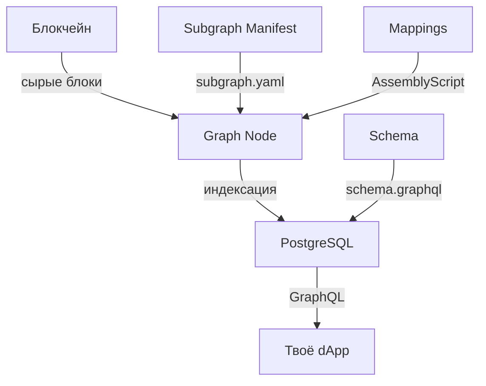

# The Graph / Subgraph — индексация ончейн-данных

**The Graph — это децентрализованный протокол для индексации и запросов данных из блокчейна.** Subgraph (сабграф) — твой код, который говорит The Graph: какие данные доставать из контракта, как их обработать и в каком виде отдавать через GraphQL. Готовый API из сырых ончейн-данных.

> **Актуальность:** июль 2026. 60+ поддерживаемых сетей, graph-cli последней версии, Studio + децентрализованная сеть. Данные проверены по официальной документации [thegraph.com/docs](https://thegraph.com/docs/).

## Зачем нужен Subgraph (прямой вызов контракта медленный)

Представь: ты фронтендер, делаешь dApp — дашборд токена ERC-20. Нужно показать:

- Баланс пользователя — `balanceOf(address)`
- Все его переводы за месяц — события `Transfer`
- Топ-100 держателей — нужны все `Transfer` события

### Проблема прямых вызовов (RPC)

```ts
// ❌ Так не делают в продакшене:
const provider = new JsonRpcProvider("https://eth-mainnet.g.alchemy.com/v2/KEY")

// 1 запрос = 1 RPC-вызов — быстро
const balance = await contract.balanceOf(address)

// Но 100 запросов = 100 RPC-вызовов — медленно
const balances = await Promise.all(
  holders.map(h => contract.balanceOf(h))
)
// ~3-5 секунд, плюс rate-limit провайдера

// А чтобы собрать все Transfer за месяц?
// Нужно тянуть блок за блоком — тысячи запросов, минуты ожидания
```

**Прямые RPC-вызовы не предназначены для агрегации и фильтрации данных** — блокчейн не база данных. Каждый вызов `balanceOf` ходит в отдельный блок. Каждый `eth_getLogs` тянет сырые логи, которые нужно парсить.

### Решение — Subgraph

```
┌──────────────┐     ┌─────────────────┐     ┌──────────────┐
│  Смарт-      │     │  The Graph      │     │  React-      │
│  контракт    │────▶│  Indexer        │────▶│  приложение  │
│  (блокчейн)  │     │                 │     │              │
└──────────────┘     │ • Читает блоки  │     │ 1 GraphQL-   │
                     │ • Сохраняет в   │     │ запрос даёт  │
                     │   PostgreSQL    │     │ всё сразу    │
                     │ • GraphQL API   │     │              │
                     └─────────────────┘     └──────────────┘
```

**Subgraph индексирует блокчейн один раз** и сохраняет обработанные данные в обычную базу (PostgreSQL). Ты получаешь быстрый GraphQL API:

```graphql
# 1 запрос — всё что нужно!
{
  transfers(first: 100, orderBy: timestamp, orderDirection: desc) {
    from
    to
    value
    timestamp
  }
}
```

> **Как читать `{ transfers(first: 100, orderBy: timestamp, orderDirection: desc) { from to value timestamp } }`:** «запроси у сабграфа последние 100 переводов: отсортируй по времени от новых к старым, для каждого верни отправителя, получателя, сумму и метку времени — одним запросом». Мнемоника: GraphQL к сабграфу = SQL к индексированному блокчейну; `first`/`skip` = LIMIT/OFFSET.

## Как работает The Graph

### Архитектура протокола



**Ключевые компоненты:**

- **Graph Node** — нода, которая слушает блокчейн, запускает маппинги и сохраняет данные в БД. Конечный пользователь не запускает ноду сам — использует хостинг (Subgraph Studio) или децентрализованную сеть.
- **Indexer** (индексатор) — оператор ноды в децентрализованной сети. Получает GRT-токены за индексацию и обработку запросов.
- **Curator** (куратор) — сигнализирует токенами GRT, какие сабграфы полезны/качественны. Indexer'ы индексируют в первую очередь то, на что есть сигнал.
- **Delegator** (делегатор) — делегирует GRT индексатору и получает долю от наград.

> **Для фронтендера важны только Indexer и твой Subgraph.** Остальные роли — это экономика протокола. Ты просто деплоишь Subgraph и получаешь GraphQL-эндпоинт.

### Два способа хостинга

| Способ | Описание | Бесплатно? |
|--------|----------|------------|
| **Subgraph Studio** | Тестирование и разработка. Твой сабграф индексируется одним Upgrade Indexer. Rate-limited, не для продакшена. | Да |
| **The Graph Network** | Децентрализованная сеть. Indexer'ы соревнуются за твой сабграф. Публичный, production-ready. 100K запросов/мес бесплатно. | Фримиум |

## Архитектура Subgraph

Сабграф состоит из трёх файлов — это и есть твой код:

```
my-subgraph/
├── subgraph.yaml       # Манифест: ЧТО индексируем
├── schema.graphql      # Схема: КАК выглядят данные
├── src/
│   └── mapping.ts      # Маппинги: КАК обрабатываем
└── node_modules/
```

### 1. Manifest — `subgraph.yaml`

Указывает, какой контракт слушать, с какого блока, какие события обрабатывать:

```yaml
specVersion: 1.0.0
schema:
  file: ./schema.graphql
dataSources:
  - kind: ethereum
    name: MyToken
    network: mainnet
    source:
      address: "0x...ТВОЙ_КОНТРАКТ..."
      abi: MyToken
      startBlock: 18000000    # Блок деплоя контракта
    mapping:
      kind: ethereum/events
      apiVersion: 0.0.7
      language: wasm/assemblyscript
      entities:
        - Transfer
        - Account
      abis:
        - name: MyToken
          file: ./abis/MyToken.json
      eventHandlers:
        - event: Transfer(indexed address,indexed address,uint256)
          handler: handleTransfer
      file: ./src/mapping.ts
```

> **Как читать секцию `dataSources` в `subgraph.yaml`:** «опиши The Graph, какой контракт слушать: вот его адрес, вот ABI для декодирования, начинай с этого блока; `eventHandlers` связывают события контракта (например, `Transfer(indexed address,indexed address,uint256)`) с функциями-обработчиками в mapping.ts». Мнемоника: `subgraph.yaml` = конфиг-слушатель: с какого контракта, с какого блока, на какие события реагировать.

**Что здесь важно:**
- `startBlock` — блок деплоя контракта. Не ставь 0, сэкономишь дни индексации.
- `eventHandlers` — на каждое событие контракта свой handler-функция в mapping.ts.
- `abis` — ABI контракта нужен для декодирования событий.

### 2. Schema — `schema.graphql`

Описывает структуру данных, которые ты будешь запрашивать. Это GraphQL-схема (не Solidity!):

```graphql
# Тип для аккаунта (держателя токенов)
type Account @entity {
  id: ID!                    # адрес — уникальный идентификатор
  address: Bytes!
  balance: BigInt!
  transfersFrom: [Transfer!]! @derivedFrom(field: "from")
  transfersTo: [Transfer!]!   @derivedFrom(field: "to")
}

# Тип для перевода
type Transfer @entity {
  id: ID!                    # txHash-logIndex
  from: Account!
  to: Account!
  value: BigInt!
  timestamp: BigInt!
  blockNumber: BigInt!
  transactionHash: Bytes!
}
```

> **Как читать `type Transfer @entity { id: ID!; from: Account!; to: Account!; value: BigInt! }`:** «опиши GraphQL-тип, который The Graph сохранит в PostgreSQL: `@entity` — этот тип станет таблицей; `ID!` — обязательный первичный ключ; `BigInt` — потому что uint256 не влезает в обычный Int; `@derivedFrom` — виртуальная обратная связь (one-to-many), не хранится, вычисляется при запросе». Мнемоника: `schema.graphql` = проектируешь БД на GraphQL; `@entity` = таблица, `@derivedFrom` = внешний ключ наоборот.

**Правила:**
- `@entity` — тип сохраняется в БД. Без `@entity` нельзя.
- `ID!` — обязательный уникальный идентификатор. Обычно адрес, txHash, или составной ключ.
- `BigInt` для чисел (не Int! uint256 не влезает в 32 бита).
- `Bytes` для адресов и хешей.
- `@derivedFrom` — обратная связь (one-to-many), не хранится в БД, вычисляется при запросе.

### 3. Mappings — `mapping.ts` (AssemblyScript)

Код, который реагирует на события блокчейна и сохраняет данные согласно схеме:

```typescript
import { Transfer as TransferEvent } from '../generated/MyToken/MyToken'
import { Transfer, Account } from '../generated/schema'
import { BigInt, Bytes } from '@graphprotocol/graph-ts'

export function handleTransfer(event: TransferEvent): void {
  // --- Создаём/обновляем запись Transfer ---
  let transfer = new Transfer(
    event.transaction.hash.toHex() + '-' + event.logIndex.toString()
  )
  transfer.from = event.params.from
  transfer.to = event.params.to
  transfer.value = event.params.value
  transfer.timestamp = event.block.timestamp
  transfer.blockNumber = event.block.number
  transfer.transactionHash = event.transaction.hash
  transfer.save()

  // --- Обновляем баланс отправителя ---
  let fromAccount = Account.load(event.params.from)
  if (fromAccount == null) {
    fromAccount = new Account(event.params.from)
    fromAccount.balance = BigInt.fromI32(0)
  }
  fromAccount.balance = fromAccount.balance.minus(event.params.value)
  fromAccount.save()

  // --- Обновляем баланс получателя ---
  let toAccount = Account.load(event.params.to)
  if (toAccount == null) {
    toAccount = new Account(event.params.to)
    toAccount.balance = BigInt.fromI32(0)
  }
  toAccount.balance = toAccount.balance.plus(event.params.value)
  toAccount.save()
}
```

> **Как читать связку `new Transfer(id)` + заполнение полей + `.save()` в AssemblyScript-маппинге:** «создай новую запись в БД сабграфа с уникальным ключом (обычно txHash-logIndex), заполни поля значениями из события блокчейна и закоммить вызовом `.save()`; для существующих записей — `Entity.load(id)` вернёт объект, который можно изменить и снова сохранить». Мнемоника: `new Entity(id)` = INSERT, `.save()` = COMMIT, `Entity.load(id)` = SELECT для UPDATE.

**Важно понимать про AssemblyScript:**
- Это **не TypeScript**! Строгий статически типизированный язык, компилируется в WASM.
- Нет `console.log` на каждый чих — используй `log.info()` (логи появляются в Studio).
- Все импорты — из `@graphprotocol/graph-ts`. Нет доступа к `fs`, `http`, обычному JS.
- `BigInt` — беззнаковый. Нет отрицательных значений. Вычитание может упасть с overflow.
- Записи в `store` — `new Entity(id)` + `.save()` = INSERT или UPDATE. Под капотом PostgreSQL.

## Создание своего Subgraph для ERC-20

### Пошаговый гайд

#### Шаг 1. Установка Graph CLI

```bash
npm install -g @graphprotocol/graph-cli@latest
graph --version   # проверяем
```

#### Шаг 2. Инициализация из контракта

```bash
graph init
```

CLI задаст вопросы:
- **Protocol:** `ethereum`
- **Subgraph slug:** `my-token-mainnet` (уникальное имя)
- **Directory:** `my-token-subgraph`
- **Network:** `mainnet` (или `sepolia` для тестов)
- **Contract address:** `0x...` (адрес твоего ERC-20)
- **ABI:** путь к JSON-файлу (или автоопределение из Etherscan)
- **Start block:** номер блока деплоя контракта
- **Index events as entities:** `true` (автоматически создаст маппинги на все события)

CLI создаст структуру:
```
my-token-subgraph/
├── subgraph.yaml
├── schema.graphql
├── src/mapping.ts
├── abis/MyToken.json
└── package.json
```

#### Шаг 3. Правим схему под ERC-20

Замени автосгенерированную схему на осмысленную:

```graphql
type Account @entity {
  id: ID!
  address: Bytes!
  balance: BigInt!
  transferCount: Int!
  transfersFrom: [Transfer!]! @derivedFrom(field: "from")
  transfersTo: [Transfer!]! @derivedFrom(field: "to")
}

type Transfer @entity {
  id: ID!
  from: Account!
  to: Account!
  value: BigInt!
  timestamp: BigInt!
  blockNumber: BigInt!
  transactionHash: Bytes!
}
```

#### Шаг 4. Правим маппинг

```typescript
import { Transfer as TransferEvent } from '../generated/MyToken/MyToken'
import { Transfer, Account } from '../generated/schema'
import { BigInt } from '@graphprotocol/graph-ts'

export function handleTransfer(event: TransferEvent): void {
  // --- Transfer entity ---
  let transfer = new Transfer(
    event.transaction.hash.toHex() + '-' + event.logIndex.toString()
  )
  transfer.from = event.params.from
  transfer.to = event.params.to
  transfer.value = event.params.value
  transfer.timestamp = event.block.timestamp
  transfer.blockNumber = event.block.number
  transfer.transactionHash = event.transaction.hash
  transfer.save()

  // --- From account ---
  let from = Account.load(event.params.from)
  if (!from) {
    from = new Account(event.params.from)
    from.address = event.params.from
    from.balance = BigInt.fromI32(0)
    from.transferCount = 0
  }
  from.balance = from.balance.minus(event.params.value)
  from.transferCount += 1
  from.save()

  // --- To account ---
  let to = Account.load(event.params.to)
  if (!to) {
    to = new Account(event.params.to)
    to.address = event.params.to
    to.balance = BigInt.fromI32(0)
    to.transferCount = 0
  }
  to.balance = to.balance.plus(event.params.value)
  to.transferCount += 1
  to.save()
}
```

#### Шаг 5. Генерируем код и собираем

```bash
graph codegen   # генерирует типы из schema.graphql + ABI
graph build     # компилирует AssemblyScript → WASM
```

`graph codegen` создаст папку `generated/` с TypeScript-типами. Их нельзя редактировать — они пересоздаются при каждом codegen.

#### Шаг 6. Деплой в Subgraph Studio

1. Иди на [thegraph.com/studio](https://thegraph.com/studio/), подключи кошелёк
2. Нажми **«Create a Subgraph»**, назови `MyToken Mainnet`
3. Скопируй **Deploy Key** со страницы сабграфа
4. В терминале:

```bash
graph auth <DEPLOY_KEY>
graph deploy <SUBGRAPH_SLUG>
```

> **Deploy Key ≠ API Key.** Deploy Key — для деплоя (записи). API Key создаётся отдельно для запросов (чтения).

#### Шаг 7. Жди индексации

Индексация может занять от 5 минут до нескольких часов — зависит от количества событий с `startBlock`. В Studio вкладка **Logs** показывает прогресс:

```
Processing block #18000000
Applying 2 event handlers
Synced 15.2%
```

Когда статус сменится на **Synced 100%** — сабграф готов к запросам.

#### Шаг 8. Публикация в децентрализованную сеть

Для продакшена публикуй сабграф в The Graph Network:

```bash
graph publish
# или через Studio: кнопка Publish → подпись в кошельке
```

После публикации твой сабграф появляется в [Graph Explorer](https://thegraph.com/explorer), доступен без rate-limit'ов и индексируется децентрализованными Indexer'ами.

> **Рекомендуется добавить кураторский сигнал** (3 000+ GRT) при публикации — это стимулирует Indexer'ов начать индексацию твоего сабграфа.

## Запросы из React-приложения

### Способ 1. Apollo Client

```bash
npm install @apollo/client graphql
```

```tsx
// graphql/client.ts
import { ApolloClient, InMemoryCache } from '@apollo/client'

export const client = new ApolloClient({
  uri: 'https://api.studio.thegraph.com/query/YOUR_ID/my-token-mainnet',
  cache: new InMemoryCache(),
})
```

```tsx
// components/TransferList.tsx
import { useQuery, gql } from '@apollo/client'

const GET_TRANSFERS = gql`
  query GetTransfers($first: Int!, $skip: Int!) {
    transfers(
      first: $first,
      skip: $skip,
      orderBy: timestamp,
      orderDirection: desc
    ) {
      id
      from { address }
      to { address }
      value
      timestamp
      transactionHash
    }
  }
`

function TransferList() {
  const { loading, data, fetchMore } = useQuery(GET_TRANSFERS, {
    variables: { first: 20, skip: 0 },
  })

  if (loading) return <div>Загрузка...</div>

  return data.transfers.map(t => (
    <div key={t.id}>
      {t.from.address} → {t.to.address}: {t.value.toString()} wei
    </div>
  ))
}
```

### Способ 2. urql (легче, чем Apollo)

```bash
npm install urql graphql
```

```tsx
// graphql/client.ts
import { Client, cacheExchange, fetchExchange } from 'urql'

export const client = new Client({
  url: 'https://api.studio.thegraph.com/query/YOUR_ID/my-token-mainnet',
  exchanges: [cacheExchange, fetchExchange],
})

// В корне приложения:
// <Provider value={client}><App /></Provider>
```

```tsx
// hooks/useTransfers.ts
import { useQuery } from 'urql'

const TransfersQuery = `
  query ($first: Int!, $skip: Int!) {
    transfers(first: $first, skip: $skip, orderBy: timestamp, orderDirection: desc) {
      id
      from { id }
      to { id }
      value
      timestamp
    }
  }
`

function useTransfers(first = 20) {
  const [result] = useQuery({ query: TransfersQuery, variables: { first, skip: 0 } })
  return result
}
```

### Способ 3. Простой fetch (без библиотек)

```tsx
const query = `
  {
    transfers(first: 10, orderBy: timestamp, orderDirection: desc) {
      id
      from { id }
      to { id }
      value
    }
  }
`

const res = await fetch('https://api.studio.thegraph.com/query/YOUR_ID/my-token-mainnet', {
  method: 'POST',
  headers: { 'Content-Type': 'application/json' },
  body: JSON.stringify({ query }),
})
const { data } = await res.json()
```

**Любой GraphQL-клиент работает** — The Graph отдаёт стандартный GraphQL-эндпоинт. Разницы нет, Apollo, urql или fetch.

### Пагинация

```graphql
query ($first: Int!, $skip: Int!) {
  transfers(first: $first, skip: $skip, orderBy: timestamp, orderDirection: desc) {
    id
    value
  }
}
```

```tsx
// «Загрузить ещё»:
fetchMore({ variables: { first: 20, skip: data.transfers.length } })
```

### Типичный API Key flow

С июля 2024 Subgraph Studio требует API Key для запросов:

1. Создай API Key в Studio → вкладка **API Keys**
2. Добавь в заголовки:

```tsx
const client = new ApolloClient({
  uri: '...',
  cache: new InMemoryCache(),
  headers: {
    Authorization: 'Bearer YOUR_API_KEY',
  },
})
```

Без ключа — 429 ошибка. Бесплатный тир: 100K запросов/мес.

## Goldsky — альтернатива The Graph

**Goldsky** — это коммерческий хостинг для сабграфов. Совместим со стандартным форматом The Graph, но предлагает:

### Сравнение The Graph vs Goldsky

| Критерий | The Graph (децентрализованная сеть) | Goldsky |
|----------|--------------------------------------|---------|
| **Модель** | Децентрализованная (Indexer'ы) | Централизованная (Goldsky) |
| **Бесплатный тир** | 100K запросов/мес | Есть (ограниченный) |
| **Совместимость** | Стандартный формат subgraph | Тот же формат! Можно деплоить те же файлы |
| **Realtime** | ~несколько блоков задержки | Substreams + real-time (< 1 сек) |
| **Webhooks** | ❌ | ✅ (JSON webhooks на события) |
| **Direct DB access** | ❌ | ✅ Mirror в свою БД |
| **Mirror pipelines** | ❌ | ✅ Можно зеркалировать данные в свою БД |
| **Установка** | graph-cli → graph deploy | goldsky CLI → goldsky subgraph deploy |
| **Сложность** | Проще для старта (Studio бесплатен) | Нужен аккаунт, но больше фич |

### Когда Goldsky

- Нужен **real-time** (< 1 сек задержки) — Goldsky использует Substreams
- Нужны **webhooks** на ончейн-события
- Нужна **потоковая передача** данных в свою инфраструктуру
- Команда готова **платить** за инфраструктуру

### Когда The Graph

- Бесплатный старт через Studio
- Децентрализация принципиальна
- Стандартный индекс-и-запрос без специфических требований
- Хочешь публичный сабграф для сообщества

> **На практике:** многие проекты начинают на The Graph Studio (бесплатно), а для продакшена выбирают между публикацией в децентрализованную сеть The Graph и Goldsky — в зависимости от требований к задержке и дополнительным фичам.

## Типичные ошибки

### 1. AssemblyScript — это не TypeScript

```typescript
// ❌ Не работает:
console.log(event.params.value)          // нет console
const x = event.params.value as number  // нет as-приведения для BigInt

// ✅ Правильно:
import { log } from '@graphprotocol/graph-ts'
log.info('Transfer value: {}', [event.params.value.toString()])
```

### 2. BigInt переполнение

```typescript
// ❌ Опасно: вычитание из нуля
fromAccount.balance = fromAccount.balance.minus(event.params.value)
// Если баланс был 0, а value > 0 — overflow, сабграф крашится

// ✅ Защита:
if (fromAccount.balance.ge(event.params.value)) {
  fromAccount.balance = fromAccount.balance.minus(event.params.value)
} else {
  fromAccount.balance = BigInt.fromI32(0)
}
```

### 3. Отсутствие id у @entity

```graphql
# ❌ Без id не заведётся
type Token @entity {
  name: String!
  symbol: String!
}

# ✅ Обязательно поле id: ID!
type Token @entity {
  id: ID!
  name: String!
  symbol: String!
}
```

### 4. startBlock = 0

```yaml
source:
  startBlock: 0   # ❌ Будет индексироваться неделями
  startBlock: 18000000  # ✅ Блок деплоя контракта
```

### 5. GraphQL query без first

```graphql
# ❌ Может вернуть 1000+ записей и упасть по таймауту
{ transfers { id } }

# ✅ Всегда first + пагинация
{ transfers(first: 100, skip: 0) { id } }
```

## Когда НЕ нужен Subgraph

- **Просто прочитать `balanceOf` один раз** — RPC достаточно
- **Данные нужны мгновенно** (после транзакции) — Subgraph отстаёт на несколько блоков, используй события контракта + wagmi `useWatchContractEvent`
- **Данные на один экран** без истории/агрегации — Subgraph избыточен

Правило большого пальца: **Subgraph нужен, когда запрос требует агрегации, фильтрации или истории.** Иначе — прямой RPC.

## Связанное

- [[wiki/wagmi-RainbowKit-фронтенд]] — как читать данные из контракта напрямую (альтернатива)
- [[wiki/ERC-20-стандарт-токенов]] — стандарт токенов, события Transfer
- [[wiki/Главная]] — дорожная карта web3
- [[wiki/web3-фронтендер-план-трудоустройства]] — план трудоустройства
