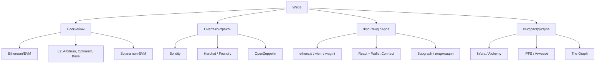

# Дорожная карта: web3 для frontend-разработчика

## Зачем web3 фронтендеру

Web3 — это децентрализованные приложения (dApps), где бэкенд заменён смарт-контрактами в блокчейне. Для фронтендера это означает:

- **Новый тип бэкенда** — не REST API, а вызовы смарт-контрактов через ethers.js / wagmi
- **Новый тип состояния** — не Redux, а блокчейн (ончейн) + локальное (офчейн)
- **Новые UX-паттерны** — подтверждение транзакций, ожидание блоков, gas fees, wallet connect
- **Новый тип пользователя** — с криптокошельком (MetaMask, WalletConnect) вместо логина/пароля

## Что входит в web3 (обзор)

## План изучения (5 этапов)

### Этап 1. Блокчейн-основы (1-2 недели)

**Цель:** понимать, как работает блокчейн на концептуальном уровне.

Что изучить:
- [ ] Как устроен блокчейн: блоки, хеши, консенсус (PoW vs PoS)
- [ ] Ethereum: аккаунты (EOA vs контракт), транзакции, gas, nonce
- [ ] Кошельки: MetaMask, приватные ключи, seed-фразы, публичный адрес
- [ ] Транзакции: что происходит при отправке ETH / вызове контракта
- [ ] Etherscan: как читать транзакции и контракты

Практика:
- [ ] Установить MetaMask, получить тестовый ETH из крана (Sepolia faucet)
- [ ] Отправить тестовую транзакцию, посмотреть её на Etherscan

### Этап 2. Смарт-контракты (Solidity) (2-3 недели)

**Цель:** написать и задеплоить простой смарт-контракт.

Что изучить:
- [ ] Solidity basics: типы данных, функции, модификаторы, события
- [ ] Хранение: storage vs memory vs calldata
- [ ] Маппинги, массивы, структуры
- [ ] Payable функции, transfer, send
- [ ] ERC-20 (токены) — стандарт, как устроен
- [ ] ERC-721 (NFT) — стандарт, mint, метаданные
- [ ] Hardhat — среда разработки: компиляция, тесты, деплой
- [ ] OpenZeppelin — библиотека проверенных контрактов

Практика:
- [ ] Написать простой контракт-счётчик (increment/decrement + события)
- [ ] Написать и задеплоить ERC-20 токен в тестовую сеть
- [ ] Написать тесты на Hardhat (Chai + waffle)

### Этап 3. Фронтенд dApps (2-4 недели)

**Цель:** подключить React-приложение к смарт-контракту.

Что изучить:
- [ ] ethers.js v6 / viem — чтение и отправка транзакций
- [ ] wagmi — React-хуки для web3 (useAccount, useContractRead, useContractWrite)
- [ ] WalletConnect / RainbowKit — connect wallet UI
- [ ] Обработка транзакций: pending → confirmed → receipt
- [ ] Чтение событий (events/logs) из контракта
- [ ] Subgraph (The Graph) — индексация ончейн-данных для быстрого чтения

Практика:
- [ ] Простое dApp: connect wallet + прочитать баланс + отправить транзакцию
- [ ] dApp к своему токену: mint, transfer, просмотр баланса
- [ ] Добавить события: слушать Transfer, показывать историю

### Этап 4. DeFi и продвинутые темы (2-4 недели)

**Цель:** понимать, как устроены реальные web3-продукты.

- [ ] DEX (Uniswap): AMM, пулы ликвидности, свопы
- [ ] Lending (Aave): заём и кредитование, collateral
- [ ] Стейкинг, yield farming
- [ ] Layer 2: Arbitrum, Optimism, Base — зачем и как работают
- [ ] MEV, фронтраннинг, безопасность
- [ ] IPFS — децентрализованное хранение (для метаданных NFT)

### Этап 5. Пет-проект

**Цель:** собрать полноценное dApp от контракта до фронтенда.

Идеи (ранжированы по сложности и охвату технологий):

- **[[wiki/GitHub-Commit-Notary]]** — нотаризация коммитов (сложность: ⭐⭐) — криптография, хеши, Ethereum calldata, CLI
- **[[wiki/Proof-of-Skill]]** — децентрализованные сертификаты (сложность: ⭐⭐⭐) — DID, Soulbound NFT, IPFS, EIP-712 подписи
- **[[wiki/Open-Source-Sponsor-Escrow]]** — эскроу для опенсорса (сложность: ⭐⭐⭐⭐) — смарт-контракты, оракулы, GitHub API, безопасность

### Рекомендуемый порядок

1. **GitHub Commit Notary** — простой старт: контракт не нужен, учит работе с хешами и транзакциями
2. **Proof of Skill** — средняя сложность: ERC-721, цифровые подписи, DID, IPFS
3. **Open Source Sponsor Escrow** — сильный проект для портфолио: смарт-контракты, безопасность, интеграция с GitHub, реальные деньги

Каждый следующий проект опирается на знания из предыдущего. Вместе они охватывают три ключевые области Web3: неизменяемые доказательства, цифровую идентичность и автоматизацию доверия через смарт-контракты.

## Технологический стек (рекомендуемый)

- **Блокчейн:** Ethereum (Sepolia testnet), потом Base/Arbitrum — самая большая экосистема
- **Смарт-контракты:** Solidity + Hardhat + OpenZeppelin — индустриальный стандарт
- **Фронтенд:** React + TypeScript + wagmi + viem — привычный стек + web3
- **Wallet:** RainbowKit / AppKit — готовый UI для connect wallet
- **RPC-провайдер:** Alchemy / Infura — доступ к блокчейну без своей ноды
- **Индексация:** The Graph (Subgraph) — быстрое чтение ончейн-данных

## Первые шаги (сегодня)

1. Установить MetaMask, переключиться на Sepolia testnet
2. Получить тестовый ETH: https://sepoliafaucet.com
3. Прочитать первый концепт: [[wiki/Блокчейн-как-это-работает]]

## Связанное
- [[wiki/Словарь-web3|Словарь терминов web3]]
- [[wiki/Сравнение-ethers-viem-wagmi|Сравнение ethers.js, viem, wagmi]]
- [[wiki/ERC-20-стандарт-токенов]] — стандарт токенов
- [[wiki/ERC-721-NFT-стандарт]] — NFT стандарт
- [[wiki/Solidity-основы]] — синтаксис Solidity
- [[wiki/Hardhat-среда-разработки]] — среда разработки
- [[wiki/OpenZeppelin-безопасные-контракты]] — безопасные контракты
- [[wiki/wagmi-RainbowKit-фронтенд]] — React-фронтенд для dApps
