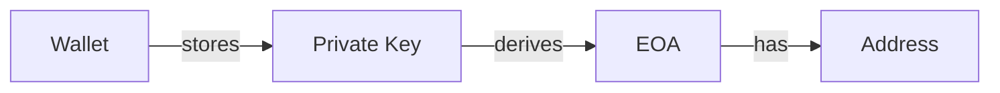
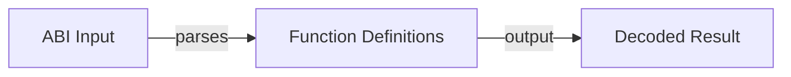
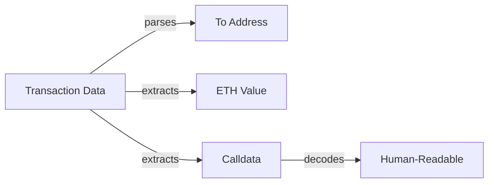
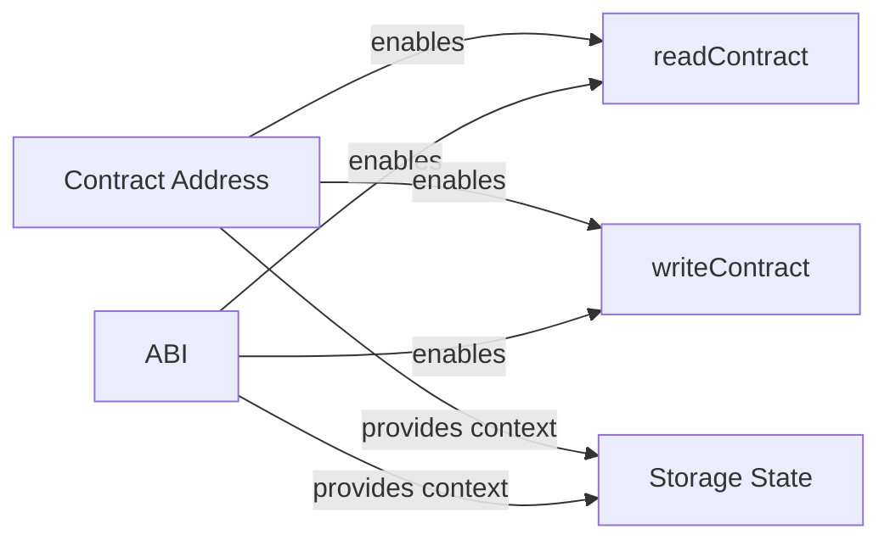
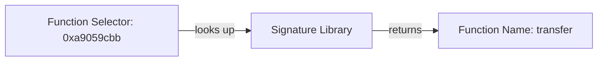

# Словарь терминов web3

## A

**ABI (Application Binary Interface)** — JSON-описание интерфейса смарт-контракта: какие функции есть, какие параметры принимают, что возвращают. Нужен фронтенду, чтобы знать, как вызывать контракт.

**Account (аккаунт)** — в Ethereum два типа:
- **EOA (Externally Owned Account)** — обычный кошелёк пользователя, контролируется приватным ключом
- **Contract Account** — смарт-контракт, контролируется кодом

**AMM (Automated Market Maker)** — математическая модель обмена токенов без книги ордеров. x × y = k. Используется в Uniswap.

## B
**Bytecode** — **Bytecode** — низкоуровневый код, состоящий из opcode, получаемый после компиляции Solidity (или другого языка) для EVM.

**Base Fee** — базовая комиссия сети, определяемая протоколом по заполненности блоков. Сжигается (никому не достаётся). Вместе с Priority Fee составляет Total Fee по EIP-1559.

**Block** — набор транзакций, подтверждённых сетью. Каждый блок ссылается на предыдущий (цепочка).

**Blockchain** — распределённый реестр, где данные хранятся в цепочке блоков. Нельзя изменить прошлое, не пересчитав всю цепочку.

## C
**Calldata** — **Calldata** — неизменяемая область transaction.data, содержит ABI‑закодированный селектор функции и аргументы.

**Cancel** — отправка новой транзакции с тем же nonce, часто `to = own address`, `value = 0`, и более высокой комиссией. Если она включена раньше исходной, исходная операция не будет выполнена.

**Consensus (консенсус)** — механизм, которым сеть договаривается о едином состоянии. Ethereum: PoS (Proof of Stake). Раньше: PoW (Proof of Work, как у Bitcoin).

## D

**dApp (Decentralized Application)** — приложение, чья логика выполняется в смарт-контрактах, а не на сервере.

**DeFi (Decentralized Finance)** — финансовые сервисы на блокчейне: обмен, кредиты, стейкинг.

**Deploy (деплой)** — публикация смарт-контракта в блокчейн. После деплоя контракт получает адрес и его код нельзя изменить.

## E

**Endpoint** — URL, по которому доступен RPC сервис (например, `https://mainnet.infura.io/v3/...`). Клиент отправляет на него JSON-RPC запросы.

**EOA** — см. Account.

**ERC-20** — стандарт взаимозаменяемых токенов (fungible tokens). Все токены одного контракта одинаковы (как доллары).

**ERC-721** — стандарт невзаимозаменяемых токенов (NFT). Каждый токен уникален.

**eth_call** — RPC-метод: выполняет вызов смарт-контракта локально на ноде, без отправки транзакции и без изменения состояния. Используется для чтения (`balanceOf`, `owner`). Бесплатен для пользователя.

**EVM (Ethereum Virtual Machine)** — «компьютер», выполняющий код смарт-контрактов. Работает на всех нодах Ethereum.

**Event (событие)** — лог, который смарт-контракт записывает в блокчейн. Дешевле хранения, но нельзя прочитать из самого контракта (только извне).

## F

**Faucet (кран)** — сервис, выдающий тестовые токены (ETH) для разработки в тестовых сетях.

## G

**Gas** — плата за вычисления в Ethereum. Измеряется в gwei (1 gwei = 0.000000001 ETH). Каждая операция стоит определённое количество gas.

**Gas limit** — максимальное количество gas, которое ты готов потратить на транзакцию.

**Gas price** — цена за единицу gas. Чем выше, тем быстрее майнеры включат транзакцию в блок.

## H

**Hash (хеш)** — односторонняя криптографическая функция. Одинаковый ввод → одинаковый хеш. По хешу нельзя восстановить исходные данные.

## J

**JSON-RPC** — протокол обмена запросами и ответами в JSON-формате (2.0). Ethereum RPC построен на нём: запрос содержит `jsonrpc`, `method`, `params`, `id`; ответ — `result` (часто hex).

## L

**Layer 1 (L1)** — основной блокчейн (Ethereum, Solana).

**Layer 2 (L2)** — решение поверх L1 для ускорения и удешевления транзакций (Arbitrum, Optimism, Base).

## M
**Memory** — **Memory** — линейное адресное пространство, временное хранилище данных во время выполнения транзакции.

**Max Fee Per Gas** — максимальная цена газа, которую пользователь готов заплатить за единицу газа. Фактическая цена может быть ниже: `min(maxFeePerGas, base fee + priority fee)`.

**Mempool** — набор принятых нодой, но ещё не включённых в блок транзакций. Единого глобального mempool нет: каждая нода ведёт собственный и распространяет его другим нодам.

**MetaMask** — самый популярный браузерный криптокошелёк.

**Mint** — создание нового токена (обычно NFT).

## N

**Node (нода)** — компьютер, участвующий в сети блокчейна. Хранит копию блокчейна, проверяет транзакции и отвечает на RPC-запросы клиентов.

**Nonce** — порядковый номер транзакции от конкретного адреса. Предотвращает повторную отправку и обеспечивает строгий порядок исполнения: транзакция с nonce N не выполнится до nonce N−1.

## P
**pure** — **pure** — модицикатор функции Solidity, гарантирует, что функция ни читает, ни изменяет состояние (зависит только от параметров).

**Pending Transaction** — транзакция, которая отправлена в сеть, но ещё не получила требуемого подтверждения (ожидает в mempool). Возможные исходы: Included → Confirmed, Dropped или Replaced.

**PoS (Proof of Stake)** — механизм консенсуса: валидаторы ставят ETH как залог. Если обманут — теряют залог.

**PoW (Proof of Work)** — механизм консенсуса: майнеры решают сложные математические задачи. Энергозатратно (Bitcoin).

**Priority Fee** — дополнительная комиссия валидатору за включение транзакции в блок (tip). Вместе с Base Fee составляет Total Fee по EIP-1559.

**Private key (приватный ключ)** — секретный ключ, дающий полный контроль над кошельком. Никому не показывать!

**Public key / address (адрес)** — публичный идентификатор кошелька (0x...). Можно показывать всем.

## R

**Replacement Transaction** — замена транзакции в mempool: тот же nonce, но более высокая комиссия. Основа механизмов Speed Up и Cancel.

**RPC (Remote Procedure Call)** — механизм обращения приложения к удалённой Ethereum-ноде: чтение данных и отправка транзакций. Интерфейс связи, а не блокчейн и не нода.

**RPC Provider** — сервис, дающий доступ к нодам через RPC endpoint (Alchemy, Infura). Избавляет от необходимости поднимать собственную ноду; для отказоустойчивости можно использовать несколько endpoints.

## S
**SSTORE** — **SSTORE** — opcode, записывает 256‑битное значение из стека в Storage по ключу, меняет состояние блокчейна.
**SLOAD** — **SLOAD** — opcode, читает 256‑битное значение из Storage по ключу и помещает его в стек.
**Storage** — **Storage** — постоянное ключ‑значение хранилище контракта, сохраняется в блокчейне, дорогое в изменении.
**Stack** — **Stack** — стек размером 256‑бит на каждый элемент, используется для промежуточных вычислений в EVM.

**Seed phrase (сид-фраза)** — 12/24 слов, из которых генерируются все приватные ключи кошелька. Хранить офлайн!

**Smart contract (смарт-контракт)** — программа, выполняющаяся на блокчейне. Код + состояние. После деплоя код неизменяем.

**Solidity** — основной язык программирования для Ethereum-смарт-контрактов. Похож на JavaScript.

**Speed Up** — отправка новой транзакции с тем же nonce и более высокой комиссией для ускорения включения зависшей транзакции. Успешно включена может быть только одна транзакция с этим nonce.

**Stablecoin (стейблкоин)** — токен, привязанный к фиатной валюте (USDT, USDC = 1 USD).

## T

**Testnet (тестовая сеть)** — копия Ethereum для разработки. Токены бесплатные, ошибки не страшны. Sepolia — текущая основная тестовая сеть.

**Transaction (транзакция)** — операция в блокчейне: перевод ETH, вызов функции контракта, деплой контракта.

**Transaction Receipt (квитанция)** — данные о выполненной транзакции: статус (успех/фейл), израсходованный газ, информация о блоке и logs. Получается через `eth_getTransactionReceipt`.

## W

**Wallet (кошелёк)** — программа/расширение для управления криптоактивами. Хранит приватные ключи и подписывает транзакции.

**WebSocket RPC** — транспорт RPC с постоянным двусторонним соединением. Позволяет получать события в реальном времени (новые блоки, pending-транзакции) без опроса по HTTP.

**Wei** — мельчайшая единица ETH. 1 ETH = 10¹⁸ wei.

> **Как читать `1 ETH = 10¹⁸ wei`:** читай как «в одном эфире 1 000 000 000 000 000 000 (квинтиллион) неделимых частиц-вей». Мнемоника: wei для ETH — как копейка для рубля, только копеек не 100, а квинтиллион, и дробных чисел в блокчейне нет, поэтому все расчёты в этих «копейках».

## O

## V

## Дополнительные термины (из урока 7)

**EVM (Ethereum Virtual Machine)** — стековая виртуальная машина, исполняет bytecode смарт-контрактов Ethereum.

**Bytecode** — низкоуровневый код, состоящий из opcode, получаемый после компиляции Solidity (или другого языка) для EVM.

**Opcode** — базовая инструкция EVM (например, ADD, MUL, SLOAD, SSTORE, CALL, RETURN).

**Stack** — стек размером 256‑бит на каждый элемент, используется для промежуточных вычислений в EVM.

**Memory** — линейное адресное пространство, временное хранилище данных во время выполнения транзакции.

**Storage** — постоянное ключ‑значение хранилище контракта, сохраняется в блокчейне, дорогое в изменении.

**Calldata** — неизменяемая область transaction.data, содержит ABI‑закодированный селектор функции и аргументы.

**SLOAD** — opcode, читает 256‑битное значение из Storage по ключу и помещает его в стек.

**SSTORE** — opcode, записывает 256‑битное значение из стека в Storage по ключу, меняет состояние блокчейна.

**eth_call** — JSON‑RPC метод, имитирует вызов контракта без создания транзакции, не требует gas от пользователя и не меняет состояние.

**view** — модификатор функции Solidity, гарантирует, что функция не изменяет состояние (может читать состояние).

**pure** — модицикатор функции Solidity, гарантирует, что функция ни читает, ни изменяет состояние (зависит только от параметров).

## Дополнительные термины (из урока 8)

**Gas** — единица измерения вычислительной работы EVM; не является валютой, а измеряет количество выполненных операций.

**Gas Used** — фактически израсходованное количество Gas при выполнении транзакции; определяет реальную комиссию.

**Gas Limit** — максимальное количество Gas, которое пользователь разрешает потратить на транзакцию; защита от непредвиденных расходов.

**Gas Price** — цена за единицу Gas в gwei; в legacy-транзакциях определяет комиссию совместно с Gas Used.

**Base Fee** — базовая комиссия за единицу Gas в EIP-1559, определяемая сетью и сжигаемая (burn).

**Priority Fee** — дополнительная плата (tip) валидатору за включение транзакции в блок; часть общей комиссии в EIP-1559.

**Max Fee Per Gas** — верхний предел цены за Gas, который пользователь готов заплатить в EIP-1559 транзакции.

**Max Priority Fee Per Gas** — верхний предел tip, который пользователь готов заплатить валидатору в EIP-1559 транзакции.

**Effective Gas Price** — фактическая цена за единицу Gas, использованная в транзакции; обычно Base Fee + Priority Fee (если не превышает лимиты).

**Gwei** — деноминация ETH: 1 gwei = 10^-9 ETH; используется для удобного указания комиссии и цены за Gas.

**Out of Gas** — состояние, когда Gas Limit меньше необходимого количества Газа для выполнения транзакции; транзакция может быть включена в блок, но её выполнение неуспешно.
**Gas Estimation** — процесс оценки необходимого Gas перед отправкой транзакции (например, через eth_estimateGas или viem.estimateGas); результат — приближение, не гарантия.

## 9. Account Model

**Account** — сущность в Ethereum, имеющая address, balance и nonce. Два типа: EOA и Contract Account.

**EOA (Externally Owned Account)** — аккаунт, управляемый внешним владельцем через приватный ключ. Имеет address, balance, nonce, но нет bytecode и storage.

**Contract Account** — аккаунт, связан со смарт-контрактом. Имеет address, balance, nonce, bytecode и storage.

**Address** — идентификатор аккаунта в Ethereum (формат 0x...). Определяется от Public Key.

**Wallet** — программа/расширение для управления криптоактивами. Хранит приватные ключи и подписывает транзакции. Управляет EOA.

**Private Key** — секретный ключ, дающий полный контроль над кошельком (EOA). Никому не показывать!

**Nonce** — порядковый номер транзакции от конкретного адреса. Предотвращает повторную отправку и обеспечивает строгий порядок исполнения.

**Bytecode** — низкоуровневый код, состоящий из opcode, получаемый после компиляции Solidity (или другого языка) для EVM. Есть только у Contract Account.

**Storage** — постоянное ключ‑значение хранилище контракта, сохраняется в блокчейне, дорогое в изменении. Есть только у Contract Account. Хранит ERC-20 балансы.

**msg.sender** — непосредственный вызывающий адрес в выходе смарт-контракта. Может отличаться от tx.origin.

**tx.origin** — исходный EOA, инициировавший транзакцию. Не следует использовать для авторизации.

**Native Balance** — native ETH баланс аккаунта. Хранится напрямую в аккаунте, а не в смарт-контракте.

**ERC-20 Balance** — баланс токена стандарта ERC-20. Хранится в Storage токен-контракта по ключу адреса пользователя.

**EOA ≠ Wallet ≠ Address** — различие между этими концепциями: Wallet управляет Private Key, Private Key derivates EOA, EOA имеет Address.

**ETH balance vs ERC-20 balance** — ETH хранится как native balance аккаунта, ERC-20 баланс хранится в Storage токен-контракта.

**EOA** — см. Account.

**Contract Account** — см. Account.

## 10. Smart Contract и ABI

**ABI (Application Binary Interface)** — машиночитаемое описание интерфейса смарт-контракта. Описывает функции, аргументы, типы возвращаемых значений и события. Используется фронтендом и инструментами для взаимодействия с контрактом.

**Bytecode** — код смарт-контракта после компиляции Solidity, выполняемый EVM. Есть только у Contract Account.

**Contract Address** — адрес Deployed контракта в блокчейне. Определяется при деплое. Используется вместе с ABI для взаимодействия.

**Function Signature** — идентификатор функции, включающий название и типы аргументов (например, `transfer(address,uint256)`). Используется для вычисления Function Selector.

**Function Selector** — первые 4 байта keccak256 хеша Function Signature. Используется EVM для идентификации вызываемой функции. Пример: `0xa9059cbb` для функции `transfer(address,uint256)`.

**Calldata** — данные транзакции, содержащие Function Selector (4 байта) + Encoded Arguments. Используется для записи данных в контракт.

**ABI Encoding** — процесс кодирования аргументов функции в формат calldata с использованием ABI. В viem: `encodeFunctionData({abi, functionName, args})`.

**ABI Decoding** — процесс восстановления аргументов из calldata с использованием ABI. Позволяет читать результаты функций и декодировать события.

**ABI Slot** — 32-байтовое слово ABI-кодирования. Содержит значение static type, часть составного static value или offset к dynamic data.

**Static Type** — ABI-тип, размер кодирования которого известен из самого типа. Примеры: `address`, `uint256`, `bool`, `bytes32`.

**Dynamic Type** — ABI-тип переменного размера, представленный в Head через offset к данным в Tail. Примеры: `string`, `bytes`, `uint256[]`.

**Offset** — смещение до динамических данных. Для верхнеуровневых аргументов вызова считается от начала области аргументов, без 4-байтового Function Selector.

**Head** — начальная область ABI-кодирования со значениями static types и offsets для dynamic types.

**Tail** — область ABI-кодирования, содержащая длины и данные dynamic types с необходимым padding.

**Padding** — нулевое заполнение ABI-значения до границы 32 байт. Направление зависит от типа.

**Canonical Type** — нормализованная запись ABI-типа, используемая в Function Signature: например, `uint` преобразуется в `uint256`.

**Event** — событие, которое смарт-контракт записывает в блокчейн. Описывается в ABI. Позволяет фронтенду отслеживать изменения и декодировать logs.

**Log** — запись события в блокчейне. Получится через `eth_getLogs`. Декодируется с помощью ABI.

**readContract** — метод чтения данных с контракта через `eth_call`. Не создает транзакцию, не требует gas от пользователя.

**writeContract** — метод отправки транзакции для вызова функции контракта. Требует подготовки calldata и оплаты gas.

---

## EOA ≠ Wallet ≠ Address

**Wallet** — программа (MetaMask), которая хранит Private Key и управляет ключами.

**EOA** — аккаунт в Ethereum, создаваемый от Private Key. Имеет address, balance, nonce.

**Address** — идентификатор аккаунта (0x...). Можно публиковать.



**Ключевые правила:**
- Never share your Private Key
- Address can be safely shared
- Wallet manages one or more EOA(s)
- Different wallets can manage the same EOA (via seed phrase import)
- EOA has no code, only data (address, balance, nonce)
```

---

## ETH balance vs ERC-20 balance

### ETH (Native Balance)

- Хранится напрямую в аккаунте
- Это баланс ETH на адресе
- Проверяется через `eth_getBalance` RPC метод
- Пример: `EOA balance = 2 ETH`

### ERC-20 Balance

- Хранится в **Storage** токен-контракта
- Ключ хранения — это адрес владельца
- Пример хранения: `balance[Alice] = 1000` (1000 токенов)
- Проверяется через вызов `balanceOf(user)` в токен-контракте
- Пример: USDC токен, где `balance[Alice] = 500` означает 500 USDC

```mermaid
graph TB
    EOA[EOA/User Address]
    Token[ERC-20 Token Contract]
    Storage[Storage Slot: balance[user]]
    
    EOA -->|call| Token
    Token -->|reads| Storage
    Storage -->|returns| Balance[balance value]
```

### Сравнение:

| Характеристика | ETH Balance | ERC-20 Balance |
|---|---|---|
| Где хранится | В аккаунте напрямую | В Storage токен-контракта |
| Как получить | `eth_getBalance` | `balanceOf(user)` вызов |
| Единицы | ETH (10¹⁸ wei) | Токен-specific (например, 6 decimals для USDC) |
| Изменение | При переводе ETH | При вызове transfer/методах |

---

## 12. Ссылки на связанные материалы

- [[07. EVM — Ethereum Virtual Machine]] — глубокий разбор работы виртуальной машины
- [[09. Account Model — EOA и Contract Account]] — учетные модели Ethereum
- [[08. Gas — стоимость выполнения транзакции]] — Gas, газ-лимиты и комиссии
- [[Calldata]] — детальная информация о calldata
- [[Function Selector]] — как вычисляется селектор функции
- [[Smart Contract]] — что такое смарт-контракты
- [[ERC-20]] — стандарт токенов и ABI
- [[viem]] — библиотека для взаимодействия с Ethereum

---

## 13. Повторить на лавке

### 10 максимально коротких тезисов для быстрого повторения:

1. **ABI** — машиночитаемое описание интерфейса смарт-контракта.
2. **Bytecode** — выполняется EVM, результат компиляции Solidity.
3. **ABI vs Bytecode**: Bytecode — для EVM, ABI — для фронтенда и инструментов.
4. **Contract Address + ABI** = полный доступ к контракту из фронтенда.
5. **Function Signature** — название функции + типы аргументов (например, `transfer(address,uint256)`).
6. **Function Selector** — первые 4 байта keccak256 от Function Signature (например, `0xa9059cbb`).
7. **Calldata** — concatenation Function Selector + Encoded Arguments.
8. **ABI Encoding** — процесс кодирования аргументов в формат, понятный EVM.
9. **readContract** использует `eth_call`, **writeContract** требует отправки транзакции.
10. **Events** в ABI позволяют декодировать logs и показывать человекочитаемые данные.

---

## 14. Связь с Web3 DevTools Hub

Подробно показываем связь урока с будущими инструментами:

### ABI Decoder



**Объяснение:** Инструмент принимает raw ABI определение и превращает его в структурированные определения функций. Используется для генерации TypeScript типов, валидации аргументов и автоматическогоCompletion кода в IDE.

### Calldata Decoder

```mermaid
graph LR
    Calldata[Raw Calldata: 0xa9059cbb...]
    Selector[Function Selector: 0xa9059cbb]
    Args[Encoded Arguments]
    Decoded[Decoded Call: transfer(to, amount)]

    Calldata -->|extracts| Selector
    Calldata -->|removes selector| Args
    Selector & Args -->|reconstructs| Decoded
```

**Объяснение:** Инструмент считывает calldata из транзакции, отделяет function selector от аргументов, хеширует selector для определения вызываемой функции, а затем декодирует аргументы с использованием ABI. Позволяет пользователю видеть `transfer(0x123..., 100)` вместо бесполезного hex.

### Transaction Decoder



**Объяснение:** Полный декстер транзакции, который разбивает данные транзакции на компоненты: получатель, значение ETH и calldata. Затем calldata декодируется с использованием ABI для отображения понятного действия (например, `Swap on Uniswap` или `Transfer 50 USDC`).

### Contract Inspector



**Объяснение:** Инструмент для инспектации контракта: чтение состояния переменных, вызов функций с проверкой аргументов, анализ событий. Использует ABI для валидации входных данных и интерпретации результатов.

### Function Selector Lookup



**Объяснение:** Инструмент для поиска имени функции по ее селектору. Вводит 4-байтовый hex-селектор и получает соответствующее название функции и типы аргументов. Полезно при анализе старых транзакций или деобфускации кода контракта.

---
